# 1 初始 Hadoop

## 1.4 不仅仅是批处理

​	许多处理模式能与 Hadoop 协同工作，如：

- **Interactive SQL （交互式 SQL）**

  利用 MapReduce 进行分发并使用一个分布式查询引擎，使得在 Hadoop 上获得 SQL 查询低延迟响应的同时还能保持对大数据集规模的可扩展性。

- **Iterative processing （迭代处理）**

  许多算法自身具有迭代性，因此和那种每次迭代都从硬盘加载的方式相比，这种在内存中保存每次中间结果集的方式更加高效。 MapReduce 的架构不允许这样，但如果使用 Spark 就会比较直接，它在使用数据集方面展现了一种高度探究的风格。

- **Stream processing（流处理）**

  流系统，例如 Storm， Spark Streaming 或 Samza 使得在无边界数据流上运行实时，分布式的计算，并向 Hadoop 存储系统或外部系统发布结果成为可能。

- **Search（搜索）**

  Solr 搜索平台能够在 Hadoop 集群上运行，当文档加入 HDFS 后就可以对其进行索引，并且根据 HDFS 中存储的索引为搜索查询提供服务。

## 1.5 相较于其他系统的优势

### 1.5.1 关系型数据库管理系统

​	如果数据库只更新一小部分记录，那么传统的 B 树（关系型数据库中使用的一种数据结构，受限于寻址的速率）就更有优势。但数据库如果有大量的数据更新时， B 树的效率就明显落后于 MapReduce ，因为需要使用“排序/合并”（sort/merge）来重建数据库。

​	在许多情况下，可以将 MapReduce 视为关系型数据库管理系统（RDBMS）的补充。 MapReduce 比较适合解决需要批处理方式分析整个数据集的问题，尤其一些特定目的的分析。 RDBMS 适用于索引后数据集的点查询（point query）和更新。 MapReduce 适合一次写入、多次读取数据的应用，关系型数据库则更适合持续更新的数据集。

|          | RDBMS          | MapReduce          |
| -------- | -------------- | ------------------ |
| 数据大小 | GB             | PB                 |
| 数据存取 | 交互式和批处理 | 批处理             |
| 更新     | 多次读/写      | 一次写入，多次读取 |
| 事务     | ACID           | 无                 |
| 结构     | 写时模式       | 读时模式           |
| 完成性   | 高             | 低                 |
| 横向拓展 | 非线性的       | 线性的             |

​	然而关系数据库和 Hadoop 系统之间的区别是模糊的。一方面，关系型数据已经开始吸收 Hadoop 的一些思想，另一方面，诸如 Hive 这样的 Hadoop 系统不仅变得更具交互性（通过从 Hadoop 中脱离出来），而且增加了索引和事务这样的特性，使其看上去更像传统的关系型数据库。

​	Hadoop 对非结构化或半结构化得数据非常有效，因为它是在处理数据时才对数据进行解释（即所谓的“读时模式”）。这种模式在提供灵活性的同时避免了 RDBMS 数据加载阶段带来的高开销，因为在 Hadoop 中仅仅是一个文件拷贝操作。

​	Hadoop 非常适合用于分析各种日志文件。注意，Hadoop 也能够做连接（join）操作，只不过这种操作并没有在关系型数据库中用的多。

​	MapReduce 以及 Hadoop 中其他的处理模型是可以随着数据规模线性伸缩的。对数据分区后，函数原语（如 map 和 reduce）能够在各个分区上并行工作。这意味着，如果输入的数据量是原来的两倍，那么作业的运行时间也需要两倍。但如果集群规模拓展为原来的两倍，那么作业的运行速度却却仍然与原来一样快。 SQL 查询一般不具备该特性。

### 1.5.2 网格计算

​	Hadoop 尽量在计算节点上存储数据。以实现数据的本地快速访问。数据本地化特性是 Hadoop 数据处理的核心，并因此获得良好的性能。意识到到网络带宽是数据中心环境中最珍贵的资源（到处复制数据很容易耗尽网络带宽）之后， Hadoop 通过显式网络拓扑结构来保留网络带宽。注意，这种排列方式并没有降低 Hadoop 对计算密集型数据进行分析的能力。

# 2 关于 MapReduce

### 2.3.1 map 和 reduce

​	MapReduce 任务过程分为两个处理阶段： map 阶段和 reduce 阶段。每个阶段都以键-值对作为输入和输出，其类型由开发人员来选择。

​	map 阶段输入的是原始数据。map 阶段只是一个数据准备阶段，通过这种方式准备数据，使 reduce 函数能够继续对它来进行处理。

### 2.3.2 Java MapReduce

``` java
public class MaxTemperatureMapper extends Mapper<LongWritable, Text, Text, IntWritable> {
    private static final int MISSING = 9999;

    @Override
    protected void map(LongWritable key, Text value, Context context) throws IOException, InterruptedException {
        String line = value.toString();
        String year = line.substring(15, 19);
        int airTemperature;
        if (line.charAt(87) == '+') {// parseInt doesn't like leading plus signs
            airTemperature = Integer.parseInt(line.substring(88, 92));
        } else {
            airTemperature = Integer.parseInt(line.substring(87, 92));
        }
        String quality = line.substring(92, 93);
        if (airTemperature != MISSING && quality.matches("01459]")) {
            context.write(new Text(year), new IntWritable(airTemperature));
        }
    }
}
```

​	Mapper 类是一个泛型类型，它有四个形参类型，分别制定 map 函数的输入键、输入值、输出键和输出值的类型。如上的例子，输入键是一个长整数偏移量，输入值是一行文本，输出键是年份，输出值是气温（整数）。 Hadoop 本身提供了一套可优化网络序列化传输的基本类型，而不是直接使用 Java 内嵌的类型。

​	map() 方法的输入时一个键和一个值。

​	map() 方法还提供 Context 实例用于输出内容的写入。

## 2.4 横向拓展

​	MapReduce 作业（ job ）是客户端需要执行的一个工作单元：它包括输入数据、 MapReduce 程序和配置信息。 Hadoop 将作业分成若干个任务（ task ）来执行，其中包括两类任务： map 任务 和 reduce 任务。这些任务运行在集群的节点上，并通过 YARN 进行调度。如果一个任务失败，它将在另一个不同的节点上自动调度运行。

​	Hadoop 将 MapReduce 的输入数据划分成等长的小数据块，称为输入分片（ input split ）或简称“分片”。 Hadoop 为每个分片构建一个 map 任务，并由该任务来运行用户自定义的 map 函数从何处理分片中的每条记录。

​	拥有许多分片，意味着处理每个分片所需要的时间少于处理整个输入数据所花的时间。因此，如果我们并行处理每个分片，且每个分片数据比较小，那么整个处理过程将获得更好的负载均衡。

​	另一方面，如果分片切分得太小，那么管理分片的总时间和构建 map 任务的总时间将决定作业的整个执行时间。对于大多数作业来说，一个合理的分片大小趋向于 HDFS 的一个块的大小，默认是 128 MB，不过可以针对集群调整这个默认值（对所有新建的文件），或在每个文件创建时指定。

​	Hadoop 在存储有输入数据（ HDFS 中的数据）的节点上运行 map 任务，可以获得最佳性能，因为它无需使用宝贵的集群带宽资源。这就是所谓的”数据本地化优化“。有时候对于一个 map 任务的输入分片来说，存储该分片的  HDFS 数据块复本的所有节点可能正在运行其他 map 任务，此时作业调度需要从某一数据块所在的机架中的一个节点上寻找一个空闲的 map 槽（slot）来运行该 map 任务分片。仅仅在非常偶然的情况下，会使用其他机架中的节点运行该 map 任务，这将导致机架与机架之间的网络传输。如图展示了这三种可能。

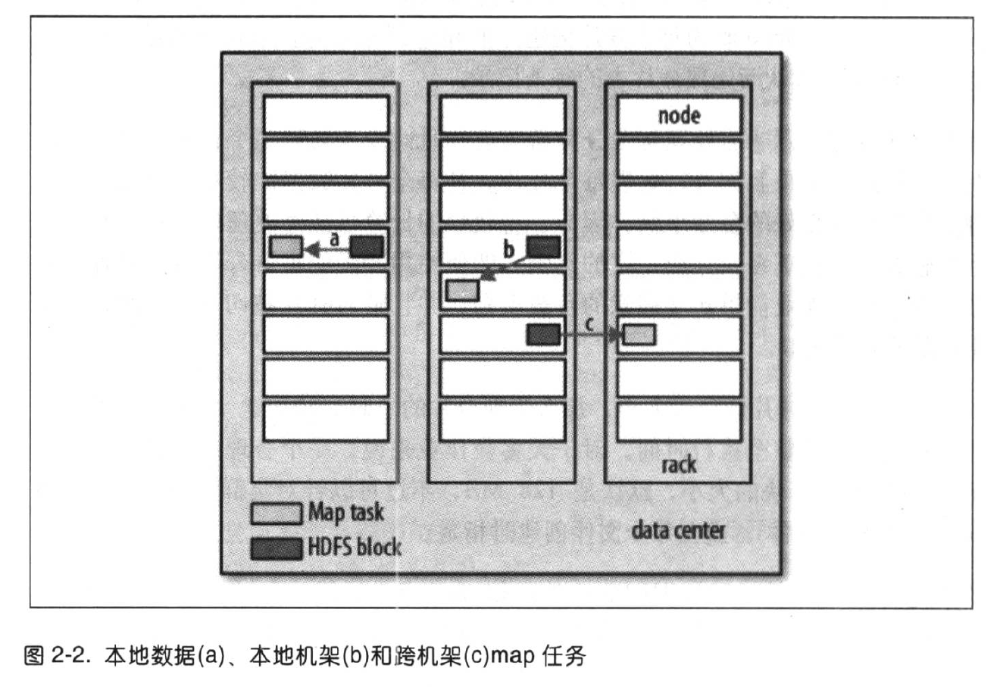

​	reduce 任务并不具备数据本地化的优势，单个 reduce 任务的输入通常来自所有 mapper 的输出。

​	一个 reduce 任务的完整数据流如下图所示。虚线框表示节点，虚线箭头表示节点内部的数据传输，而实现表示不同节点的数据传输。

​	每个 map 任务就会针对输出进行分区，即为每个 reduce 任务创建一个分区。分区可由用户定义的分区函数控制，但通常默认的 partitioner 通过哈希函数来分区，很高效。

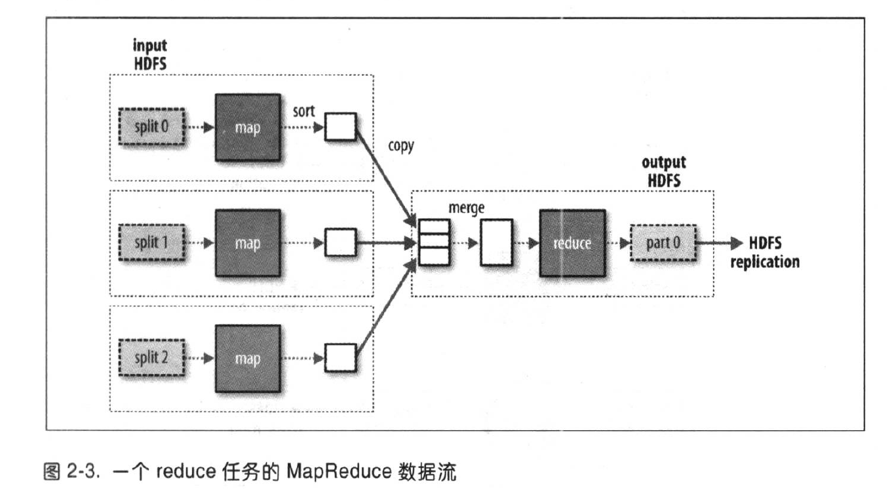

​	一般情况下，多个 reduce 任务的数据流如下图所示。该图清楚地说明了为什么 map 任务和 reduce 任务之间的数据流称为 shuffle（混洗），因为每个 reduce 任务的输入都来自许多 map 任务。

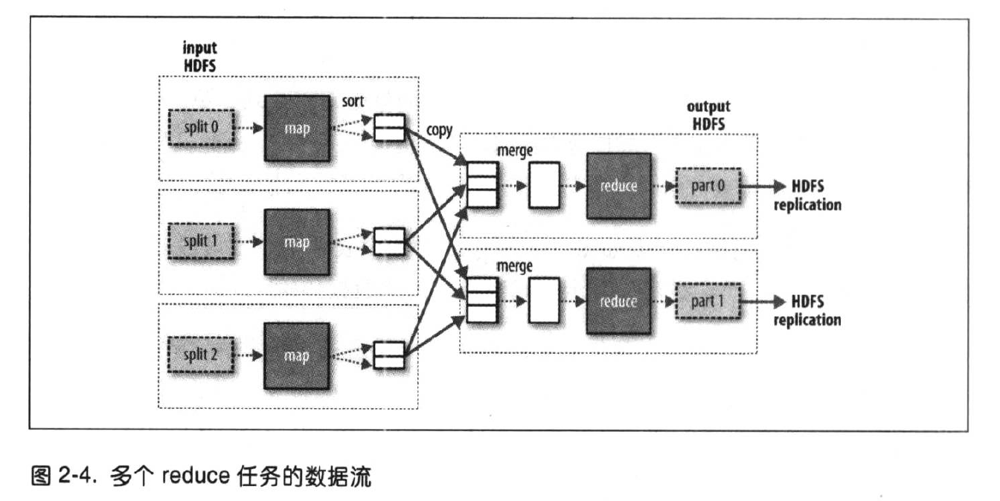

​	当数据处理可以完全并行（即无需混洗时），可能会出现无 reduce 任务的情况。这种情况下，唯一的非本地节点数据传输是 map 任务将结果写入 HDFS。

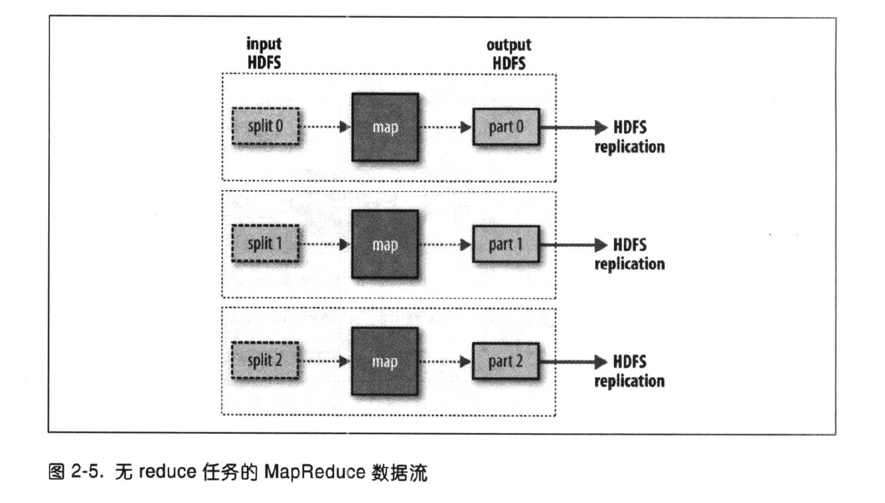

### 2.4.2 combiner 函数

​	Hadoop 允许用户针对 map 任务的输出指定一个 combiner（就像 mapper 和 reducer 一样）， combiner 函数的输出作为 reduce 函数的输入。由于 combiner 属于优化方案，所以 Hadoop 无法确定要对一个指定的 map 任务输出记录调用多少次 combiner （如果需要）。

​	combiner 函数不能取代 reduce 函数。我们仍然需要 reduce 函数来处理不同 map 输出中具有相同键的记录。但 combiner 函数能帮助减少 mapper 和 reducer 之间的数据传输量。

# 3 Hadoop 分布式文件系统

## 3.1 HDFS 的设计

​	HDFS 以流式数据访问模式来存储超大文件，运行与商用硬件集群上。

- **超大文件**：在这里指具有几百 MB、几百 GB 甚至几百 TB 大小的文件。
- **流式数据访问**： HDFS 的构建思路是一次写入，多次读取时最高效的访问方式。数据集通常由数据源生成或从数据源复制而来。
- **低时间延迟的数据访问**：要求低时间延迟数据访问的应用，不适合在 HDFS 上运行。对于低延迟的访问需求， HBase 是更好的选择。
- **大量的小文件**：由于 namenode 将文件系统的元数据存储在内存中，因此该文件系统所能存储的文件总数受限于 namenode 的内存容量。
- **多用户写入，任意修改文件**： HDFS 中的文件写入支持单个写入者，而且写操作总是以“只添加”方式在文件末尾写数据。它不支持多个写入者的操作，也不不支持在文件的任意位置进行修改。可能以后会支持这些操作。

## 3.2 HDFS 的概念

### 3.2.1 数据块

​	HDFS 的块，默认为 128 MB。 HDFS 中小于一个块大小的文件不会占据整个块的空间（例如，当一个 1 MB 的文件存储在一个 128 MB 的块中，文件只使用 1 MB 的磁盘空间，而不是 128 MB）。

> HDFS 的块比磁盘的块大，其目的是为了最小化寻址开销。如果块足够大，从磁盘传输数据的时间会明显大于定位这个块开始位置所需的时间。

​	对分布式文件系统中的块进行抽象有很多好处。

​	一、一个文件的大小可以大于网络中任意一个磁盘的容量。文件的所有块并不需要存储在同一个磁盘上，因此它们可以利用集群上的任意一个磁盘进行存储。

​	二、使用抽象块而非整个文件作为存储单元，大大简化了存储子系统的设计。

​	不仅如此，块还非常适用于数据备份而提供数据容错能力和提高可用性。

### 3.2.2 namenode 和 datanode

​	HDFS 集群有两类节点以“管理节点-工作节点”模式运行，即一个 namenode （管理节点）和多个 datanode  （工作节点）。 namenode 管理文件系统的命名空间。它维护着文件系统树即整棵树内所有的文件和目录。这些信息以两个文件形式永久保存在本地磁盘上：命名空间镜像文件和编辑日志文件。 namenode 也记录着每个文件中各个块所在的数据节点信息，但它并不永久保存块的位置信息，因为这些信息会在系统启动时根据数据节点信息重建。

​	 datanode 是文件系统的工作节点。它们根据需要存储并检索数据块（受客户端或 namenode 调度），并且定期向 namenode 发送它们所存储的块的列表。

​	没有 namenode ，文件系统无法使用。如果运行 namenode 服务的机器损坏，文件系统上所有的文件将丢失，因为无法根据 datanode 的块重建文件。对 namenode 实现容错非常重要， Hadoop 为此提供两种机制。

​	第一种机制，备份那些组成文件系统元数据持久状态的文件。 Hadoop 可以通过配置使 namenode 在多个文件系统上保存元数据的持久状态。这些写操作时实时同步的，并且是原子操作。一般的配置是，将持久状态写入本地磁盘的同时，写入一个远程挂载的网络文件系统（ NFS ）。

​	另一种机制，运行一个辅助 namenode，但它不能被用作 namenode 。这个辅助 namenode 的重要作用是定期合并编辑日志与命名空间镜像，以防止编辑日志过大。这个辅助 namenode 一般在另一台单独的物理计算机上运行，因为它需要占用大量的 CPU 时间，并且需要与 namenode 一样多的内存来执行合并操作。它会保存合并后的命名空间镜像的副本，并在 namenode 发生故障时启用。但是，辅助 namenode 保存的状态总是滞后于主节点，所以在主节点全部失效时，难免会丢失部分数据。在这种情况下，一般把存储在 NFS 上的 namenode 元数据复制到辅助 namenode 并作为新的主 namenode 运行。

### 3.2.3 块缓存

​	通常 datanode 从磁盘中读取块，但对于访问频繁的文件，其对应的块可能被显式地缓存在 datanode 的内存中，以堆外块缓存（ off-heap block cache ）的形式存在。默认情况下，一个块仅缓存在一个 datanode 的内存中，当然可以针对每个文件配置 datanode 的数量。作业调度器（用于 MapReduce  、 Spark 和其他框架的）通过在缓存块的 datanode 上运行任务，可以利用块缓存的优势提高读操作的性能。例如，连接（ join ）操作中使用的一个小的查询表就是块缓存的一个很好的候选。

​	用户或应用通过在缓存池中增加一个 cache directive 来告诉 namenode 需要缓存哪些文件及存多久。缓存池是一个用于管理缓存权限的资源使用的管理性分组。

### 3.2.4 联邦 HDFS

​	在 2.x 发行版本系列中引入的联邦 HDFS 允许系统通过添加 namenode 实现拓展，其中每个 namenode 管理文件系统命名空间中的一部分。例如，一个 namenode 可能管理 /user 目录下的所有文件，而另一个 namenode 可能管理 /share 目录下的所有文件。

​	在联邦环境下，每个 namenode 维护一个命名空间卷（ namespace volume ），由命名空间的元数据和一个数据块池（ block pool ）组成，数据块池包含该命名空间下文件的所有数据块。命名空间卷之间是相互的，两两之间并不相互通信，甚至其中一个 namenode 的失效也不会影响其他 namenode 维护的命名空间的可用性。数据块池不再进行切分，因此集群中的 datanode 需要注册到每个 namenode ，并且存储着来自多个数据块池的数据块。

​	要想访问联邦 HDFS 集群，客户端需要使用客户端挂载数据表将文件路径映射到 namenode。该功能可以通过 ViewFileSystem 和 viewfs://URI 进行配置和管理。

### 3.2.5 HDFS 的高可用性

​	想从一个失效的 namenode 恢复，系统管理员得启动一个拥有文件系统元数据副本的新的 namenode ，并配置 datanode 和客户端以便使用这个新的 namenode。新的 namenode 直到满足以下情形才能响应任务：

1. 将命名空间的映像导入内存中；

2. 重演编辑日志；

3. 接收足够多的来自 datanode 的数据块报告并退出安全模式。

​	Hadoop2 针对上述问题增加了对 HDFS 高可用性（ HA ）的支持。在这一实现中，配置了一对活动-备用（ active-standby ） namenode 。当活动 namenode 失效，备用 namenode 就会接管它的任务并开始服务于来自客户端的请求，并不会有任何明显中断。实现这一目标需要在架构上做如下修改。

- namenode 之间需要通过高可用共享存储实现编辑日志的共享。当备用 namenode 接管工作之后，它将通读共享日志直至末尾，以实现与活动 namenode 的状态同步，并继续读取由活动 namenode 写入新条目。

- datanode 需要同时向两个 namenode 发送数据块处理报告，因为数据块的映射信息存储在 namenode 的内存中，而非磁盘。

- 客户端需要使用特定的机制来处理 namenode 失效问题，这一机制对用户是透明的。

- 辅助 namenode 的角色被备用 namenode 所包含，备用 namenode 为活动的 namenode 命名空间设置周期性检查点。

​	可以从两种高可用性共享存储做出选择： NFS 过滤器或集群日志管理器（ QJM ， quorum journal manager ）。 QJM 是一个专门的 HDFS 实现，为提供一个高可用的编辑日志而设计。 QJM 以一组日志节点（ journal node ）的形式运行，每一次编辑必须写入多数日志节点。 QJM 的实现并没有使用 ZooKeeper 。 HDFS HA 在选取活动的 namenode 时确实使用 ZooKeeper 技术。

​	在活动 namenode 失效后，备用 namenode 能够快速（几十秒的时间）实现任务接管，因为最新的状态存储在内存中：包括最新的编辑日志条目和最新的数据块映射信息。

​	**故障切换与规避**

​	在非平稳故障转移的情况下，无法确切直到失效 namenode 是否已经停止运行。例如，在网速非常慢或者网络被分割的情况下，同样也能激发故障转移，但是先前的活动 namenode 依然运行着并且依旧是活动 namenode 。高可用实现做了更进一步的优化，以确保先前活动的 namenode 不会执行危害系统并导致系统崩溃的操作，该方法称为“规避”。

​	客户端的故障转移通过客户端类库实现透明处理。最简单的实现是通过客户端的配置文件实现故障转移的控制。 HDFS URI 使用一个逻辑主机名，该主机名映射到一对 namenode 地址，客户端类库会访问每一个 namenode 地址直至处理完成。

## 3.3 命令行接口

​	**文件系统的基本操作**

``` bash
$ hadoop fs -copyFromLocal input/docs/quangle.txt \ hdfs://localhost/user/tom/quangle.txt
```
## 3.4 Hadoop 文件系统

​	Hadoop 有一个抽象的文件系统概念， HDFS 只是其中的一个实现。 Java 抽象类 org.apache.hadoop.fs.FileSystem 定义了 Hadoop 中一个文件系统的客户端接口，并且该抽象类有几个具体实现。

​	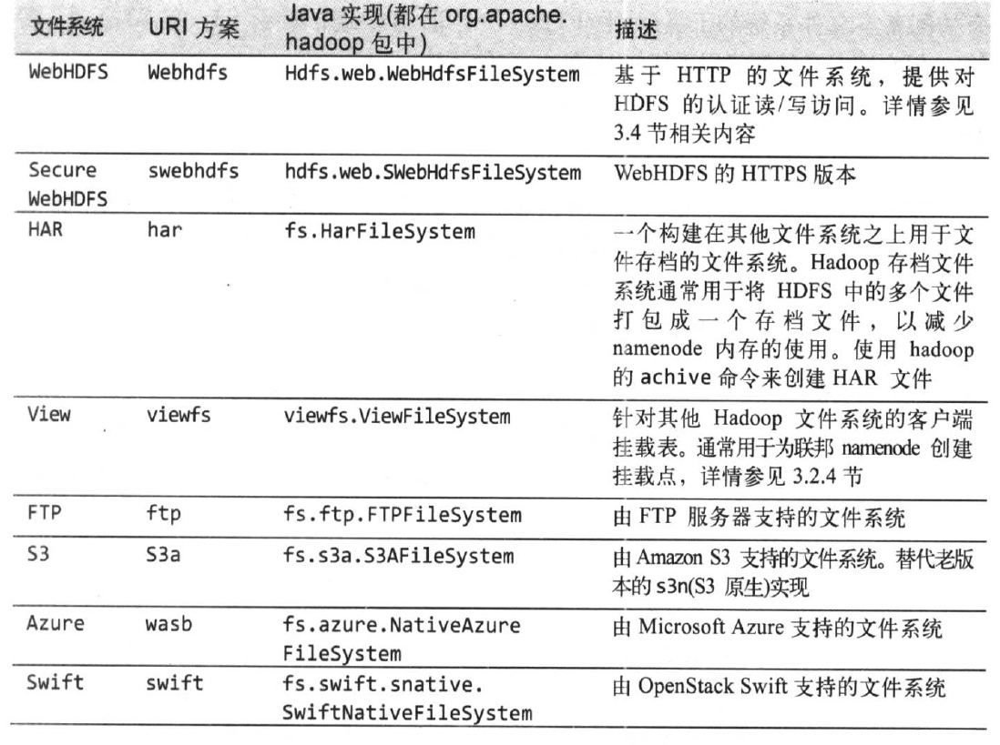

​	Hadoop 对文件系统提供了许多接口，它一般使用 URI 方案来选取合适的文件系统实例进行交互。

​	**接口**

​	Hadoop 是用 Java 写的，通过 Java API 可以调用大部分 Hadoop 文件系统的交互操作。

​	**1、HTTP**

​	由 WebHDFS 协议提供的 HTTP REST API 则使得其他语言开发的应用能够更方便地与 HDFS 交互。HTTP 接口比原生的 Java 客户端要慢，所以不到万不得已，尽量不要用它来传输大数据。

​	通过 HTTP 来访问 HDFS 有两种方法：直接访问， HDFS 守护进程直接服务于来自客户端的 HTTP 请求；通过代理（一个或多个）访问，客户端通常使用 DistributedFileSystem API 访问 HDFS 。如图所示。


​	第一种情况下， namenode 和 datanode 内嵌的 web 服务器作为 WebHDFS 的端节点运行。（由于 dfs.webhdfs.enabled 被设置为 true ， WebHDFS 默认是启用状态。）文件元数据操作由 namenode 管理，文件读（写）操作首先被发往 namenode ，由 namenode 发送一个 HTTP 重定向至某个客户端，指示以流方式传输文件数据的目的或源 datanode 。

​	第二种方法，（由于代理服务是无状态的，因此可以运行在标准的负载均衡器之后。）所有到集群的网络通信都需要经过代理，因此客户端不能直接访问namenode 或 datanode 。通常情况下，都使用代理服务器，实现在不同数据中心部署的 Hadoop 集群之间的数据传输，或从外部网络访问云端进行的 Hadoop 集群。

​	HttpFS 代理提供和 WebHDFS 相同的 HTTP （和 HTTPS ）接口，这样客户端能够通过 webhdfs （ swebhdfs ） URI 访问这两类接口。 HttpFS 代理的启动独立于 namenode 和 datanode 的守护进程，使用 httpfs.sh 脚本，默认在一个不同的端口上监听（端口号 14000）。

### 3.5.2 通过 FileSystem API 读取数据

​	Hadoop 文件系统中通过 Hadoop Path 对象（而非 java.io.File 对象，因为它的语义与本地文件系统联系太紧密）来代表文件。可以将路径视为一个 Hadoop 文件系统 URI ，如 hdfs://localhost/user/tom/quangle.txt 。

​	FileSystem 是一个通用的文件系统 API ，所以第一步是检索我们需要使用的文件系统实例，这里是 HDFS 。获取 FileSystem 实例有下面几个静态工厂方法：

```java
public static FileSystem get(Configuration conf) throws IOException
public static FileSystem get(URI uri, Configuration conf) throws IOException
public static FileSystem get(URI uri, Configuration conf, String user) throws IOException
```

​	Configuration 对象封装了客户端或服务器的配置，通过设置配置文件读取类路径来实现（如 etc/hadoop/core-site.xml ）。第一种方法返回的是默认文件系统（在 core-site.xml 中指定的，如果没有指定，则使用默认的本地文件系统）。第二个方法通过给定的 URI 方案和权限来确定要使用的文件系统，如果给定 URI 中没有指定方案，则返回默认文件系统。第三，作为给定用户来访问文件系统，对安全来说至关重要。

​	在某些情况下，可能希望获取本地文件系统的运行实例，此时可以使用 getLocal() 方法获取。

```java
public static LocalFileSystem getLocal(Configuration conf) throws IOException
```

​	有了 FileSystem 实例之后，调用 open() 方法来获取文件的输入流。

```java
public FSDataInputStream open(Path f) throws IOException
public abstract FSDataInputStream open(Path f, int bufferSize) throws IOException
```

​	第一个默认方法使用默认的缓冲区大小 4 KB 。

### 3.5.3 写入数据

​	FileSystem 类有一系列新建文件的方法。最简单的方法是给准备键的文件指定一个 Path 对象，然后返回一个用于写入数据的输出流：

```java
public FSDataOutputStream create(Path f) throws IOException
```

​	另一种新建文件的方法是使用 append() 方法在一个现有文件末尾追加数据。

```java
public FSDataOutputStream append(Path f) throws IOException
```

​	这样的追加操作允许一个 writer 打开文件后在访问该文件的最后偏移量处追加数据。该追加操作时可选的，并非所有 Hadoop 文件系统都实现了该操作。例如， HDFS 支持追加，但 S3 文件系统就不支持。

### 3.5.4 目录

​	FileSystem 实例提供了创建目录的方法：

```java
public boolean mkdirs(Path f) throws IOException
```

​	这个方法可以一次性新建所有必要但还没有的目录。

### 3.5.5 查询文件系统

​	**1、文件元数据：FileStatus**

​	任何文件系统的一个重要特征都是提供其目录结构浏览和检索它所存文件和目录相关信息的功能。 FileStatus 类封装了文件系统中文件和目录的元数据，包括文件长度、块大小、复本、修改时间、所有者以及权限信息。

​	FileSystem 的 getFileStatus() 方法用于获取文件或目录的 FileStatus 对象。

​	**2、列出文件**

​	FileSystem 的 listStatus() 方法能够列出目录中的内容：

``` java
public FileStatus[] listStatus(Path f) throws Exception
public FileStatus[] listStatus(Path f, PathFilter filter) throws Exception
public FileStatus[] listStatus(Path[] files) throws Exception
public FileStatus[] listStatus(Path[] files, PathFilter filter) throws Exception
```

​	**3、文件模式**

​	Hadoop 为执行通配（ globbing ）提供了两个 FileSystem 方法。

```java
public FileStatus[] globStatus(Path pathPattern) throws IOException
public FileStatus[] globStatus(Path pathPattern, PathFilter filter) throws IOException
```

​	**4、PathFilter 对象**

### 3.5.6 删除数据

​	使用 FileSystem 的 delete() 方法可以永久性删除文件或目录。

``` java
public boolean delete(Path f, boolean recursive) throws IOException
```

​	只有 recursive 为 true 时，非空目录及其内容才会被删除（否则会抛出 IOException 异常）。

## 3.6 数据流

### 3.6.1 剖析文件读取

​	DistributedFileSystem 通过使用 RPC 来调用 namenode ，以确定文件起始块的位置。对于每一个块， namenode 返回存有该块副本的 datanode 地址。此外，这些 datanode 根据它们与客户端的距离来排序（根据网络拓扑）。如果该客户端本身就是一个 datanode（比如，在一个 MapReduce 任务中），那么该客户端将会从保存有相应数据块副本的本地 datanode 读取数据。

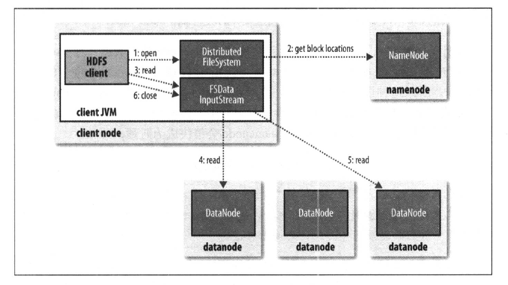

​	DistributedFileSystem 类返回一个 FSDataInputStream 对象（一个支持文件定位的输入流）给客户端以便读取数据。 FSDataInputStream 类转而封装 DFSInputStream 对象，该对象管理着 datanode 和 namenode 的 I/O 。

### 3.6.2 剖析文件写入

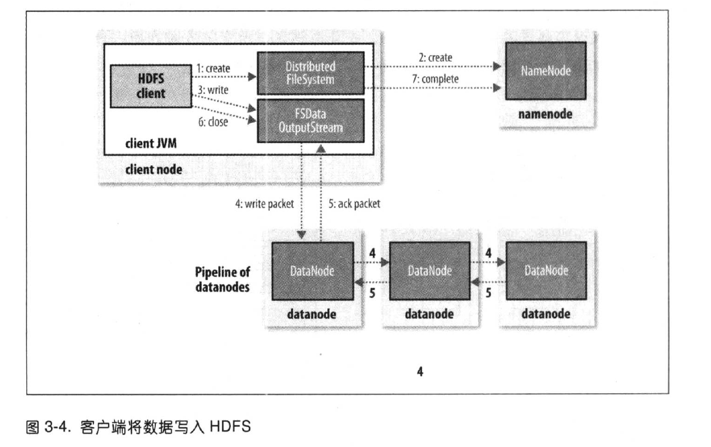

​	客户端通过对 DistributedFileSystem 对象调用 create() 来新建文件。  DistributedFileSystem 对 namenode 创建一个 RPC 调用，在文件系统的命名空间中新建一个文件。 DistributedFileSystem 向客户端返回一个 FSDataOutputStream 对象，由此客户端可以开始写入数据。 FSDataOutputStream 封装一个 DFSoutPutStream 对象，该对象负责处理 datanode 和 namenode 之间的通信。

​	在客户端写入数据时（步骤3）， DFSOutputStream 将它分成一个个的数据包，并写入内部队列，称为“数据队列”。 DataStreamer 处理数据队列，它的责任是挑选出适合存储数据复本的一组 datanode ，并据此来要求 namenode 分配新的数据块。这一组 datanode 构成一个管线（假设复本数为3，所以管线中有3个节点）。 DataStreamer 将数据包流式传输到管线中第1个 datanode ，该 datanode 存储数据包并将它发送到管线中的第2个 datanode。以此类推。

​	DFSOutputStream 也维护着一个内部数据包队列来等待 datanode 的收到确认回执，称为“确认队列”。收到管线中所有的 datanode 确认信息后，该数据包才会从确认队列中删除。

​	如果任何 datanode 在数据写入期间发生故障，则执行以下操作。首先关闭管线，确认把队列中的所有数据包添加回数据队列的最前端，以确保故障节点下游的 datanode 不会漏掉任何一个数据包。为存储在另一个正常 datanode 的当前数据块指定一个新的标识，并将该标识传送给 namenode，以便故障 datanode 在恢复后可以删除存储的部分数据块。从管线中删除故障 datanode ，基于两个正常的 datanode 构建一条管线。余下的数据块写入管线中正常的 datanode 。 namenode 注意到块复本量不足时，会在另一个节点上创建一个新的复本。后续的数据块继续正常接受处理。

​	在一个块被写入期间可能会有多个 datanode 同时发生故障，但是非常少见。只要写入了 dfs.namenode.replication.min 的复本数（默认为1），写操作就会成功，并且这个块可以在集群中异步复制，直到达到其目标复本数（ dfs.replication 的默认值为3）。

​	客户端完成数据的写入后，对数据流调用 close() 方法（步骤6）。该操作将剩余的所有数据包写入 datanode 管线，并在联系到 namenode 告知其文件写入完成之前，等待确认（步骤7）。 namenode 已经知道文件由哪些块组成（因为 DataStreamer 请求分配数据块），所以它在返回成功前只能需要等待数据块进行最小量的复制。

> Hadoop 的默认布局策略是在运行客户端的节点放第1个复本（如果客户端运行在集群之外，就随机选择一个节点，不过系统会避免挑选哪些存储太满或太忙的节点）。第2个复本放在与第一个不同且随机另外选择的机架中节点上（离架）。第3个复本与第2个复本放在同一个机架上，且随机选择另一个节点。其他复本放在集群中随机选择的节点上，不过系统会尽量避免在同一个的机架是哪个放太多复本。

### 3.6.3 一致模型

​	新建一个文件之后，它能在文件系统的命名空间中立即可见。但是，写入文件的内容并不保证立即可见，即使数据流已经刷新并存储。当写入的数据超过一个块后，第一个块对新的 reader 就是可见的。之后的块也不列外。总之，当前正在写入的块对其他 reader 不可见。

​	HDFS 提供了一个种强行将所有缓存刷新到 datanode 中的手段，即对 FSDataOutputStream 调用 hflush() 方法。当 hflush() 方法返回成功后，对所有新的 reader 而言， HDFS 能保证文件中到目前为止写入的数据均到达所有 datanode 的写入管道并且对所有新的 reader 均可见。

​	但是， hflush() 不保证 datanode 已经将数据写到磁盘上，仅确保数据在 datanode 的内存中。为确保数据写入到磁盘上，可以用 hsync() 替代。

​	hsync() 操作类似于 POSIX 中的 fsync() 系统调用，该调用提交的是一个文件描述符的缓冲数据。HDFS 中关闭文件起始隐含了执行 hflush() 方法。

## 3.7 通过 distcp 并行复制

​	Hadoop 自带的 distcp 可以并行从 Hadoop 文件系统中复制大量数据，也可以将大量数据复制到 Hadoop 中。

​	distcp 的一种用法是替代 hadoop fs -cp 。例如，将文件复制到另一个文件中：

``` bash
% hadoop distcp file1 file2
```

​	也可以复制目录：

``` bash
% hadoop distcp dir1 dir2
```

​	如果 dir2 不存在，将新建 dir2，目录 dir1 的内容全部复制到 dir2 下。可以指定多个源路径，所有源路径下的内容都将被复制到目标路径下。

​	如果 dir2 已经存在，name目录 dir1 将被复制到 dir2 下，形成目录结构 dir2/dir1 。可以使用 -overwrite 选项，在保持同样的目录结构的同时覆盖原有文件。也可以使用 -update 选项，仅更新发生变化的文件。

​	distcp 是作为一个 MapReduce 作业来实现的，该复制作业是通过集群中并行运行 map 来完成。这里没有 reducer 。每个文件通过一个 map 进行复制，并且 distcp 试图为每一个 map 分配大致相等的数据来执行，即把文件划分为大致相等的块。默认情况下，将近20个 map 被使用，但是可以通过为 distcp 指定 -m 参数来修改 map 的数目。

​	关于 distcp 的一个常见使用实例是在两个 HDFS 集群间传输数据。例如，以下命令在第二个集群上为第一个集群 /foo 目录创建一个备份：

``` bash
% hadoop distcp -update -delete -p hdfs://namenode1/foo hdfs://namenode2/foo
```

​	-delete 选项使得 distcp 可以删除目标路径中任意没有在源路径中出现的文件或目录， -p 选项意味着文件状态属性如权限、块大小和复本数被保留。

​	如果两个集群运行的是 HDFS 的不兼容版本，可以将 webhdfs 协议用于它们之间的 distcp：

```bash
% hadoop distcp webhdfs://namenode1:50070/foo webhdfs://namenode2:50070/foo
```

# 4 关于 YARN

​	Apache YARN（Yet Another Resource Negotitor 的缩写）是 Hadoop 的集群资源管理系统。 YARN 被引入 Hadoop 2，最初是为了改善 MapReduce 的实现，但它具有足够的通用性，同样可以支持其他的分布式计算模式。

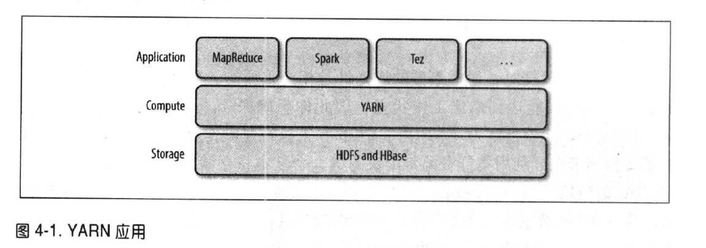

​	一些分布式计算框架（ MapReduce， Spark 等等 ）作为 YARN 应用运行在集群计算层（ YARN ）和集群存储层（ HDFS 和 Hbase ）上。

​	还有一层应用是建立在图 4-1 所示的框架之上。如 Pig ， Hive 和 Crunch 都是运行在 MapReduce ， Spark 或 Tez （或三个都可）之上的处理框架，它们不和 YARN 直接打交道。

## 4.1 剖析 YARN 应用运行机制

​	YARN 通过两类长期运行的守护进程提供自己的核心服务：管理集群上资源使用的资源管理器、运行在集群中所有节点上且能够启动和监控容器的节点管理器。容器用于执行特定应用程序的进程，每个容器都有资源限制。一个容器可以是一个 Unix 进程，也可以是一个 Linux cgroup ， 取决于 YARN 的配置。

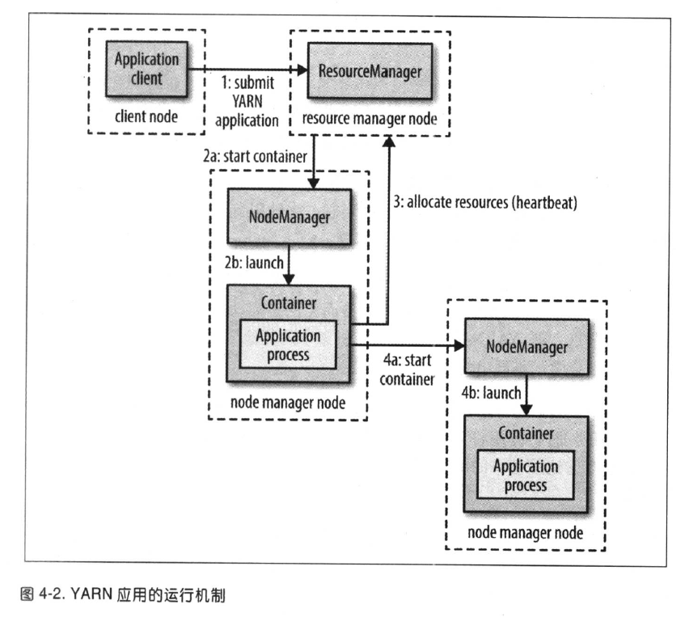

​	为了在 YARN 上运行一个应用，首先，客户端联系资源管理器，要求运行一个 application master 进程（图4-2中的步骤1）。然后，资源管理器找到一个能够在容器中启动 application master 的节点管理器（步骤2a和2b）。准确地说， application master 一旦运行起来后能够做什么取决于应用本身。有可能是在所处的容器中简单地运行一个计算，并将结果返回给客户端；或是向资源管理器请求更多的容器（步骤3）。以用于运行一个分布式计算（步骤4a和步骤4b）。后者是 MapReduce YARN 应用所做的事情。

## 4.3 YARN 中的调度

​	YARN 调度器的工作就是根据既定策略为应用分配资源。

### 4.3.1 调度选项

​	YARN 中有三种调度器可用：FIFO 调度器、容量调度器和公平调度器。

​	在一个共享集群中，更适合使用容量调度器和公平调度器。这两种调度器都允许长时间运行的作业能及时完成，同时也允许正在进行较小临时查询的用户能够在合理时间内得到返回结果。

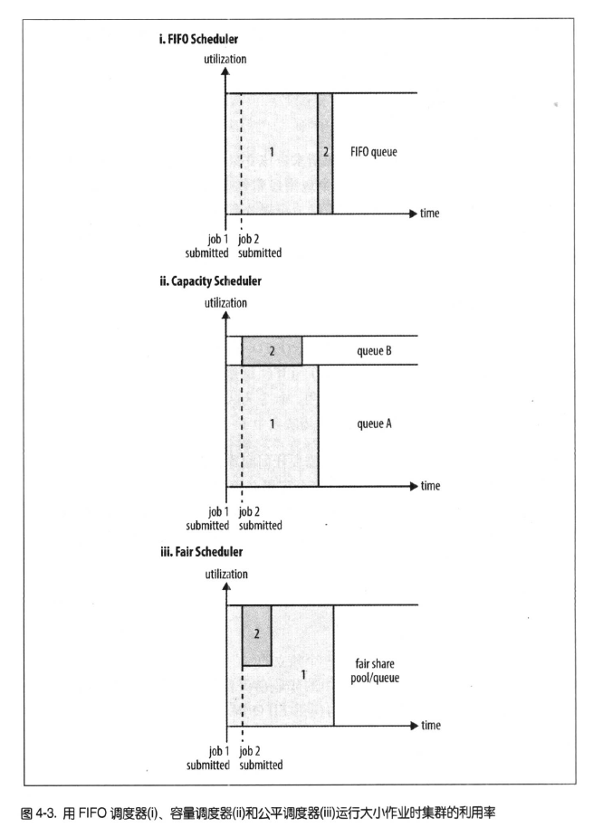

​	使用容量调度器时，一个独立的专门队列保证小作业一提交就可以启动，由于队列容量是为那个队列的作业保留的，因此这种策略是以整个集群的利用率为代价的。这意味着与使用 FIFO 调度相比，大作业执行的时间要长。

​	使用公平调度器时，不需要预留一定量的资源，因为调度器会在所有运行的作业之间动态平衡资源。第一个（大）作业启动时，它也是唯一运行的作业，因而获得集群中所有的资源。当第二个（小）作业启动时，它被分配到集群的一半资源，这样每个作业都能公平共享资源。

​	从第二个作业的启动到获得公平共享资源之间会有时间滞后，因为它必须等待第一个作业使用的容器用完并释放出资源。当小作业结束且不再申请资源后，大作业将会去再次使用全部的集群资源。最终的效果是，既得到了较高的集群利用率，又能保证小作业能及时完成。

### 4.3.3 公平调度器配置

​	**4. 抢占**

​	在一个繁忙的集群中，当作业被提交给一个空队列时，作业不会立即启动，直到集群上已经运行的作业释放了资源。作为使作业从提交到执行所需的时间可预测，公平调度器支持“抢占”功能。

​	所谓抢占，就是允许调度器终止哪些占用资源超过了其公平共享份额的队列的容器，这些容器资源释放后可以分配给资源数量低于应得份额的队列。抢占会降低整个集群的效率，因为被终止的 containers 需要重新执行。

​	通过将 yarn.scheduler.fair.preemption 设置为 true ，可以全面抵用抢占功能。有两个相关的抢占超时设置：一个用于最小共享（ minimum share preemption timout ），另一个用于公平共享（ fair share preemption timout ），两者设定时间均为秒级。默认情况下，两个超时均不设置。所以为了允许抢占容器，需要至少设置其中一个超时参数。

​	如果队列在 minimum share preemption timout 指定的时间内未获得被承诺的最小共享资源，调度器就会抢占其他容器。可以通过分配文件中的顶层元素 defaultMinSharePreemptionTimout 为所有队列设置默认的超时时间，还可以通过设置每个队列的 minSharePreemptionTimeout 元素来为单个队列指定超时时间。

​	类似，如果队列在  fair share preemption timout 指定的时间内获得的资源仍然低于其共享份额的一半，name调度器就会抢占其他容器。可以通过分配文件中的顶层元素 defaultFairSharePreemptionTimeout 为所有队列设置默认的超时时间，还可以通过设置每个队列的 fairSharePreemptionTimeout 元素来为单个对垒指定超时时间。通过设置 defaultFairSharePreemptionThreshold 和 fairSharePreemptionThreshold （针对每个队列）可以修改超时阈值，默认值是 0.5。

### 4.3.5 延迟调度

​	YARN 中的每个节点管理器周期性地（默认每秒一次）向资源管理器发送心跳请求。心跳中携带了节点管理器中正在运行的容器。新容器可用的资源等信息，这样对于一个计划运行一个容器的应用而言，每个心跳就是一个潜在的调度机会。

​	当使用延迟调度时，调度器不会简单地使用它接收的第一个调度机会，而是等待设定的最大数目的调度机会发生，然后才放松本地性限制并接收下一个调度机会。

​	对于容量调度器，可以通过设置 yarn.scheduler.capacity.node-locality-delay 来配置延迟调度。设置为正整数，表示调度器在放松节点限制、改为匹配同一机架上的其他节点前，准备错过的调度机会数量。

​	公平调度器也使用调度机会的数量来决定延迟时间，尽管是使用集群规模的比例来表示这个值。例如将 yarn.scheduler.fair.locality.threshold.node 设置为0.5，表示调度器在接受同一机架中的其他节点之前，将一直等待直到集群中的一半节点都已经给过调度机会。相关属性 yarn.scheduler.fair.locality.threshold.rack ，表示在接受另一个机架替代所申请的机架之前需要等待的时间阈值。

### 4.3.6 主导资源公平性

​	YARN 中调度器观察每个用户的主导资源，并将其作为对集群资源使用的一个度量。这个方法称为“主导资源公平性”（ Dominant Resource Fairness ， DRF ）。

​	假设一个总共有100个CPU和10TB的集群。应用 A 请求的每份容器资源为2个 CPU 和300 GB 内存，应用 B 请求的每份容器资源为6个 CPU 和100 GB 内存。 A 请求的资源在集群资源中占比分别为2%和3%，由于内存占比（3%）大于 CPU 占比（2%），所以内存是 A 的主导资源。同理， CPU 是 B 的主导资源。由于 B 申请的资源是 A 的两倍（ 6% vs 3% ），所以在公平调度下， B 将分到一半的容器数。

​	默认情况下不使用 DRF ，因此在资源计算期间，只需要考虑内存，不必考虑 CPU 。对容器调度器进行配置后，可以使用 DRF ，将 capacity-scheduler.xml 文件中的 org.apache.hadoop.yarn.util.resource.DominantResourceCalculator 设为 yarn.scheduler.capacity.resource-calculator 即可。

​	公平调度器若要使用 DRF ，通过将分配文件中的顶层元素 defaultQueueSchedulingPolicy 设置为 drf 即可。

# 5 Hadoop 的 I/O 操作

## 5.1 数据完整性

​	尽管磁盘或网络上的每个 I/O 操作不太可能将错误引入自己正在读/写的数据中，但是如果系统中需要处理的数据量大到 Hadoop 的处理极限时，数据被损坏的概率还是很高的。

​	检测数据是否损坏的常见措施是，在数据第一次引入系统时计算校验和并在数据通过一个不可靠的通道时再次计算校验和，这样就能发现数据是否损坏。校验和也是可能损坏的，不知是数据，但由于校验和比数据小得多，所以损坏的可能性非常小。

### 5.1.1 HDFS 的数据完整性

​	HDFS 会对写入的所有数据计算校验和，并在读取数据时验证校验和。它针对每个由 dfs.bytes-per-checksum 指定字节的数据计算校验和。默认情况下为 512 个字节，由于 CRC-32 校验和是4个字节，所以存储校验和的额外开销低于1%。

### 5.1.2 LocalFileSystem

​	Hadoop 的 LocalFileSystem 执行客户端的校验和验证。当写入一个名为 filename 的文件时，文件系统客户端会明确在包含每个文件块校验和的同一个目录内新建一个 .filename.crc 隐藏文件。文件块的大小由属性 file.bytes-per-checksum 控制，默认512个字节。文件块的大小作为元数据存储在 .crc 文件中，所以即使文件块大小的设置已经发生变化，仍然可以正确读回文件。在读取文件时需要验证校验和，并且如果检测到错误， LocalFileSystem 还会抛出一个 ChecksumException 异常。

​	我们也可以禁用校验和计算，特别是在底层文件系统本身就支持校验和的时候。在这种情况下，使用 RawLocalFileSystem 替代 LocalFileSystem 。要想在一个应用中实现全局校验和验证，需要将 fs.file.impl 属性设置为 org.apache.hadoop.fs.RawLocalFileSystem 进而实现对文件 URI 的重新映射。

### 5.1.3 ChecksumFileSystem

​	ChecksumFileSystem 类有一些与校验和有关的有用方法，比如 getChecksumFile() 可以获取任意一个文件的校验和文件路径。

​	如果 ChecksumFileSystem 类在读取文件时检测到错误，会调用自己的 reportChecksumFailure() 方法。默认实现为空方法，但 LocalFileSystem 类会将这个出错的文件及其校验和移到同一存储设备上一个名为 *bad_files* 的编辑文件夹中。管理员应该定期检查这些坏文件并采取相应的行动。

## 5.2 压缩

​	与 Hadoop 结合使用的常见压缩方法，都提供9个不同的选项来控制压缩时必须考虑的权衡；选项 -1 为优化压缩速度， -9 为优化压缩空间。例如，下述命令通过最快的压缩方法创建一个名为 file.gz 的压缩文件：

``` bash
%gzip -1 file
```

### 5.2.1 codec

​	Codec 是压缩-解压缩算法的一种实现。在 Hadoop 中，一个对 CompressionCodec 接口实现代表一个 codec 。例如， GzipCodec 包装了 gzip 的压缩和解压缩算法。

​	**1.通过 CompressionCodec 对数据流进行压缩和解压缩**

​	CompressionCodec 包含两个函数，可以轻松用于压缩和解压缩数据。如果要对写入输出数据流的数据进行压缩，可以 createOutputStream （ OutputStream out ）方法在底层的数据流中对需要以压缩格式写入在此前上位压缩的数据新建一个 CompressionOutputStream 对象。相反，对输入数据流中读取的数据进行解压缩的时候，则调用 createInputStream （ InputStream in ）获取 CompressionInputStream ，可以通过该方法从底层数据流读取解压缩后的数据。

​	**2.通过 CompressionCodecFactory 推断 CompressionCodec**

​	CompressionCodecFactory 提供了 getCodec() 方法，可以将文件扩展名映射到一个 CompressionCodec 的方法，该方法取文件的 Path 对象作为参数。

​	**3.原生类库**

​	为了提高性能，最好使用“原生”类库来实现压缩和解压缩。

​	**4.CodePool**

​	如果使用的是原生代码库并且需要在应用中执行大量压缩和解压缩操作，可以考虑使用 CodecPool ，它支持反复使用压缩和解压缩，以分摊创建这些对象的开销。

### 5.2.2 压缩和输入分片

​	因为 gzip 不支持文件切分，无法实现从 gzip 压缩数据流的任意位置读取数据，所以无法让 map 任务独立于其他任务进行数据读取。

​	在这种情况下， MapReduce 会采用正确的做法，它不会尝试切分 gzip 压缩文件。这牺牲了数据的本地性：一个 map 任务处理8个 HDFS 块，而其中大多数块并没有存贮在执行该 map 任务的节点上。而且， map 任务越少，作业的粒度就越大，因而运行的时间可能会更长。

## 5.3 序列化

### 5.3.1 Writable 接口

​	Writable 接口定义了两个方法：一个将其状态写入 DataOutput 二进制流，另一个从 DataInput 二进制流读取状态。

``` java
public interface Writable {
    void write(DataOutput var1) throws IOException;
    void readFields(DataInput var1) throws IOException;
}
```

### 5.3.2 Writable 类

​	**1、 Java 基本类型的 Writable 封装器**

​	Hadoop 自带的 org.apache.hadoop.io 包中有广泛的 Writable 类可供选择。

​	Writable 类对所有 Java 基本类型提供封装， char 类型除外（可以存储在 IntWritable 中）。所有的封装包含 get() 和 set() 两个方法用于读取或存储封装的值。

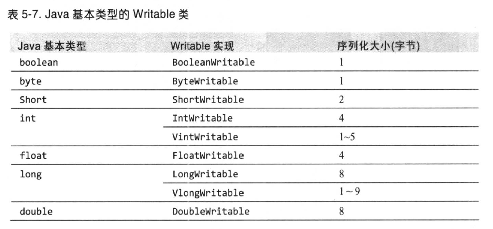

​	**2、Text 类型**

​	Text 类使用整型来存储字符串编码中所需的字节数，因此该最大值 2 GB。

​	**索引**：对 Text 类的索引是根据编码后字节序列中的位置实现的，并非字符串中的 Unicode 字符，也不是  Java char 的编码单元（如 String）。对于 ASCII 字符串，这三个索引位置的概念是一致的。

​	Text 类并不像 java.lang.String 类那样有丰富的字符串操作的 API 。在多数情况下，需要将 Text 对象转换成 String 对象。这一转换通常通过调用 toString() 方法实现。

​	**3、BytesWritable**

​	BytesWritable 是对二进制数据数组的封装。它的序列化格式为一个指定所含数据字节数的整数域（4字节），后跟数据内容本身。

​	BytesWritable 类的 getBytes() 方法返回的字节数组长度（容量）可能无法体现 BytesWritable 所存储数据的实际大小。可以通过 getLength() 方法来确定的 BytesWritable 的大小。

​	**4、NullWritable** 

​	NullWritable 是 Writable 是特殊类型，它的序列化长度为0。它并不从数据流中读取数据，也不写入数据。它充当占位符；例如，在 MapReduce 中，如果不需要使用键或值得序列化地址，就可以将键或值声明为 NullWritable ，这样可以高效存储常量空值。如果希望存储一系列数值，与键-值对相对， NullWritable 也可以用作在 SequenceFile 中的键。它是一个不可变的单实例类型，通过调用 NullWritable.get() 方法可以获取这个实例。

## 5.4 基于文件的数据结构

### 5.4.1 关于 SequenceFile

​	日志文件，其中每一行文本代表一条日志记录。纯稳步不适合记录二进制类型的数据。在这种情况下， Hadoop 的 SequenceFile 类非常合适，为二进制键-值对提供了一个持久数据结构。

​	SequenceFiles 也可以作为小文件的容器。 HDFS 和 MapReduce 是针对大文件优化的，所以通过 Sequence 类型将小文件包装起来，可以获得更高效率的存储和处理。

**1.通过命令行接口显示 SequenceFile**

​	hadoop fs 命令有一个 -text 选项可以以文本形式显示顺序文件。该选项可以查看文件的代码，由此检测出文本的类型并将其转换成相应的文本。该选项可以识别 gzip 压缩文件、顺序文件和 Avro 数据文件；否则，便假设输入为纯文本文件。

``` bash
% hadoop fs -text numbers.seq | head
```

**3.SequenceFile 的格式**

​	顺序文件由文件头和随后的一条或多条记录组成。顺序文件的前三个字节为 SEQ （顺序文件码），紧随其后的一个字节表示顺序文件的版本号。文件头还包括其他字段，例如键和值类的名称、数据压缩细节、用户定义的元数据以及同步标识。同步标识用于在读取文件时能够从任意位置开始识别记录边界。每个文件都有一个随机生成的同步标识，其值存储在文件头中。同步标识位于顺序文件中的记录与记录之间。同步标识的额外存储开销要求小于1%，所以没有必要再每条记录末尾添加该标识（特别是比较短的记录）。

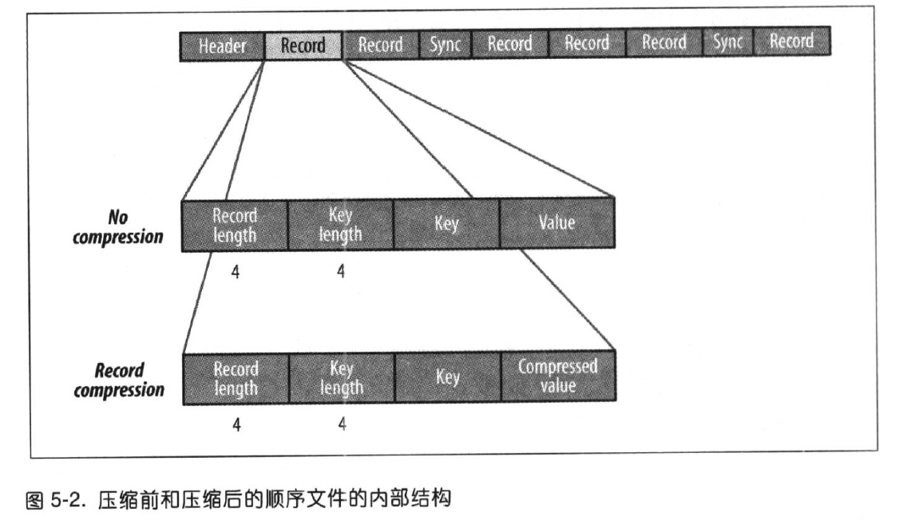

​	块压缩（ block compression ）是指一次性压缩多条记录，因为它可以利用记录间的相似性进行压缩，所以相较于单条记录压缩方法，该方法的压缩效率更高。可以不断向数据块中压缩记录，直到块的字节数不小于 io

.seqfile.compress.blocksize 属性中设置的字节数：默认为1 MB。每一个新块的开始处都需要插入同步标识。数据块的格式如下：首先是一个指示数据块中字节数的字段；紧接着是4个压缩字段（键长度、键、值长度和值）。

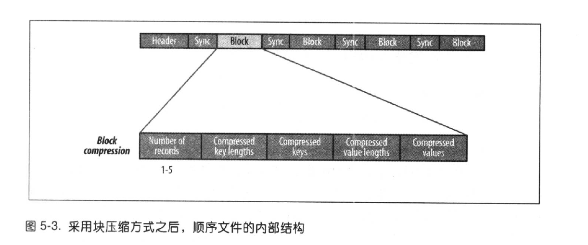

### 5.4.2 关于 MapFile

