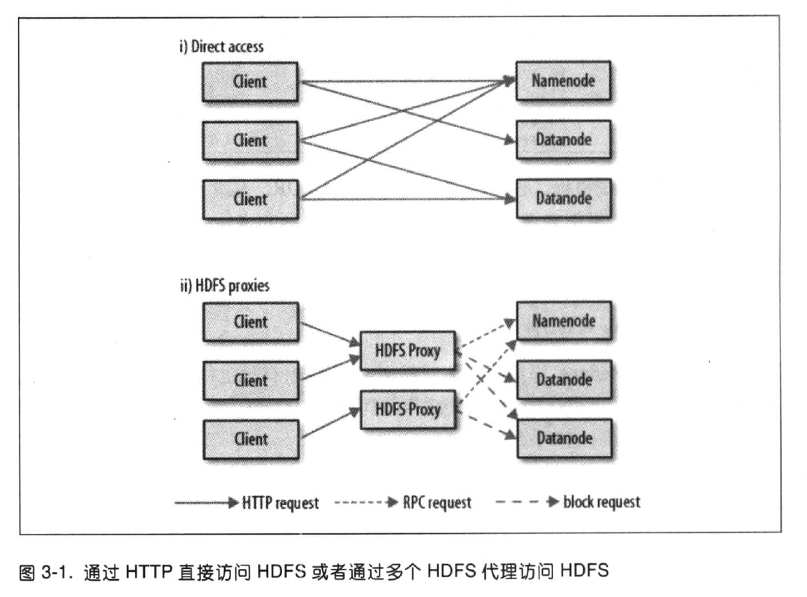

# 1 初始 Hadoop

## 1.4 不仅仅是批处理

​	许多处理模式能与 Hadoop 协同工作，如：

- **Interactive SQL （交互式 SQL）**

  利用 MapReduce 进行分发并使用一个分布式查询引擎，使得在 Hadoop 上获得 SQL 查询低延迟响应的同时还能保持对大数据集规模的可扩展性。

- **Iterative processing （迭代处理）**

  许多算法自身具有迭代性，因此和那种每次迭代都从硬盘加载的方式相比，这种在内存中保存每次中间结果集的方式更加高效。 MapReduce 的架构不允许这样，但如果使用 Spark 就会比较直接，它在使用数据集方面展现了一种高度探究的风格。

- **Stream processing（流处理）**

  流系统，例如 Storm， Spark Streaming 或 Samza 使得在无边界数据流上运行实时，分布式的计算，并向 Hadoop 存储系统或外部系统发布结果成为可能。

- **Search（搜索）**

  Solr 搜索平台能够在 Hadoop 集群上运行，当文档加入 HDFS 后就可以对其进行索引，并且根据 HDFS 中存储的索引为搜索查询提供服务。

## 1.5 相较于其他系统的优势

### 1.5.1 关系型数据库管理系统

​	如果数据库只更新一小部分记录，那么传统的 B 树（关系型数据库中使用的一种数据结构，受限于寻址的速率）就更有优势。但数据库如果有大量的数据更新时， B 树的效率就明显落后于 MapReduce ，因为需要使用“排序/合并”（sort/merge）来重建数据库。

​	在许多情况下，可以将 MapReduce 视为关系型数据库管理系统（RDBMS）的补充。 MapReduce 比较适合解决需要批处理方式分析整个数据集的问题，尤其一些特定目的的分析。 RDBMS 适用于索引后数据集的点查询（point query）和更新。 MapReduce 适合一次写入、多次读取数据的应用，关系型数据库则更适合持续更新的数据集。

|          | RDBMS          | MapReduce          |
| -------- | -------------- | ------------------ |
| 数据大小 | GB             | PB                 |
| 数据存取 | 交互式和批处理 | 批处理             |
| 更新     | 多次读/写      | 一次写入，多次读取 |
| 事务     | ACID           | 无                 |
| 结构     | 写时模式       | 读时模式           |
| 完成性   | 高             | 低                 |
| 横向拓展 | 非线性的       | 线性的             |

​	然而关系数据库和 Hadoop 系统之间的区别是模糊的。一方面，关系型数据已经开始吸收 Hadoop 的一些思想，另一方面，诸如 Hive 这样的 Hadoop 系统不仅变得更具交互性（通过从 Hadoop 中脱离出来），而且增加了索引和事务这样的特性，使其看上去更像传统的关系型数据库。

​	Hadoop 对非结构化或半结构化得数据非常有效，因为它是在处理数据时才对数据进行解释（即所谓的“读时模式”）。这种模式在提供灵活性的同时避免了 RDBMS 数据加载阶段带来的高开销，因为在 Hadoop 中仅仅是一个文件拷贝操作。

​	Hadoop 非常适合用于分析各种日志文件。注意，Hadoop 也能够做连接（join）操作，只不过这种操作并没有在关系型数据库中用的多。

​	MapReduce 以及 Hadoop 中其他的处理模型是可以随着数据规模线性伸缩的。对数据分区后，函数原语（如 map 和 reduce）能够在各个分区上并行工作。这意味着，如果输入的数据量是原来的两倍，那么作业的运行时间也需要两倍。但如果集群规模拓展为原来的两倍，那么作业的运行速度却却仍然与原来一样快。 SQL 查询一般不具备该特性。

### 1.5.2 网格计算

​	Hadoop 尽量在计算节点上存储数据。以实现数据的本地快速访问。数据本地化特性是 Hadoop 数据处理的核心，并因此获得良好的性能。意识到到网络带宽是数据中心环境中最珍贵的资源（到处复制数据很容易耗尽网络带宽）之后， Hadoop 通过显式网络拓扑结构来保留网络带宽。注意，这种排列方式并没有降低 Hadoop 对计算密集型数据进行分析的能力。

# 2 关于 MapReduce

### 2.3.1 map 和 reduce

​	MapReduce 任务过程分为两个处理阶段： map 阶段和 reduce 阶段。每个阶段都以键-值对作为输入和输出，其类型由开发人员来选择。

​	map 阶段输入的是原始数据。map 阶段只是一个数据准备阶段，通过这种方式准备数据，使 reduce 函数能够继续对它来进行处理。

### 2.3.2 Java MapReduce

``` java
public class MaxTemperatureMapper extends Mapper<LongWritable, Text, Text, IntWritable> {
    private static final int MISSING = 9999;

    @Override
    protected void map(LongWritable key, Text value, Context context) throws IOException, InterruptedException {
        String line = value.toString();
        String year = line.substring(15, 19);
        int airTemperature;
        if (line.charAt(87) == '+') {// parseInt doesn't like leading plus signs
            airTemperature = Integer.parseInt(line.substring(88, 92));
        } else {
            airTemperature = Integer.parseInt(line.substring(87, 92));
        }
        String quality = line.substring(92, 93);
        if (airTemperature != MISSING && quality.matches("01459]")) {
            context.write(new Text(year), new IntWritable(airTemperature));
        }
    }
}
```

​	Mapper 类是一个泛型类型，它有四个形参类型，分别制定 map 函数的输入键、输入值、输出键和输出值的类型。如上的例子，输入键是一个长整数偏移量，输入值是一行文本，输出键是年份，输出值是气温（整数）。 Hadoop 本身提供了一套可优化网络序列化传输的基本类型，而不是直接使用 Java 内嵌的类型。

​	map() 方法的输入时一个键和一个值。

​	map() 方法还提供 Context 实例用于输出内容的写入。

## 2.4 横向拓展

​	MapReduce 作业（ job ）是客户端需要执行的一个工作单元：它包括输入数据、 MapReduce 程序和配置信息。 Hadoop 将作业分成若干个任务（ task ）来执行，其中包括两类任务： map 任务 和 reduce 任务。这些任务运行在集群的节点上，并通过 YARN 进行调度。如果一个任务失败，它将在另一个不同的节点上自动调度运行。

​	Hadoop 将 MapReduce 的输入数据划分成等长的小数据块，称为输入分片（ input split ）或简称“分片”。 Hadoop 为每个分片构建一个 map 任务，并由该任务来运行用户自定义的 map 函数从何处理分片中的每条记录。

​	拥有许多分片，意味着处理每个分片所需要的时间少于处理整个输入数据所花的时间。因此，如果我们并行处理每个分片，且每个分片数据比较小，那么整个处理过程将获得更好的负载均衡。

​	另一方面，如果分片切分得太小，那么管理分片的总时间和构建 map 任务的总时间将决定作业的整个执行时间。对于大多数作业来说，一个合理的分片大小趋向于 HDFS 的一个块的大小，默认是 128 MB，不过可以针对集群调整这个默认值（对所有新建的文件），或在每个文件创建时指定。

​	Hadoop 在存储有输入数据（ HDFS 中的数据）的节点上运行 map 任务，可以获得最佳性能，因为它无需使用宝贵的集群带宽资源。这就是所谓的”数据本地化优化“。有时候对于一个 map 任务的输入分片来说，存储该分片的  HDFS 数据块复本的所有节点可能正在运行其他 map 任务，此时作业调度需要从某一数据块所在的机架中的一个节点上寻找一个空闲的 map 槽（slot）来运行该 map 任务分片。仅仅在非常偶然的情况下，会使用其他机架中的节点运行该 map 任务，这将导致机架与机架之间的网络传输。如图展示了这三种可能。


​	reduce 任务并不具备数据本地化的优势，单个 reduce 任务的输入通常来自所有 mapper 的输出。

​	一个 reduce 任务的完整数据流如下图所示。虚线框表示节点，虚线箭头表示节点内部的数据传输，而实现表示不同节点的数据传输。

​	每个 map 任务就会针对输出进行分区，即为每个 reduce 任务创建一个分区。分区可由用户定义的分区函数控制，但通常默认的 partitioner 通过哈希函数来分区，很高效。


​	一般情况下，多个 reduce 任务的数据流如下图所示。该图清楚地说明了为什么 map 任务和 reduce 任务之间的数据流称为 shuffle（混洗），因为每个 reduce 任务的输入都来自许多 map 任务。


​	当数据处理可以完全并行（即无需混洗时），可能会出现无 reduce 任务的情况。这种情况下，唯一的非本地节点数据传输是 map 任务将结果写入 HDFS。


### 2.4.2 combiner 函数

​	Hadoop 允许用户针对 map 任务的输出指定一个 combiner（就像 mapper 和 reducer 一样）， combiner 函数的输出作为 reduce 函数的输入。由于 combiner 属于优化方案，所以 Hadoop 无法确定要对一个指定的 map 任务输出记录调用多少次 combiner （如果需要）。

​	combiner 函数不能取代 reduce 函数。我们仍然需要 reduce 函数来处理不同 map 输出中具有相同键的记录。但 combiner 函数能帮助减少 mapper 和 reducer 之间的数据传输量。

# 3 Hadoop 分布式文件系统

## 3.1 HDFS 的设计

​	HDFS 以流式数据访问模式来存储超大文件，运行与商用硬件集群上。

- **超大文件**：在这里指具有几百 MB、几百 GB 甚至几百 TB 大小的文件。
- **流式数据访问**： HDFS 的构建思路是一次写入，多次读取时最高效的访问方式。数据集通常由数据源生成或从数据源复制而来。
- **低时间延迟的数据访问**：要求低时间延迟数据访问的应用，不适合在 HDFS 上运行。对于低延迟的访问需求， HBase 是更好的选择。
- **大量的小文件**：由于 namenode 将文件系统的元数据存储在内存中，因此该文件系统所能存储的文件总数受限于 namenode 的内存容量。
- **多用户写入，任意修改文件**： HDFS 中的文件写入支持单个写入者，而且写操作总是以“只添加”方式在文件末尾写数据。它不支持多个写入者的操作，也不不支持在文件的任意位置进行修改。可能以后会支持这些操作。

## 3.2 HDFS 的概念

### 3.2.1 数据块

​	HDFS 的块，默认为 128 MB。 HDFS 中小于一个块大小的文件不会占据整个块的空间（例如，当一个 1 MB 的文件存储在一个 128 MB 的块中，文件只使用 1 MB 的磁盘空间，而不是 128 MB）。

> HDFS 的块比磁盘的块大，其目的是为了最小化寻址开销。如果块足够大，从磁盘传输数据的时间会明显大于定位这个块开始位置所需的时间。

​	对分布式文件系统中的块进行抽象有很多好处。

​	一、一个文件的大小可以大于网络中任意一个磁盘的容量。文件的所有块并不需要存储在同一个磁盘上，因此它们可以利用集群上的任意一个磁盘进行存储。

​	二、使用抽象块而非整个文件作为存储单元，大大简化了存储子系统的设计。

​	不仅如此，块还非常适用于数据备份而提供数据容错能力和提高可用性。

### 3.2.2 namenode 和 datanode

​	HDFS 集群有两类节点以“管理节点-工作节点”模式运行，即一个 namenode （管理节点）和多个 datanode  （工作节点）。 namenode 管理文件系统的命名空间。它维护着文件系统树即整棵树内所有的文件和目录。这些信息以两个文件形式永久保存在本地磁盘上：命名空间镜像文件和编辑日志文件。 namenode 也记录着每个文件中各个块所在的数据节点信息，但它并不永久保存块的位置信息，因为这些信息会在系统启动时根据数据节点信息重建。

​	 datanode 是文件系统的工作节点。它们根据需要存储并检索数据块（受客户端或 namenode 调度），并且定期向 namenode 发送它们所存储的块的列表。

​	没有 namenode ，文件系统无法使用。如果运行 namenode 服务的机器损坏，文件系统上所有的文件将丢失，因为无法根据 datanode 的块重建文件。对 namenode 实现容错非常重要， Hadoop 为此提供两种机制。

​	第一种机制，备份那些组成文件系统元数据持久状态的文件。 Hadoop 可以通过配置使 namenode 在多个文件系统上保存元数据的持久状态。这些写操作时实时同步的，并且是原子操作。一般的配置是，将持久状态写入本地磁盘的同时，写入一个远程挂载的网络文件系统（ NFS ）。

​	另一种机制，运行一个辅助 namenode，但它不能被用作 namenode 。这个辅助 namenode 的重要作用是定期合并编辑日志与命名空间镜像，以防止编辑日志过大。这个辅助 namenode 一般在另一台单独的物理计算机上运行，因为它需要占用大量的 CPU 时间，并且需要与 namenode 一样多的内存来执行合并操作。它会保存合并后的命名空间镜像的副本，并在 namenode 发生故障时启用。但是，辅助 namenode 保存的状态总是滞后于主节点，所以在主节点全部失效时，难免会丢失部分数据。在这种情况下，一般把存储在 NFS 上的 namenode 元数据复制到辅助 namenode 并作为新的主 namenode 运行。

### 3.2.3 块缓存

​	通常 datanode 从磁盘中读取块，但对于访问频繁的文件，其对应的块可能被显式地缓存在 datanode 的内存中，以堆外块缓存（ off-heap block cache ）的形式存在。默认情况下，一个块仅缓存在一个 datanode 的内存中，当然可以针对每个文件配置 datanode 的数量。作业调度器（用于 MapReduce  、 Spark 和其他框架的）通过在缓存块的 datanode 上运行任务，可以利用块缓存的优势提高读操作的性能。例如，连接（ join ）操作中使用的一个小的查询表就是块缓存的一个很好的候选。

​	用户或应用通过在缓存池中增加一个 cache directive 来告诉 namenode 需要缓存哪些文件及存多久。缓存池是一个用于管理缓存权限的资源使用的管理性分组。

### 3.2.4 联邦 HDFS

​	在 2.x 发行版本系列中引入的联邦 HDFS 允许系统通过添加 namenode 实现拓展，其中每个 namenode 管理文件系统命名空间中的一部分。例如，一个 namenode 可能管理 /user 目录下的所有文件，而另一个 namenode 可能管理 /share 目录下的所有文件。

​	在联邦环境下，每个 namenode 维护一个命名空间卷（ namespace volume ），由命名空间的元数据和一个数据块池（ block pool ）组成，数据块池包含该命名空间下文件的所有数据块。命名空间卷之间是相互的，两两之间并不相互通信，甚至其中一个 namenode 的失效也不会影响其他 namenode 维护的命名空间的可用性。数据块池不再进行切分，因此集群中的 datanode 需要注册到每个 namenode ，并且存储着来自多个数据块池的数据块。

​	要想访问联邦 HDFS 集群，客户端需要使用客户端挂载数据表将文件路径映射到 namenode。该功能可以通过 ViewFileSystem 和 viewfs://URI 进行配置和管理。

### 3.2.5 HDFS 的高可用性

​	想从一个失效的 namenode 恢复，系统管理员得启动一个拥有文件系统元数据副本的新的 namenode ，并配置 datanode 和客户端以便使用这个新的 namenode。新的 namenode 直到满足以下情形才能响应任务：

1. 将命名空间的映像导入内存中；

2. 重演编辑日志；

3. 接收足够多的来自 datanode 的数据块报告并退出安全模式。

​	Hadoop2 针对上述问题增加了对 HDFS 高可用性（ HA ）的支持。在这一实现中，配置了一对活动-备用（ active-standby ） namenode 。当活动 namenode 失效，备用 namenode 就会接管它的任务并开始服务于来自客户端的请求，并不会有任何明显中断。实现这一目标需要在架构上做如下修改。

- namenode 之间需要通过高可用共享存储实现编辑日志的共享。当备用 namenode 接管工作之后，它将通读共享日志直至末尾，以实现与活动 namenode 的状态同步，并继续读取由活动 namenode 写入新条目。

- datanode 需要同时向两个 namenode 发送数据块处理报告，因为数据块的映射信息存储在 namenode 的内存中，而非磁盘。

- 客户端需要使用特定的机制来处理 namenode 失效问题，这一机制对用户是透明的。

- 辅助 namenode 的角色被备用 namenode 所包含，备用 namenode 为活动的 namenode 命名空间设置周期性检查点。

​	可以从两种高可用性共享存储做出选择： NFS 过滤器或集群日志管理器（ QJM ， quorum journal manager ）。 QJM 是一个专门的 HDFS 实现，为提供一个高可用的编辑日志而设计。 QJM 以一组日志节点（ journal node ）的形式运行，每一次编辑必须写入多数日志节点。 QJM 的实现并没有使用 ZooKeeper 。 HDFS HA 在选取活动的 namenode 时确实使用 ZooKeeper 技术。

​	在活动 namenode 失效后，备用 namenode 能够快速（几十秒的时间）实现任务接管，因为最新的状态存储在内存中：包括最新的编辑日志条目和最新的数据块映射信息。

​	**故障切换与规避**

​	在非平稳故障转移的情况下，无法确切直到失效 namenode 是否已经停止运行。例如，在网速非常慢或者网络被分割的情况下，同样也能激发故障转移，但是先前的活动 namenode 依然运行着并且依旧是活动 namenode 。高可用实现做了更进一步的优化，以确保先前活动的 namenode 不会执行危害系统并导致系统崩溃的操作，该方法称为“规避”。

​	客户端的故障转移通过客户端类库实现透明处理。最简单的实现是通过客户端的配置文件实现故障转移的控制。 HDFS URI 使用一个逻辑主机名，该主机名映射到一对 namenode 地址，客户端类库会访问每一个 namenode 地址直至处理完成。

## 3.3 命令行接口

​	**文件系统的基本操作**

``` bash
$ hadoop fs -copyFromLocal input/docs/quangle.txt \ hdfs://localhost/user/tom/quangle.txt
```
## 3.4 Hadoop 文件系统

​	Hadoop 有一个抽象的文件系统概念， HDFS 只是其中的一个实现。 Java 抽象类 org.apache.hadoop.fs.FileSystem 定义了 Hadoop 中一个文件系统的客户端接口，并且该抽象类有几个具体实现。

​	

​	Hadoop 对文件系统提供了许多接口，它一般使用 URI 方案来选取合适的文件系统实例进行交互。

​	**接口**

​	Hadoop 是用 Java 写的，通过 Java API 可以调用大部分 Hadoop 文件系统的交互操作。

​	**1、HTTP**

​	由 WebHDFS 协议提供的 HTTP REST API 则使得其他语言开发的应用能够更方便地与 HDFS 交互。HTTP 接口比原生的 Java 客户端要慢，所以不到万不得已，尽量不要用它来传输大数据。

​	通过 HTTP 来访问 HDFS 有两种方法：直接访问， HDFS 守护进程直接服务于来自客户端的 HTTP 请求；通过代理（一个或多个）访问，客户端通常使用 DistributedFileSystem API 访问 HDFS 。如图所示。



​	第一种情况下， namenode 和 datanode 内嵌的 web 服务器作为 WebHDFS 的端节点运行。（由于 dfs.webhdfs.enabled 被设置为 true ， WebHDFS 默认是启用状态。）文件元数据操作由 namenode 管理，文件读（写）操作首先被发往 namenode ，由 namenode 发送一个 HTTP 重定向至某个客户端，指示以流方式传输文件数据的目的或源 datanode 。

​	第二种方法，（由于代理服务是无状态的，因此可以运行在标准的负载均衡器之后。）所有到集群的网络通信都需要经过代理，因此客户端不能直接访问namenode 或 datanode 。通常情况下，都使用代理服务器，实现在不同数据中心部署的 Hadoop 集群之间的数据传输，或从外部网络访问云端进行的 Hadoop 集群。

​	HttpFS 代理提供和 WebHDFS 相同的 HTTP （和 HTTPS ）接口，这样客户端能够通过 webhdfs （ swebhdfs ） URI 访问这两类接口。 HttpFS 代理的启动独立于 namenode 和 datanode 的守护进程，使用 httpfs.sh 脚本，默认在一个不同的端口上监听（端口号 14000）。

### 3.5.2 通过 FileSystem API 读取数据

​	Hadoop 文件系统中通过 Hadoop Path 对象（而非 java.io.File 对象，因为它的语义与本地文件系统联系太紧密）来代表文件。可以将路径视为一个 Hadoop 文件系统 URI ，如 hdfs://localhost/user/tom/quangle.txt 。

​	FileSystem 是一个通用的文件系统 API ，所以第一步是检索我们需要使用的文件系统实例，这里是 HDFS 。获取 FileSystem 实例有下面几个静态工厂方法：

```java
public static FileSystem get(Configuration conf) throws IOException
public static FileSystem get(URI uri, Configuration conf) throws IOException
public static FileSystem get(URI uri, Configuration conf, String user) throws IOException
```

​	Configuration 对象封装了客户端或服务器的配置，通过设置配置文件读取类路径来实现（如 etc/hadoop/core-site.xml ）。第一种方法返回的是默认文件系统（在 core-site.xml 中指定的，如果没有指定，则使用默认的本地文件系统）。第二个方法通过给定的 URI 方案和权限来确定要使用的文件系统，如果给定 URI 中没有指定方案，则返回默认文件系统。第三，作为给定用户来访问文件系统，对安全来说至关重要。

​	在某些情况下，可能希望获取本地文件系统的运行实例，此时可以使用 getLocal() 方法获取。

```java
public static LocalFileSystem getLocal(Configuration conf) throws IOException
```

​	有了 FileSystem 实例之后，调用 open() 方法来获取文件的输入流。

```java
public FSDataInputStream open(Path f) throws IOException
public abstract FSDataInputStream open(Path f, int bufferSize) throws IOException
```

​	第一个默认方法使用默认的缓冲区大小 4 KB 。

### 3.5.3 写入数据

​	FileSystem 类有一系列新建文件的方法。最简单的方法是给准备键的文件指定一个 Path 对象，然后返回一个用于写入数据的输出流：

```java
public FSDataOutputStream create(Path f) throws IOException
```

​	另一种新建文件的方法是使用 append() 方法在一个现有文件末尾追加数据。

```java
public FSDataOutputStream append(Path f) throws IOException
```

​	这样的追加操作允许一个 writer 打开文件后在访问该文件的最后偏移量处追加数据。该追加操作时可选的，并非所有 Hadoop 文件系统都实现了该操作。例如， HDFS 支持追加，但 S3 文件系统就不支持。