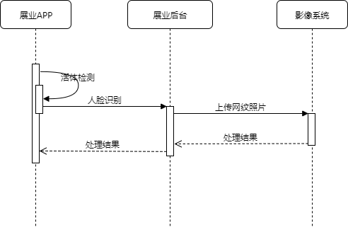

# 远程面签流程

-------------------

## 相关接口


## 下发任务


&emsp;&emsp;核心调用FaceSignHessianService.acceptTask(FaceSignTaskDTO faceSignTaskDTO)接口下发面签任务。面签任务保存至fs_task表。展业APP调用[CEIS_J010](http://172.30.3.61:8092/dashboard/#!/project/GYHIpjXBK)接口获取客户经理（fs_task表manager_id字段）为登录用户的面签任务列表。

### 代码
``` java
public interface FaceSignHessianService {
    void acceptTask(FaceSignTaskDTO faceSignTaskDTO);
}
```
## 任务处理


&emsp;&emsp;进入面签处理界面，展业APP调用[CEIS_J021](http://172.30.3.61:8092/dashboard/#!/project/GYHIpjXBK)接口获取面签任务状态。可判断“现调上传”等附属任务完成情况。
注：展业APP仅处理云贷非直批及云测任务。云贷非直批不需要“客户核身”及“信息录入”。


### 附属任务：
####1、现调上传：

&emsp;&emsp;进入“现调上传”处理界面。展业APP调用[CEIS_J011](http://172.30.3.61:8092/dashboard/#!/project/GYHIpjXBK)接口，获取现调任务详情。点击“住宅情况”或“经营场所情况”，进行定位、信息填写及图片上传操作。填写完相关信息、上传完现调图片后，保存现调信息，展业后台生成报告并携带现调图片及相关信息送至核心系统。
&emsp;&emsp;在“定位”、“上传现调照片”操作之间根据核心系统的“现调监控范围”，判断是否需要接入视频见证。如“现调监控范围”为“家庭和单位”，则核心系统的“视频反馈”展示两次视频见证的展业PC端备注信息。

####2、客户核身：

&emsp;&emsp;展业APP调用第三方活体检测接口，截取人脸照片送至展业后台。展业后台将用户基本信息及人脸照片发送给第三方，以获取网纹照片。若成功获取网纹照片，则将网纹照片发送至影像系统进行保存。若第三方返回网纹照片与人脸照片的对比分数大于系统设定分数，则通过客户核身环节，反之，未通过。核身结果返回至展业APP。
&emsp;&emsp;注：云贷非直批任务：由于已经在云贷APP完成了客户核身，所以不需要在展业APP再次进行客户核身。

####3、视频见证：

&emsp;&emsp;展业APP进行视频见证时调用[CEIS_J023](http://172.30.3.61:8092/dashboard/#!/project/GYHIpjXBK)接口获取AnyChat签名（展业PC登录时获取），进入AnyChat视频队列。当展业PC获取该视频任务时，调用[CEIS_J013](http://172.30.3.61:8092/dashboard/#!/project/GYHIpjXBK)接口获取客户基本信息，当接受该视频任务时，向展业APP发起视频。
&emsp;&emsp;接通视频后，展业PC调用[CEIS_J013](http://172.30.3.61:8092/dashboard/#!/project/GYHIpjXBK)接口将视频任务锁定，并调用相关接口获取所需信息（借款人申请信息[CEIS_J014](http://172.30.3.61:8092/dashboard/#!/project/GYHIpjXBK)、现调照片[CEIS_J015](http://172.30.3.61:8092/dashboard/#!/project/GYHIpjXBK)、网纹照片[CEIS_J020](http://172.30.3.61:8092/dashboard/#!/project/GYHIpjXBK)）进行展示。提交（或放回）任务前，进行云端拍照图片上传（[CEIS_J006](http://172.30.3.61:8092/dashboard/#!/project/GYHIpjXBK)）。
&emsp;&emsp;注：云贷直批任务由云贷APP发起，展业PC直接提交至核心系统。

####4、信息录入：

进入相关信息录入界面，展业APP首先通过展业后台获取相关信息进行回显。用户修改后，进行“下一步”提交修改信息。
注：云贷非直批任务，由于已经在云贷APP完成了相关信息的填写，所以不需要在展业APP再次进行信息录入。
