[TOC]

# 批处理编程之美
&nbsp;&nbsp;Spring Batch 将批处理程序分解为 Job 和 JobStep 两个部分。
&nbsp;&nbsp;将异常处理机制归结为跳过、重试、重启是三种类型。将作业方式区分为多线程、并行、远程、分区四大特征。

# SpringBatch 简介
## 1.2 SpringBatch
&nbsp;&nbsp;Spring Batch 是一个批处理应用框架，不是调度框架。

&nbsp;&nbsp;Spring Batch 经典的三步走策略：
&nbsp;&nbsp;1. 数据读
&nbsp;&nbsp;2. 数据处理
&nbsp;&nbsp;3. 数据写

### 1.2.2 Spring Batch 架构
&nbsp;&nbsp;Spring Batch 核心架构分为三层：应用层、核心层、基础架构层。
- &nbsp;&nbsp;应用层：包含所有的批处理作业。
- &nbsp;&nbsp;核心层：包含 Spring Batch 启动和控制所需的核心类，如：JobLauncher、Job和step等。
- &nbsp;&nbsp;基础架构层：提供通用的读（ItemReader）、写（ItemWriter）和服务处理（如：RetryTemplate：重视模板；RepeatTemplate：重复模板，也可以被应用层和核心层使用）。

### 1.3.7 健壮的批处理应用
- &nbsp;&nbsp;Spring Batch 框架支持作业的跳过、重试、重启能力，避免因错误导致导致批作业的异常的异常中断。
- &nbsp;&nbsp;跳过（Skip）：通常在发生非致命异常的情况下，应该不中断批处理应用。
- &nbsp;&nbsp;重试（Retry）：发生瞬态异常情况下，应该能够通过重试操作避免该类异常，保证批处理应用的连续性和稳定性。
- &nbsp;&nbsp;重启（Restart）：当批处理应用因错误发生错误号，应该能够在最后执行失败的地方重新启动 Job 实例。

### 1.3.8 易扩展的批处理应用
- &nbsp;&nbsp;Spring Batch 框架通过并发和并行技术实现应用的横向、纵向扩展机制，满足数据处理性能的需要。
- &nbsp;&nbsp;扩展机制包括：
- &nbsp;&nbsp;多线程执行一个 Step （Multithreaded step）。
- &nbsp;&nbsp;多项城并行执行多个 Step （Parallelizing step）。
- &nbsp;&nbsp;远程执行作业（Remote chunking）。
- &nbsp;&nbsp;分区执行（Partitioning Step）。

## 1.4 Spring Batch 2.0 新特性：
1. 支持 Java5
2. 非顺序的 Step 支持
3. 面向 Chunk 处理
4. 强化元数据访问
5. 增强扩展性
6. 可配置

### 1.4.5 扩展性
&nbsp;&nbsp;**远程分块：**
&nbsp;&nbsp;远程分块是一个把 Step 进行技术分割的工作，它不需要对处理数据的结构有明确了解。任何输入源能够使用单进程读取并在动态分割后作为“块”发送给远程的工作进程。远程进程实现了监听者模式。

&nbsp;&nbsp;**分区：**
&nbsp;&nbsp;分区需要对数据的结构有一定的了解。这种模式有点在于分区中的每一个元素的处理器都能够像一个普通的 Spring Batch 任务的单步一样运行。分区理论上比远程分块更有拓展性，因为分区并不存在从一个地方读取所有输入数据并进行序列化的瓶颈。

&nbsp;&nbsp;每个作业 Job 有1个或者多个作业步 Step；每个 Step 对应一个 ItemReader、ItemProcessor、ItemWriter。

# SpringBatch 基本概念
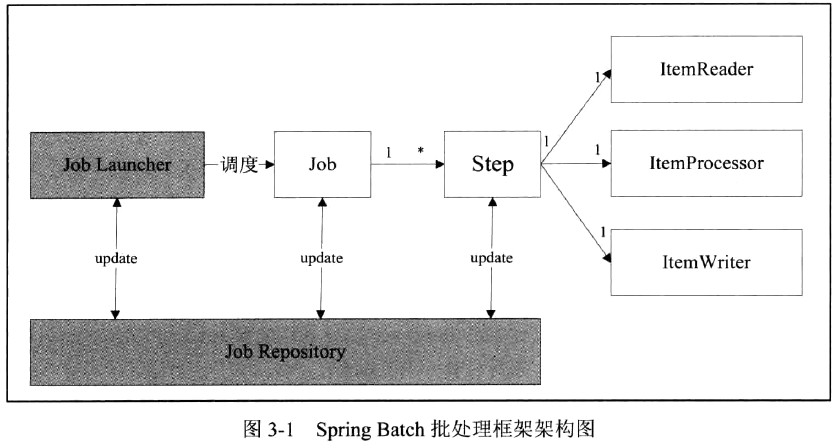
&nbsp;&nbsp;通过 Job Launcher 可以启动 Job，启动 Job 时需要从 JobRepository 获取存在的 Job Execution ；当前运行的 Job 及 Step 的结果和状态会保存在 JobRepository 中。

| 领域对象 | 描 述 |
|--------|--------|
|  Job Instance      | 作业。批处理中的核心概念，是 Batch 操作的基础单元      |

## 3.1 命名空间
## 3.2 Job
&nbsp;&nbsp;Job 执行的时候回生成一个 Job Instance（作业实例）， Job Instance 包含执行 Job 期间产生的数据以及 Job 执行的状态信息等； Job Instance 通过 Job Name（作业名称）和 Job Parameter（作业参数）来区分。
### 3.2.1 Job Instance
&nbsp;&nbsp;Job Instance （作业实例）是一个运行期的概念，Job 每执行一次都会涉及一个 Job Instance 。 Job Instacne 来源可能有两种：一种是根据 Job Parameters cong Job Repository

## 3.3 Step
&nbsp;&nbsp;Step 与 Job 的关系图。


&nbsp;&nbsp;Step 的执行过程是由 StepExecution 类的对象所表示的，包括每次执行所对应的 step、Job Execution、相关的事务操作、开始结束时间等。此外每次执行时还包含一个 ExecutionContext，用来存放开发者在批处理过程中所需要的任何信息，例如用来重启的静态数据与状态数据。

Job Repository 初始化脚本：schema-mysql.sql

## 3.5.4 数据库 Schema
&nbsp;&nbsp;Spring Batch 框架进行元数据管理共有九张表，其中三张表（后缀为 SEQ ）是用来分配主键的。
&nbsp;&nbsp;数据表描述及数据表关系如下：

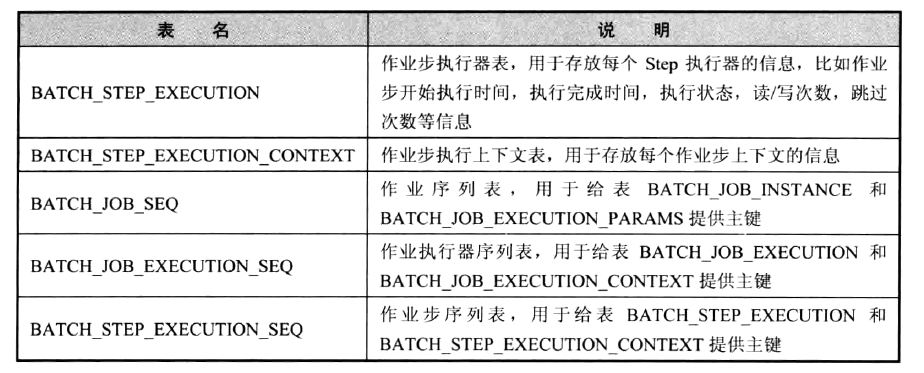
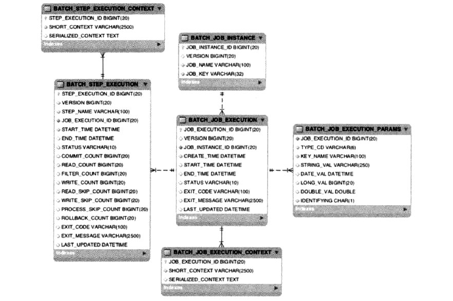

# 3.8 ItemProcessor


&nbsp;&nbsp;业务操作需要实现 ItemProcessor 接口，接口定义如下：
``` java
public interface ItemProcessor<I, O> {
	O process(I item) throws Exception;
}
```

&nbsp;&nbsp;process 方法中，参数 item 是 ItemReader 读取的数据，返回值 O 是交给 ItemWriter 写的数据，在 process 方法中可以修改读到的数据的值。如果返回值是 null ，表示忽略这次的数据。

### 4.1.4 Job 抽象与继承
&nbsp;&nbsp;Job 的抽象、继承与 Java 中的抽象、继承概念比较相似。父类不能被实例化、子可以继承父的所有特性，甚至可以覆写父中的特性。
### 4.2.1 Step Scope
&nbsp;&nbsp;Step Scope 是 Spring Batch 框架提供的自定义的 Scope ，将 Spring Bean 定义为 Step Score ，支持 Spring Bean 在 Step 开始的时候初始化，在 Step 结束的时候销毁 Spring Bean ，将 Spring Bean 的生命周期与 Step 绑定。

## 4.3 运行 Job
&nbsp;&nbsp;Spring Batch 框架提供一组执行 Job 的接口 API 。包括 JobLauncher 、 JobExploer 和 JobOperator 三个操作 Job 的接口 ，关系图如下。
&nbsp;&nbsp;JobLauncher 是常用的作业调度器，通过给定的 Job Name 和 Job Parameters 可以执行 Job。
&nbsp;&nbsp;JobExploer 主要负责从 JobRepository 中获取执行的信息。
&nbsp;&nbsp;JobOperator 包含了 JobLauncher 、 JobExploer 的大部分操作。
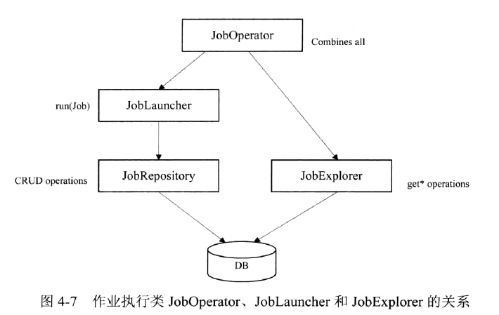

### 4.3.5 停止 Job
&nbsp;&nbsp;通过接口 org.springframework.batch.core.launch.JobOperator 中的 stop 方法来实现； stop 方法返回 boolean 值，表示当前终止消息是否发送成功， Spring Batch 框架决定什么时候终止。

#### 4.3.5.2 业务停止 Job
&nbsp;&nbsp;通过 JobOperator 可以在作业外部终止 Job 。 SpringBatch 框架同样提供了在作业步执行期间终止任务的能力。通过 StepExecution 中的 setTerminateOnyly 操作可以终止正在运行的任务。
&nbsp;&nbsp;StepExecution.setTerminateOnyly() 会发送一个停止消息给框架，一旦 SpringBatch 框架接收到停止消息，并且框架获取作业的控制权， SpringBatch 会自动终止作业。
&nbsp;&nbsp;在通过业务操作终止任务操作时，不要在读、处理、写的业务逻辑中终止任务，以尽量保证业务操作的完整性。 SpringBacth 框架提供了丰富的拦截器机制，可以在拦截器中执行任务的终止，例如在 ItemReaderListener 中的 beforeRead() 中终止任务。

## 5.1 配置 Step

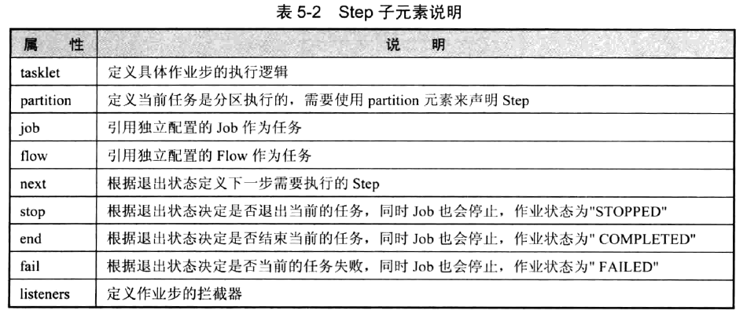
&nbsp;&nbsp;StepExecutionListener 默认实现


## 5.2 配置 Tasklet
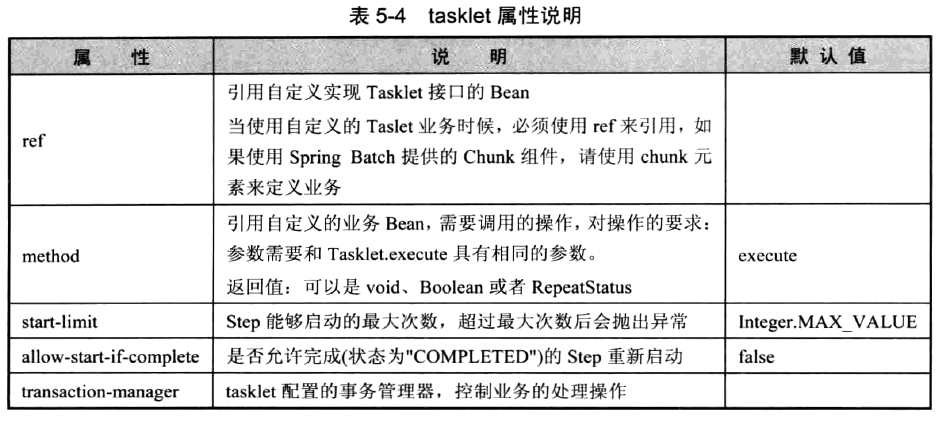


### 5.2.1 重启 Tasklet
&nbsp;&nbsp;**重启已完成的任务**
&nbsp;&nbsp;通过属性 allow-start-if-complete 设置允许已完成任务被重启。

### 5.2.2 事务
&nbsp;&nbsp;**事务属性**


### 5.2.3 事务回滚
&nbsp;&nbsp;SpringBatch 框架提供了发生特定异常不触发事务回滚的能力，可以在 tasklet 中通过子元素 no-rollback-exception-classes 来定义特定异常。

### 5.2.5 自定义 Tasklet
&nbsp;&nbsp;自定义的 Tasklet 需要实现 org.springframework.batch.core.step.tasklet.Tasklet 。需要实现 execute() 方法。
&nbsp;&nbsp;Tasklet 的默认实现。

&nbsp;&nbsp;例如通过 MethodInvokingTaskletAdapter 调用对象 jobRegistry 的 getJobNames 。
==引用自定义的业务 Bean ， 需要调用操作要求：参数需要和 Tasklet.execute 具有相同的参数；返回值可以是 void 、 Boolean 或者 RepeatStatus==
``` xml
    <job id="helloWorldServiceJob">
        <step id="helloWorldServiceStep">
           <tasklet ref="helloWorldService" method="hello">
			</tasklet>
        </step>
    </job>
    <bean:bean id="adapter"
		class="org.springframework.batch.core.step.tasklet.MethodInvokingTaskletAdapter">
		<bean:property name="targetObject" ref="jobRegistry" />
		<bean:property name="targetMethod" value="getJobNames" />
	</bean:bean>
```
## 5.3 配置 Chunk
### 5.3.2 异常跳过
&nbsp;&nbsp;当银行每天处理海量的对账文件，如果对账文件中有少量的一行或者几行错误格式的记录，在真正进行作业处理的时候，不希望因为几行错误的记录而导致整个作业的失败；而是希望将这几行没有处理的记录跳过去，让整个 Job 都正确执行，对于错误的记录则通过日志的方式记录下来后续进行单独的处理。
### 5.3.4 Chunk 完成策略
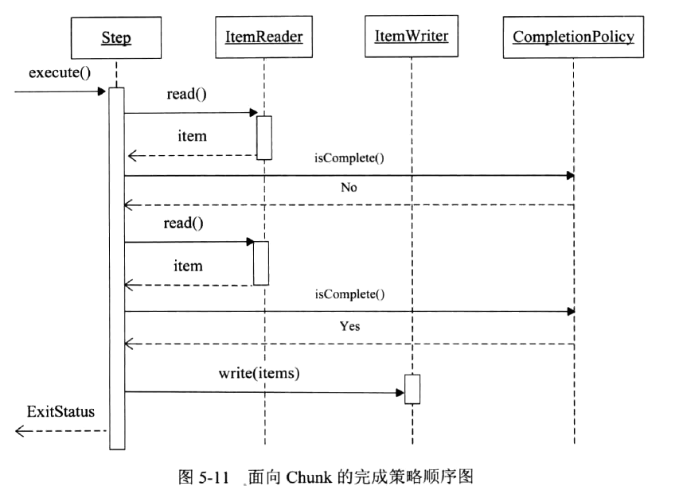
&nbsp;&nbsp;chunk-completion-policy 定义批处理完成策略，不是表示任务的完成策略， Chunk 执行期间是按照 Chunk 完成策略执行批量提交的，批量提交会执行一次写操作，同时将批处理的状态数据通过 JobRepository 持久化。
&nbsp;&nbsp;属性 chunk-completion-policy 和属性 commit-interval 不能同时存在；在 Chunk 中至少定义这两个其中的一个。
### 5.3.5 读、处理事务
&nbsp;&nbsp;**读事务队列**
&nbsp;&nbsp;reader-transactional-queue：为 true 时，表示从一个事务性的队列中读取数据，一旦发生异常会导致事务回滚，从队列中读取的数据同样会被重新放回到队列中。
&nbsp;&nbsp;**处理事务**
&nbsp;&nbsp;processor-transactional：为 true 时，表示在一次 Chunk 处理期间将 processor 处理的数据放在缓存中。
&nbsp;&nbsp;*如果将 reader-transactional-queue 设置为 true ，则 processor-transactional 必须设置为 true。*

## 5.4 拦截器
&nbsp;&nbsp;在使用 SpringBatch 的过程中，尽可能地保证业务的简单性，任何额外的处理需要在拦截中进行功能实现。
&nbsp;&nbsp;拦截器作用域：


# 读数据 ItemReader
### 6.1.2 ItemStream
&nbsp;&nbsp;ItemStream 接口定义了读操作与执行上下文 ExecutionContext 交互的能力。可以将已经读的条数通过该接口存放在执行 ExecutionContext 中（ ExecutionContext 中的数据在批处理 commit 的时候会通过 JobRepository 持久化到数据库中），这样到 Job 发生异常重新启动 Job 的时候，读操作可以跳过已经成功读过的数据，继续从上次出错的地点（可以从执行上下文中获取上次成功读的位置）开始读。

## 6.2 Flat 格式文件（跳过）
## 6.3 XML 格式文件（跳过）
&nbsp;&nbsp;SpringBatch 框架提供了 MultiResourceItemReader 支持对多文件的读取。


### 6.5.5 HibernatePagingItemReader

### 7.4.1 MultiResourceItemWriter
&nbsp;&nbsp;*MultiResourceItemWriter 中指定的 Resource 其父目录是必须存在的，否则运行期会报错。*
### 7.5.1 jdbcBatchItemWriter
&nbsp;&nbsp;jdbcBatchItemWriter 对用户屏蔽了数据库访问的操作细节，且提供了撇处理的特性， jdbcBatchItemWriter 会批量执行一组 SQL 语句来提高性能，而不是逐条执行 SQL 语句；每次批量提交的语句数和 Chunk 中定义的提交间隔是一致的。

## 7.7 组合写
&nbsp;&nbsp;Spring Bacth 框架提供了组合 ItemWriter（ CompositeItemWriter ）的模式满足将一个 Item 同时写入到多个不同的资源文件中。
## 7.8 Item 路由 Writer
&nbsp;&nbsp;Spring Batch 框架提供了支持 Item 路由写的组件 ClassifierCompositeItemWriter

## 7.9 发送邮件
### 7.9.1 SimpleMailMessageItemWriter

## 7.10 服务服用
&nbsp;&nbsp;Spring Batch 框架提供的 ItemWriterAdapter 、 PropertyExtractingItemWriter 可以方便地服用企业服务、 Spring Bean 、 EJB 或者其他远程服务。 PropertyExtractingItemWriter 代理的服务支持更复杂的参数，参数可以根据指定的属性从 Item 中抽取。


### 7.11.2
&nbsp;&nbsp;Spring Batch 框架提供的写组件 FlatFileItemWriter 、 MultiResourceItemWriter 、 StaxEventItemWriter 均实现了 ItemStream 接口。
&nbsp;&nbsp;ItemWriter 仅有部分的系统组件实现了 ItemStream 接口。因为通常情况下，如果写的资源本身是事务性操作的，比如数据库的写，对 JMS 消息的写等，如果发生错误之后，因为在事务上下文中会导致整个批量写入都不成功，下次 Job 重启的时候，会从失败点继续写入。因此本身具有事务性的写操作不需要实现 ItemStream 就可支持重启的特性，例如 JdbcBatchItemWriter 、 HibernateItemWriter 等。
&nbsp;&nbsp;如果写操作本身是有状态的，为了支持可重启的特性，必须实现 ItemStream ，例如 FlatFileItemWriter 、 StaxEventItemWriter 。

# 处理数据 ItemProcessor
### 8.1.2 系统处理组件


# 作业流 Step Flow
## 9.1 顺序Flow
&nbsp;&nbsp;定义示例：
``` xml
    <job id="sequentialJob" >
        <step id="step1" next="step2" >
            <tasklet ref="tasklet1" />
        </step>
        <step id="step2">
            <tasklet ref="tasklet2" />
        </step>
    </job>
```

## 9.2 条件Flow
&nbsp;&nbsp;定义示例：
``` xml
    <job id="conditionalJob" >
        <step id="step1" next="step2" >
            <tasklet ref="tasklet1" />
            <next on="*" to="step2" />
        	<next on="SKIPTOCLEAN" to="step3" />
        </step>
        <step id="step2">
            <tasklet ref="tasklet2" />
        </step>
		<step id="step3">
            <tasklet ref="tasklet3" />
        </step>
    </job>
```
&nbsp;&nbsp;属性 on 定义为“*”，表示当前作业步 step1 的退出状态非 SKIPTOCLEAN 的情况都会跳转到 step2 中。属性 on 定义为“SKIPTOCLEAN”，表示当前作业步 step1 的退出状态为 SKIPTOCLEAN 的情况都会跳转到 step3 中。

### 9.2.2 ExitStatus 和 BatchStatus
#### 9.2.2.1 BatchStatus （批处理状态）
&nbsp;&nbsp;用来记录 Job 或者 Step 的执行情况，在 Job 或者 Step 的重启中，批处理的状态起到了关键作用（ Job 或者 Step 的重启状态判断使用的就是 BatchStatus ）。
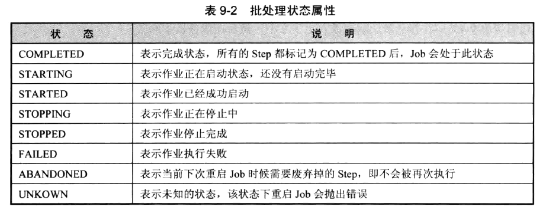
&nbsp;&nbsp;批处理状态在 Job 或者 Step 执行期间通过 Job 上下文或者 Step 上下文持久化到 DB 中，可以再打表 batch_job_execution 查看 Job 的批处理状态（字段 STATUS 表示该状态），在表 batch_step_execution 查看 Step 的批处理状态（字段 STATUS 表示该状态）。
#### 9.2.2.1 BatchStatus （执行后的状态）
&nbsp;&nbsp;退出状态表示 Step 或者 Job 执行后的状态，该状态值可以被修改，通常用于条件 Flow 中。可以通过拦截器 StepExecutionListener 的 afterStep() 操作来修改退出状态的值。
&nbsp;&nbsp;退出状态在 Job 或者 Step 执行期间通过 Job 上下文或者 Step 上下文持久化到 DB 中，可以再打表 batch_job_execution 查看 Job 的退出状态（字段 EXIT_CODE 表示该状态），在表 batch_step_execution 查看 Step 的退出状态（字段 EXIT_CODE 表示该状态）。

### 9.2.3 decision 条件
&nbsp;&nbsp;Spring Batch 框架提供了 decision 支持条件 Flow 。 decision 是 Job 的子元素，所有 decision 的实现必须实现接口 JobExecutionDecider 。

``` java
FlowExecutionStatus decide(JobExecution jobExecution, StepExecution stepExecution);
```
&nbsp;&nbsp;JobExecutionDecider 唯一的接口方法，用来决定如何跳转，参数是作业执行器和作业步执行器；返回值为 FlowExecutionStatus ，可以使用自带的枚举值，也可以自定义自己的 FlowExecutionStatus 。
&nbsp;&nbsp;如，退出状态为 NO FILE ：
``` java
	@Override
	public FlowExecutionStatus decide(JobExecution jobExecution, StepExecution stepExecution) {
		return new FlowExecutionStatus("NO FILE");
	}
```
``` xml
	<decision id="decision" decider="fileExistsDecider">
		<next on="NO FILE" to="cleanStep" />
	</decision>
```
## 9.3 并行 Flow
&nbsp;&nbsp;通过 split 元素可以定义并行的作业流。


```xml
    <job id="splitJob" >
        <split id="split" task-executor="taskExecutor" next="cleanStep">
            <flow>
                <step id="decompressStep" parent="abstractDecompressStep" next="verifyStep" >
            		<tasklet ref="decompressTasklet" />
        		</step>
        		<step id="verifyStep" next="readWrite_10Step">
            		<tasklet ref="verifyTasklet" />
        		</step>
        		<step id="readWrite_10Step" parent="parentReadWriteStep"/>
            </flow>
            <flow>
            	<step id="readWrite_11Step" parent="parentReadWriteStep"/>
            </flow>
        </split>
        <step id="cleanStep">
            <tasklet ref="cleanTasklet" />
        </step>
    </job>

    <bean:bean id="taskExecutor"
		class="org.springframework.scheduling.concurrent.ThreadPoolTaskExecutor">
		<bean:property name="corePoolSize" value="5"/>
		<bean:property name="maxPoolSize" value="15"/>
	</bean:bean>
```
&nbsp;&nbsp;属性 task-executor 用来定义执行多个 flow 时候使用的线程池。
&nbsp;&nbsp;split 内部的 flow 之间的是并行的，只有当 split 内部所有的 flow 执行完毕后，才会执行 next 属性指定的 Step 。
## 9.4 外部 Flow 定义
&nbsp;&nbsp;Spring Batch 框架提供了外部定义 Flow 的能力，通过在 Job外部定义 Flow 可以做到复用。框架本身提供了三种方式的 Flow 复用：
1. 作业引用外部 Flow ；
2. 作业步引用外部 Flow，称之为 FlowStep ；
3. 作业步引用外部定义的 Job ，称之为 JobStep ；
### 9.4.1 Flow
&nbsp;&nbsp;在 Job 中使用 flow 来配置作业。
```xml
    <job id="externalFlowJob" >
        <flow id="externalFlowJob.flow1" parent="flow1" next="cleanStep"/>
        <step id="cleanStep">
            <tasklet ref="cleanTasklet" />
        </step>
    </job>
    <flow id="flow1">
    	<step id="decompressStep" parent="abstractDecompressStep" next="verifyStep" >
            <tasklet ref="decompressTasklet" />
        </step>
        <step id="verifyStep" next="readWriteStep">
            <tasklet ref="verifyTasklet" />
        </step>
        <step id="readWriteStep" parent="parentReadWriteStep"/>
	</flow>
```
&nbsp;&nbsp;上述配置与下述配置执行效果完全一致。
```xml
    <job id="externalFlowJob" >
    	<step id="decompressStep" parent="abstractDecompressStep" next="verifyStep" >
            <tasklet ref="decompressTasklet" />
        </step>
        <step id="verifyStep" next="readWriteStep">
            <tasklet ref="verifyTasklet" />
        </step>
        <step id="readWriteStep" parent="parentReadWriteStep"/>
        <step id="cleanStep">
            <tasklet ref="cleanTasklet" />
        </step>
    </job>
```
### 9.4.2 FlowStep
&nbsp;&nbsp;FlowStep 是指 Step 元素使用外部定义的 Flow ， FlowStep 和直接使用 Flow 的区别在于前者将 Flow 作为一个单独的 Step 在执行期间出现（该单独的 Step 是将 Flow 中定义的所有的 Step 包装在一个大的 Step 中）；后者没有单独的 Step ， Flow 中定义了几个 Step ，则执行多少个 Step 。
&nbsp;&nbsp;例如：
``` xml
    <job id="externalFlowStepJob" >
        <step id="externalFlowStepJob.flow1" next="cleanStep">
            <flow parent="flow1" />
        </step>
        <step id="cleanStep">
            <tasklet ref="cleanTasklet" />
        </step>
    </job>
```
### 9.4.3 JobStep
&nbsp;&nbsp;与 FlowStep 类似：
``` xml
    <job id="externalJobJobStep" >
        <step id="externalJobJob.flow1" next="cleanStep">
            <job ref="baseJob" />
        </step>
        <step id="cleanStep">
            <tasklet ref="cleanTasklet" />
        </step>
    </job>
```
## 9.6 终止 Job

### 9.6.1 end
&nbsp;&nbsp;使用 end 元素，可以根据给定的退出状态将 Job 正常的终止掉；通常可以根据业务状态的值将 Job 终止，默认情况下 Job 的退出状态为  COMPLETED ，批处理状态为 COMPLETED ；可以根据属性 exit-code 来指定 Job 的批处理退出状态值。

``` xml
    <job id="conditionalEndJob" >
        <step id="decompressStep" parent="abstractDecompressStep" next="verifyStep" >
            <tasklet ref="decompressTasklet" />
        </step>
        <step id="verifyStep" >
            <tasklet ref="verifyTasklet" />
        	<end on="FAILED" exit-code="endExitCode"/>
        	<next on="SKIPTOCLEAN" to="cleanStep" />
            <next on="*" to="readWriteStep" />
            <listeners>
                <listener ref="verifyStepExecutionListener" />
            </listeners>
        </step>
        <step id="readWriteStep" parent="parentReadWriteStep" next="cleanStep" />
        <step id="cleanStep">
            <tasklet ref="cleanTasklet" />
        </step>
    </job>
```
&nbsp;&nbsp;执行 Job 后， Job 的 BatchStatus 为 “COMPLETED” ，退出状态 EXIT_CODE 为“endExitCode”。
### 9.6.2 stop
&nbsp;&nbsp;使用 stop 元素，可以根据给定的退出状态将 Job 停止掉；通常可以根据业务状态的值将 Job 停止，默认情况下 Job 的退出状态为  STOPED ，批处理状态为 STOPED ；可以根据属性 restart 来指定 Job 重启时候从哪个 Step 开始。

```xml
    <job id="conditionalStopJob" >
        <step id="decompressStep" parent="abstractDecompressStep" next="verifyStep" >
            <tasklet ref="decompressTasklet" />
        </step>
        <step id="verifyStep" >
            <tasklet ref="verifyTasklet" />
        	<stop on="COMPLETED" restart="readWriteStep"/>
        	<next on="SKIPTOCLEAN" to="cleanStep" />
            <next on="*" to="readWriteStep" />
            <listeners>
                <listener ref="verifyStepExecutionListener" />
            </listeners>
        </step>
        <step id="readWriteStep" parent="parentReadWriteStep" next="cleanStep" />
        <step id="cleanStep">
            <tasklet ref="cleanTasklet" />
        </step>
    </job>
```
### 9.6.3 fail
&nbsp;&nbsp;与 end 类似。

# 健壮 Job
1. 容错性
2. 可追踪性
3. 可重启性
### 10.1.2 跳过策略 SkipPolicy
&nbsp;&nbsp;通过实现 SkipPolicy 可以自定义跳过策略。
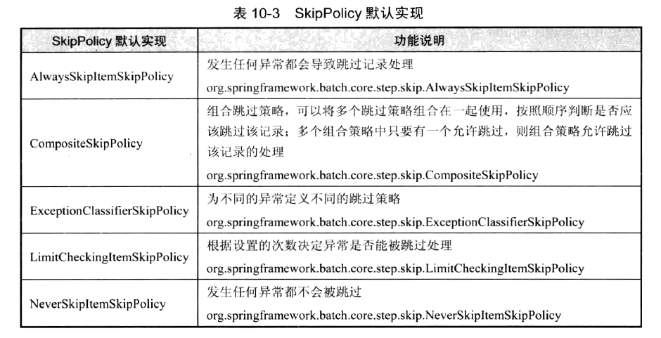
### 10.1.3 跳过拦截器
&nbsp;&nbsp;在 Chunk 的读、处理、写阶段发生的异常都会出发该拦截器。

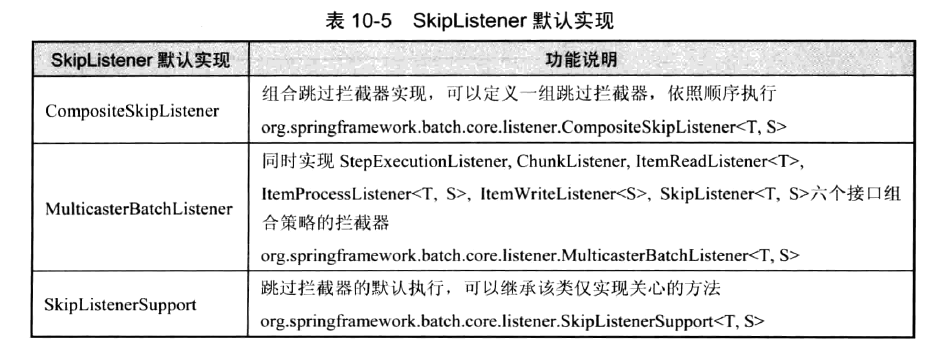

### 10.1.3 跳过拦截器
&nbsp;&nbsp;跳过拦截器执行时机：Skip 拦截器并非在读、处理、写阶段发生异常后立即执行；而是在批操作事务提交正确之前才执行。

### 重试策略 RetryPolicy
``` java
public interface RetryPolicy {
	boolean canRetry(RetryContext context);
	RetryContext open(RetryContext parent);
	void close(RetryContext context);
	void registerThrowable(RetryContext context, Throwable throwable);
}
```
&nbsp;&nbsp;canRetry() 判断是否应该重试， open() 在重试时开始执行， close() 在重试结束时执行， registerThrowable() 操作注册异常和重试上下文。
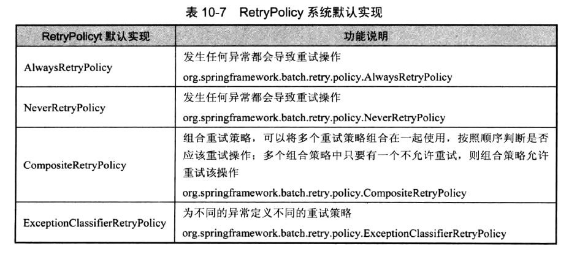

``` xml
    <job id="retryPolicyJob">
        <step id="retryPolicyStep">
          <tasklet>
				<chunk reader="reader" processor="alwaysExceptionItemProcessor" writer="writer"
				    commit-interval="1" retry-policy="exceptionClassifierRetryPolicy">
         		</chunk>
		  </tasklet>
        </step>
    </job>

	<bean:bean id="exceptionClassifierRetryPolicy"
	    class="org.springframework.retry.policy.ExceptionClassifierRetryPolicy">
		<bean:property name="policyMap">
			<bean:map>
				<bean:entry key="com.juxtapose.example.ch10.retry.MockARuntimeException">
					<bean:bean class="org.springframework.retry.policy.SimpleRetryPolicy">
						<bean:property name="maxAttempts" value="3" />
					</bean:bean>
				</bean:entry>
				<bean:entry key="com.juxtapose.example.ch10.retry.MockBRuntimeException">
					<bean:bean class="org.springframework.retry.policy.SimpleRetryPolicy">
						<bean:property name="maxAttempts" value="5" />
					</bean:bean>
				</bean:entry>
			</bean:map>
		</bean:property>
	</bean:bean>
```
&nbsp;&nbsp;定义异常 MockARuntimeException 的重试策略为 SimpleRetryPolicy ，最大重试次数为3次。
&nbsp;&nbsp;定义异常 MockBRuntimeException 的重试策略为 SimpleRetryPolicy ，最大重试次数为5次。

### 10.2.3 重试拦截器
&nbsp;&nbsp;RetryListener 的 open 、 close 操作在 Chunk 的 process 、 write 中即使不发生重试异常也会执行。因为 Chunk 中的 processor 和 write 操作默认使用 org.springframework.batch.retry.support.RetryTemplate 。
### 10.2.4 重试模板
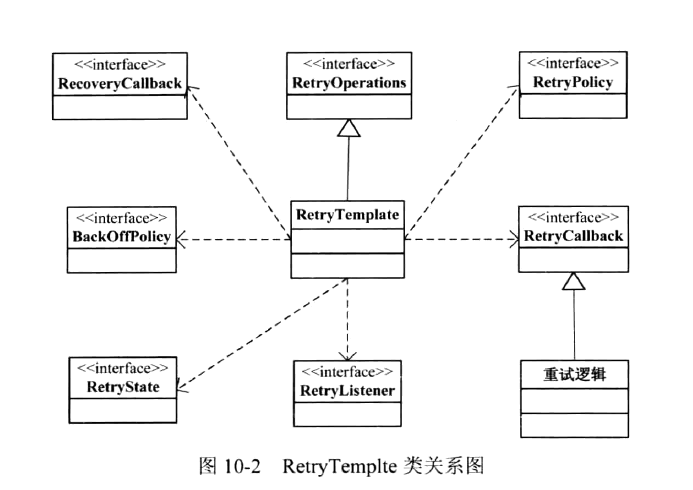
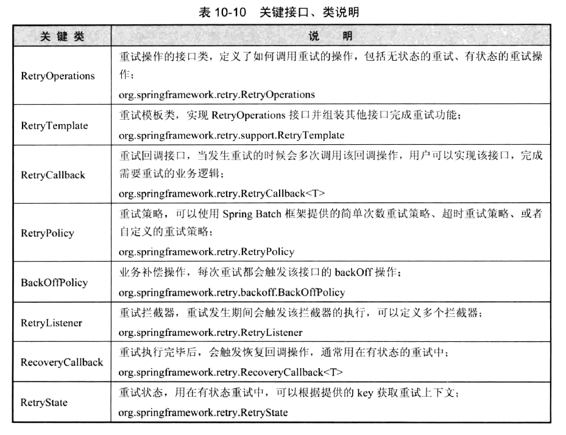
&nbsp;&nbsp;**有状态重试**
&nbsp;&nbsp;重试模板提供了有装重试的功能，需要使用 RetryState 作为参数传入重试模板。 RetryState 的关键作用是提供缓存 RetryContext 的 key ，定义哪些异常不需要重试而是执行回滚操作。通过筛选器 Classifier 根据异常类型返回 true 或者 false 来实现后者功能。
## 11.1 可拓展性
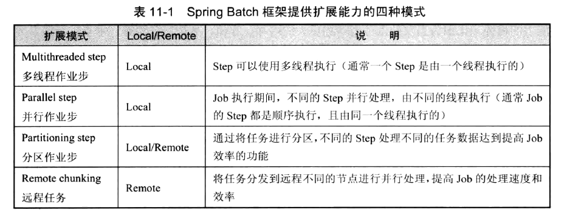
### 11.2.3 线程安全 Step
&nbsp;&nbsp;Spring Batch 框架提供的大部分 ItemReader 、 ItemWriter 等操作都是线程不安全的，主要原因在于 ItemReader 、 ItemWriter 提供了可重启特性的支持，在运行期间保存了大量的运行期状态导致了 ItemReader 、 ItemWriter 操作均是有状态的，不能直接运用在多线程中。
&nbsp;&nbsp;一个简单的方法是对 read 操作使用关键字 synchronized 进行同步执行，可以保证线程安全。通常情况下，批作业的读操作通常是非常轻量级的，更多的处理资源都消耗在处理操作、写操作上。不会造成性能瓶颈。
### 11.2.4 可重启的线程安全 Step
&nbsp;&nbsp;可以在数据记录表中增加标记字段实现。
### 11.4.1 远程 Step 框架
&nbsp;&nbsp;通常情况下，读和写的逻辑放在不同节点进行操作。

### 11.4.2 基于 SI 实现远程 Step
&nbsp;&nbsp;需要掌握 Spring Integration技术。

## 11.5 分区 Step
&nbsp;&nbsp;分区作业典型的可以分成两个处理阶段，数据分区、分区处理。
&nbsp;&nbsp;**数据分区**：根据特殊的规则将数据进行合理地切片，为不同的切片生成数据执行上下文 Execution Context 、作业步执行器 Step Execution 。可以通过接口 Partitioner 来实现自定义的分区逻辑。
&nbsp;&nbsp;**分区处理**：接口 PartitionHandler 定义了分区处理的逻辑。


JXM服务定义[JMX的定义](https://www.cnblogs.com/dongguacai/p/5900507.html)
