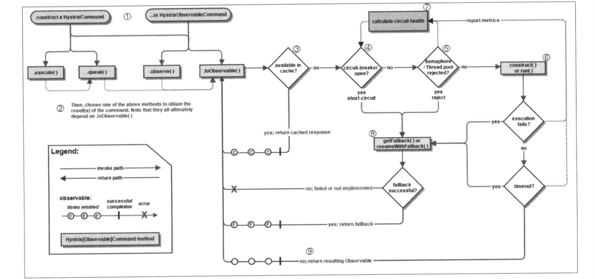
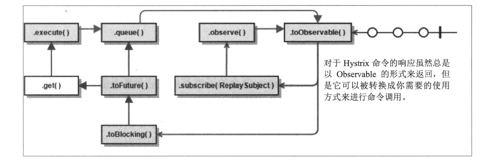
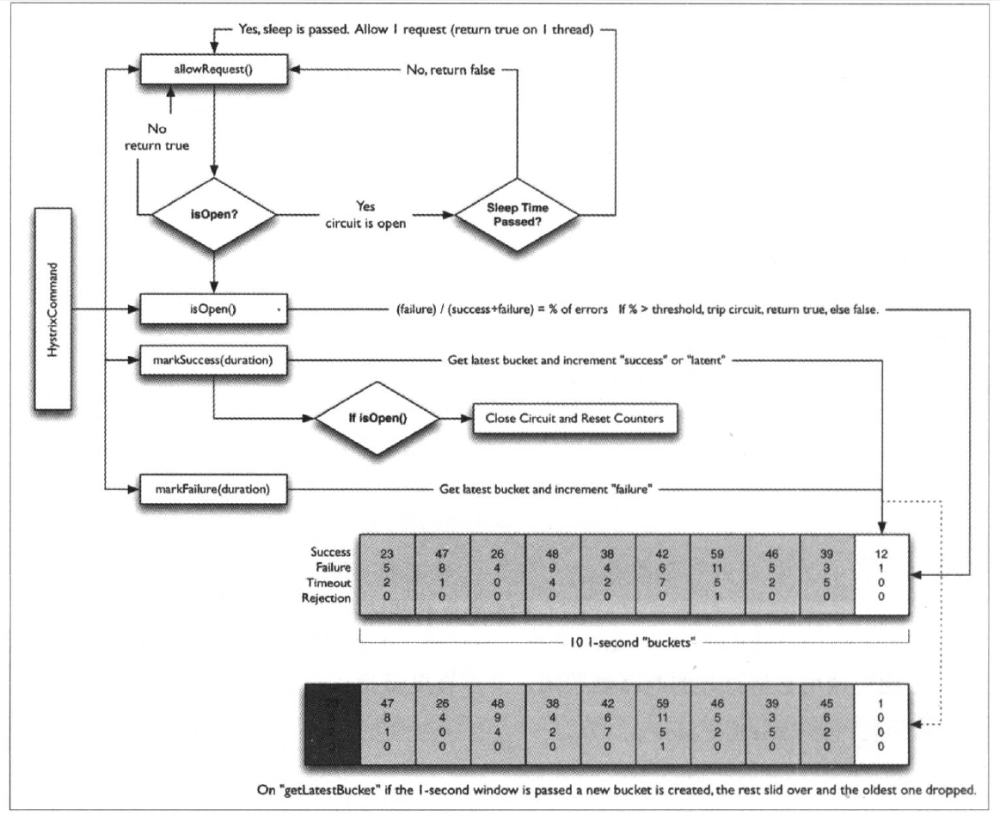

# 基础知识
## Spring Cloud简介
&nbsp;&nbsp;Spring Cloud 是一个基于 Spring Boot 实现的微服务架构开发工具。它为微服务架构中涉及配置管理、服务治理、断路器、智能路由、微代理、全局锁、决策竞选、分布式会话和集群状态管理等操作提供了一种简单的开发方式。  
&nbsp;&nbsp;微服务强调各服务之间进行“无事务”的调用，而对于数据一致性，只要求数据在最后的处理状态是一致的即可。若在过程中发现错误，通过补偿机制来进行处理，使得错误数据能够达到最终的一致性。  
&nbsp;&nbsp;Spring Cloud 包含了多个子项目：  
&nbsp;&nbsp;●**Spring Cloud Config**：配置管理工具，支持使用 Git 存储配置内容，可以使用它实现应用配置的外部化存储，并支持客户端配置信息刷新、加密/解密配置内容等。  
&nbsp;&nbsp;●**Spring Cloud Netflix**：核心组件，对多个Netflix OSS 开源套件进行整合。  
&nbsp;&nbsp;&nbsp;&nbsp;●**Eureka**：服务治理组件，包含服务注册中心、服务注册与发现机制的实现。  
&nbsp;&nbsp;&nbsp;&nbsp;●**Hystrix**：容错管理组件，实现短路器模式，帮助服务依赖中出现的延迟和故障提供强大的容错能力。  
&nbsp;&nbsp;&nbsp;&nbsp;●**Ribbon**：客户端负载均衡的服务调用组件。  
&nbsp;&nbsp;&nbsp;&nbsp;●**Feign**：基于 Ribbon 和 Hystrix 的声明式服务调用组件。  
&nbsp;&nbsp;&nbsp;&nbsp;●**Zuul**：网关组件，提供智能路由、访问过滤等功能。  
&nbsp;&nbsp;&nbsp;&nbsp;●**Archaius**：外部化配置组件。  
&nbsp;&nbsp;●**Spring Cloud Bus**：事件、消息总线用于传播集群中的状态变化或事件，以出发后续的处理，比如用来动态刷新配置等。  
&nbsp;&nbsp;●**Spring Cloud Cluster**：针对 Zookeeper、Redis、Hazelcast、Consul 的选举算法和通用状态模式的实现。  
&nbsp;&nbsp;●**Spring Cloud Cloudfoundry**：与 Pivotal Cloudfoundry 的整合支持。  
&nbsp;&nbsp;●**Spring Cloud Consul**：服务发现与配置管理工具。  
&nbsp;&nbsp;●**Spring Cloud Stream**：通过 Redis、Rabbit 或者 Kafka 实现的消费微服务，可以通过简单的声明式模型来发送和接收信息。  
&nbsp;&nbsp;●**Spring Cloud AWS**：用于简化整合 Amazon Web Service 的组件。  
&nbsp;&nbsp;●**Spring Cloud Security**：安全工具包，提供 Zuul 代理中对 OAuth2 客户端请求中继器。  
&nbsp;&nbsp;●**Spring Cloud Sleuth**：Spring Cloud 应用的分布式跟踪实现，可以完美整合 Zipkin。  
&nbsp;&nbsp;●**Spring Cloud ZooKeeper**：基于 ZooKeeper 的服务发现与配置管理组件。  
&nbsp;&nbsp;●**Spring Cloud Starters**：Spring Cloud 的基础组件，它是基于Spring Boot 风格项目的基础依赖模块。  
&nbsp;&nbsp;●**Spring Cloud CLI**：用于在 Groovy 中快速创建 Spring Cloud 应用的 Spring Boot CLI 插件。  
&nbsp;&nbsp;●... ...  
# 微服务构建：Spring Boot
## 加载顺序
&nbsp;&nbsp;1、在命令行中传入的参数。  
&nbsp;&nbsp;2、SPRING_APPLICATION_JSON 中的属性。SPRING_APPLICATION_JSON 是以JSON 格式配置在系统环境变量中的的内容。  
&nbsp;&nbsp;3、java:comp/env 中的 JNDI 属性。  
&nbsp;&nbsp;4、Java 的系统属性，可以通过System.getProperties()获取的内容。  
&nbsp;&nbsp;5、操作系统的环境变量。  
&nbsp;&nbsp;6、通过random.*配置的随机属性。  
&nbsp;&nbsp;7、位于当前应用 jar 包之外，针对不同{profile}环境的配置文件内容，例如application-{profile}.properties 或是 YAML 定义的配置文件。  
&nbsp;&nbsp;8、位于当前应用 jar 包之内，针对不同{profile}环境的配置文件内容，例如application-{profile}.properties 或是 YAML 定义的配置文件。  
&nbsp;&nbsp;9、位于当前应用jar包之外的 application.properties 和 YAML 配置内容。  
&nbsp;&nbsp;10、位于当前应用jar包之内的 application.properties 和 YAML 配置内容。  
&nbsp;&nbsp;11、在@Configuration注解修改的类中，通过 @PropertySource 注解定义的属性。  
&nbsp;&nbsp;12、应用默认属性，使用 SpringApplication.setDefaultProperties 定义的内容。  
&nbsp;&nbsp;优先级按上面的顺序由高到低，数字越小优先级越高。  
## 监控与管理
&nbsp;&nbsp;spring-boot-starter-actuator 模块的实现对于实施微服务的中小团队来说，可以有效地省去或大大减少监控系统在采集指标时的开发量。  
### 原生端点
&nbsp;&nbsp;**应用配置类**：获取应用程序中加载的应用配置、环境变量、自动化配置报告等与Spring Boot 应用密切相关的配置类信息。  
&nbsp;&nbsp;**度量指标类**：获取应用程序运行过程中用于监控的度量指标，比如内存信息、线程池信息、HTTP 请求统计等。  
&nbsp;&nbsp;**操作控制类**：提供了对应用的关闭等操作类功能。  
#### 应用配置类
&nbsp;&nbsp;●/**autoconfig**：该端点用来获取应用的自动化配置报告，其中包括所有自动化配置的候选项。同时还列出了每个候选项是否满足自动化配置的各个先决条件。该端点可以方便地找到一些自动化配置为什么没有生效的具体原因。该报告内容将自动化配置内容分为以下两各部分：  
&nbsp;&nbsp;&nbsp;&nbsp;●/positiveMatches 中返回的是条件匹配成功的自动化配置。  
&nbsp;&nbsp;&nbsp;&nbsp;●/negativeMatches 中返回的是条件匹配不成功的自动化配置。  
&nbsp;&nbsp;●/**beans**：该端点用来获取应用上下文中创建的所有Bean。  
&nbsp;&nbsp;●/**configprops**：该端点用来获取应用中配置的属性信息报告。  
&nbsp;&nbsp;●/**env**：该端点与/configprops 不同，它用来获取应用所有可用的环境属性报告。包括环境变量、JVM 属性、应用的配置属性、命令行中的参数。  
&nbsp;&nbsp;●/**mappings**：该端点用来返回所有 Spring MVC 的控制器映射关系报告。  
&nbsp;&nbsp;●/**info**：该端点用来返回一些应用自定义的信息。默认情况下，该端点只会返回一个空的 JSON 内容。可以在 application.properties 配置文件中通过 info 前缀来设置一些属性，如：  
> info.app.name=myboot
> info.app version=v1.0.0
#### 度量指标类
&nbsp;&nbsp;度量指标类端点提供的报告内容是动态变化的，这些端提供了应用程序在运行过程中的一些快照信息，比如说内存使用情况、HTTP请求统计、外部资源指标等。  
&nbsp;&nbsp;●/**metrics**：该端点用来返回当前应用的各类重要度量指标，比如内存信息、线程信息、垃圾回收信息等。  
&nbsp;&nbsp;●/**health**：该端点获取应用的各类健康指标信息。  
&nbsp;&nbsp;●/**dump**：该端点用来暴露程序运行中的线程信息。  
&nbsp;&nbsp;●/**trace**：该端点用来返回基本的 HTTP 跟踪信息。  
#### 操作控制类
&nbsp;&nbsp;操作控制类端点拥有更强大的控制力，如果要使用的话，需要通过如下配置开启：  
> endpoints.shutdown.enabled=true

&nbsp;&nbsp;●/**shutdown**：该端点可以实现关闭应用的远程操作。  
# 服务治理：Spring Cloud Eureka
## 服务治理
&nbsp;&nbsp;●**服务注册**：在服务治理框架中，通常都会构建一个注册中心，每个服务单元向注册中心登记自己提供的服务，将主机与端口号、版本号、通信协议等一些附加信息告知注册中心，注册中心按服务名分类组织服务清单。  
&nbsp;&nbsp;●**服务发现**：在服务治理框架中，服务间的调用不再通过指定具体的实例地址实现，而是通过向服务名发起请求调用实现。  
&nbsp;&nbsp;在默认配置下，服务注册中心会将自己作为客户端尝试注册自己，若要禁用它的客户端注册行为，需添加如下配置：  
> eureka.client.register-with-eureka=false
> eureka.client.fetch-registry=false

&nbsp;&nbsp;●**eureka.client.register-with-eureka**：代表不向注册中心注册自己。  
&nbsp;&nbsp;●**eureka.client.register-with-eureka**：代表不需要检索服务。  
## 高可用注册中心
&nbsp;&nbsp;Eureka Server 的高可用实际上就是将自己作为服务向其他服务注册中心注册自己，这样就可以形成一组互相注册的服务注册中心，以实现服务清单的相互同步，达到高可用的效果。  
## 服务发现与消费
&nbsp;&nbsp;服务发现的任务由 Eureka 的客户端完成，而服务消费的任务由 Ribbon 完成。Ribbon 是一个基于 HTTP 和 TCP 的客户端负载均衡器，它可以在通过客户端中配置的 ribbonServerList 服务端列表去轮询访问以达到负载均衡的作用。  当 Ribbon 与 Eureka 联合使用时，Ribbon 的服务实例清单 RibbonServerList 会被 DiscoveryEnabledNIWSServerList 重写，拓展成从 Eureka 注册中心中获取服务端列表。同时它也会用 NIWSDiscoveryPing 来取代 IPing，它将职责委托给 Eureka 来确定服务端是否已经启动。  

## Eureka详解
### 服务治理机制
#### 服务提供者
##### 服务注册
&nbsp;&nbsp;“服务提供者”在启动的时候会通过发送REST请求的方式将自己注册到 Eureka Server 上，同时带上了自身服务的一些元数据信息。 Eureka Server 接收到这个 REST 请求之后，将元数据信息存储在一个双层结构 Map 中，其中第一层的 key 是服务名，第二层的 key 是具体服务的实例名。  
&nbsp;&nbsp;对于访问实例的选择，Eureka 中有 Region 和 Zone 的概念，一个 Region 中可以包含多个 Zone ，每个服务客户端需要被注册到一个 Zone 中，所以每个客户端对应一个 Region 和 一个 Zone 。在进行服务调用的时候，优先访问同处一个 Zone 中的服务提供方，若访问不到，就访问其他的 Zone 。  
##### 服务续约
&nbsp;&nbsp;在注册服务完成注册之后，服务提供者会维护一个心跳用来持续告诉 Eureka Server，服务可以使用。  
#### 服务消费者
&nbsp;&nbsp;当启动服务消费者的时候，它会发送一个 REST 请求给服务注册中心，来获取注册的服务清单，为了性能考虑， Eureka Server 会维护一份只读的服务清单来返回给客户端，同时该缓存清单每隔30秒更新一次。  
##### 服务调用
&nbsp;&nbsp;对于访问实例的选择，Eureka中有 Region 和 Zone 的概念，一个 Region 中可以包含多个 Zone，每个客户端需要被注册到一个 Zone 中，所以每个客户端对应一个 Region 和一个 Zone。在进行服务调用的时候，优先访问同处一个 Zone 中的服务提供方，若访问不到，就返回其他的 Zone。  
##### 服务下线
&nbsp;&nbsp;当服务实例进行正常的关闭操作时，它会触发一个服务下线的 Rest 请求给 Eureka Server，告知服务注册中心。服务端在接收到请求之后，将该服务状态置为下线（DOWN），并吧该下线事件传播出去。  
#### 服务注册中心
##### 失效剔除
&nbsp;&nbsp;Eureka Server 在启动的时候会创建一个定时任务，默认每隔一段时间（默认为60秒）将当前清单中超时（默认为90秒）没有续约的服务剔除出去。  
##### 自我保护
&nbsp;&nbsp;Eureka Server 在运行期间，会统计心跳失败的比例在15分钟之内是否地域85%，如果出现低于的情况， Eureka Server 会将当前的实例注册信息保护起来，让这些实例不会过期，尽可能保护这些注册信息。但是，在这段保护期内实例若出现问题，那么客户端很容易拿到实际已经不存在的服务实例，会出现调用失败的情况，所以客户端必须要有容错机制，比如可以使用请求重试，断路器等机制。  
### 服务注册类配置
&nbsp;&nbsp;关于服务注册类的配置信息，可以通过查看 org.springframework.cloud.netflix.eureka.EurekaClientConfigBean 的源码来获取详细内容，这些配置信息都以 eureka.client 为前缀。  
### 服务实例类配置
&nbsp;&nbsp;关于服务实例类的配置信息，可以通过查看 org.springframework.cloud.netflix.eureka.EurekaInstanceConfigBean 的源码来获取详细内容，这些配置信息都以 eureka.instance 为前缀。  
#### 元数据
&nbsp;&nbsp;在  org.springframework.cloud.netflix.eureka.EurekaInstanceConfigBean 的配置信息中，有一大部分内容都是对服务实例元数据的配置。元数据是 Eureka 客户端在向服务注册中心发送注册请求时，用来描述自身服务信息的对象，其中包含了一些标准化的元数据，比如服务名称、实例名称、实例IP、实例端口等用于服务治理的重要信息；以及一些用于负载均衡策略或者是其他特殊用途的自定义元数据。  
# 客户端负载均衡：Spring Cloud Ribbon
&nbsp;&nbsp; Spring Cloud Ribbon 是一个基于 HTTP 和 TCP 的客户端负载均衡工具，它基于 Netflix Ribbon 实现。  
### 自动化配置
&nbsp;&nbsp; 通过自动化配置的实现，可以轻松地实现客户端负载均衡。同时，针对一些个性化需求，也可以方便地替换默认实现。只需要在 Spring Boot 应用中创建对应的实现实例就能覆盖这些默认的配置实现。比如下面的配置内容，由于创建了 PingUrl 实例，所以默认的 NoOpPing 就不会被创建。  
``` java
@Configuration
public class MyRibbonConfiguration {
	@Bean
	public IPing ribbonPing (IClientConfig config) {
		return new PingUrl();
	}
}
```
&nbsp;&nbsp; 另外，也可以通过使用 @RibbonClient 注解来实现更细粒度的客户端配置，比如下面的代码实现了为 hello-service 服务使用 HelloServiceConfiguration 中的配置。  
``` java
@Configuration
@RibbonClient(name = "hello-service", configuration = HelloServiceConfiguration.class)
public class RibbonConfiguration {
}
```
### Camden 版本对 RibbonClient 配置的优化
&nbsp;&nbsp; 可以直接通过&lt;clientName&gt;.ribbon.&lt;key&gt;=&lt;value&gt;的形式进行配置。比如将 hello-service 服务客户端的 IPing 接口实现替换为 PingUrl，只需在 application.properties 配置中增加如下内容即可：  
> hello-service.ribbon.NFLoadBalancePingClassName=com.netflix.loadbalancer.PingUrl

&nbsp;&nbsp; 其中 hello-service 为服务名， NFLoadBalancePingClassName 参数用来指定具体的 IPing 接口实现类。  
&nbsp;&nbsp; 全局配置方式：使用 ribbon.&lt;key&gt;=&lt;value&gt;格式进行配置即可。其中，&lt;key&gt;代表了  Ribbon 客户端配置的参数名，&lt;value&gt;则代表了对应参数的值。  
> ribbon.ConnectTimeout=250

### 与 Eureka 结合
&nbsp;&nbsp; 当 Spring Cloud 的应用中同时引入 Spring Cloud Ribbon 和 Spring Cloud Eureka 依赖时，会触发 Eureka 中实现的对 Ribbon 自动化配置。  
### 重试机制
&nbsp;&nbsp; Spring Cloud Euraka 实现的服务治理机制强调了 CAP 原理中的 AP，及可用性与可靠性，它与 ZooKeeper 这类强调 CP （一致性、可靠性）的服务治理框架的最大区别就是， Eureka 为了实现更高的服务可用性，牺牲了一定的一致性，在极端情况下它宁愿接受故障实例也不丢掉“健康实例”。  
# 服务容错保护： Spring Cloud Hystrix
## 工作流程

&nbsp;&nbsp;**1、创建 HystrixCommand 或 HystrixObservableCommand 对象**  
&nbsp;&nbsp;**2、命令执行**  
&nbsp;&nbsp;HystrixCommand 实现了下面两个执行方式。  
&nbsp;&nbsp;●execute()：同步执行，从依赖的服务返回一个单一的结果对象，或是在发生错误的时候抛出异常。  
&nbsp;&nbsp;●queue()：异步执行，直接返回一个 Future 对象，其中包含了服务执行结束时要返回的单一结果对象。  
``` java
R value = command.execute();
Future<R> fValue = command.queue();
```
&nbsp;&nbsp;HystrixObservableCommand 实现了另外两种执行方式。  
&nbsp;&nbsp;●observe()：返回 Observable 对象，它代表了操作的多个结果，它是一个 HotObservable 。  
&nbsp;&nbsp;●toObservable()：同样会返回 Observable 对象，也代表了操作的多个结果，但它返回的是一个Cold Observable。  
``` java
Observable<R> ohValue = command.observe();
Observable<R> ocValue = command.observe();
```
&nbsp;&nbsp;其中 Hot Observable ，不论“事件源”是否有“订阅者”，都会在创建后对事件进行发布，所以对于 Hot Observable 的每一个“订阅者”都有可能从“事件源”的中途开始的，并可能只看到了整个操作的局部过程。  
&nbsp;&nbsp;Cold Observable 在没有“订阅者”的时候并不会发布事件，而是进行等待，直到有“订阅者”之后才发布事件。所以对于Cold Observable 的订阅者，它可以保证从一开始看到整个操作的全部过程。  
&nbsp;&nbsp;**3、结果是否被缓存**  
&nbsp;&nbsp;若当前命令的请求缓存功能是否被启用的，并且该命令缓存命中，那么缓存的结果会立即以 Observable 对象的形式返回。  
&nbsp;&nbsp;**4、断路器是否打开**  
&nbsp;&nbsp;如果断路器是打开的，那么 Hystrix 不会执行命令，而是转接到 fallback 处理逻辑（对应下面第8步）。  
&nbsp;&nbsp;如果断路器是关闭的，那么 Hystrix 跳到第5步，检查是否有可用资源来执行命令。  
&nbsp;&nbsp;**5、线程池/请求队列/信号量是否占满**  
&nbsp;&nbsp;如果与命令相关的线程池和请求队列，或者信号量（不使用线程池的时候）已经被占满，那么 Hystrix 也不会执行命令，而是转接到 fallback 处理逻辑（对应下面的第8步）。  
&nbsp;&nbsp;**6、HystrixObservableCommand.construct() 或 HystrixCommand.run()**  
&nbsp;&nbsp;Hystrix 会根据编写的方法来决定采取什么样的方式去请求依赖服务。  
&nbsp;&nbsp;●HystrixCommand.run()：返回一个单一的结果，或者抛出异常。  
&nbsp;&nbsp;●HystrixObservableCommand.construct() ：返回一个 Observable 对象来发射多个结果，或者通过 onError 发送错误通知。
&nbsp;&nbsp;**7、计算短路器的健康度**  
&nbsp;&nbsp;Hystrix 会将 “成功”、“拒绝”、“超时”等信息报告给断路器，而断路器会维护一组计数器来统计这些数据。  
&nbsp;&nbsp;断路器会使用这些统计数据来决定是否将断路器打开，来对某个依赖服务的请求记性“熔断/短路”，直到恢复期结束。若在恢复期结束后，根据统计数据判断如果还是未达到健康指标，就再次“熔断/短路”。  
&nbsp;&nbsp;**8、fallback处理**  
&nbsp;&nbsp;**9、返回成功的响应**  
&nbsp;&nbsp;当 Hystrix 命令执行成功之后，它会将处理结果直接返回或是以 Observable 的形式返回。具体返回方式取决于第2步中我们所提到的对命令的4中不同执行方式，下图中总结了这四种调用方式之间的依赖关系。  

&nbsp;&nbsp;● toObservable()：返回最原始的 Observable，必须通过订阅它才会真正触发命令的执行流程。  
&nbsp;&nbsp;● observe()：在toObservable()产生原始 Observable 之后立即订阅它，让命令能够马上开始异步执行，并返回一个 Observable 对象，当调用它的subscribe时，将重新产生结果和通知给订阅者。  
&nbsp;&nbsp;● queue()：将 toObservable()产生的原始 Observable 通过 toBlocking() 方法转换成 BlockingObservable 对象，并调用它的 toFuture() f方法返回异步的 Future 对象。  
&nbsp;&nbsp;● execute()：在 queue() 产生异步结果 Future 对象之后，通过调用 get() 方法阻塞并等待结果的返回。  
## 断路器原理
&nbsp;&nbsp;断路器 HystrixCircuitBreaker 定义：  
```java
public interface HystrixCircuitBreaker {

	public static class Factory {...}

	static class HystrixCircuitBreakerImpl implements HystrixCircuitBreaker {...}

	static class NoOpCircuitBreaker implements HystrixCircuitBreaker {...}

	public boolean allowRequest();

	public boolean isOpen();

	void markSuccess();
}
```
&nbsp;&nbsp;●allRequest()：每个 Hystrix 命令的请求都通过它来判断是否被执行。  
&nbsp;&nbsp;●isOpen()：返回当前断路器是否被打开。  
&nbsp;&nbsp;●markSuccess()：用来闭合断路器。  
&nbsp;&nbsp;●静态类 Factory 中维护了一个 Hystrix 命令与 HystrixCircuitBreaker 的关系集合： ConcurrentHashMap&lt;String, HystrixBreaker&gt; circuitBreakerByCommand，其中 String 类型的 key 通过 HystrixCommandKey 定义，每一个 Hystrix 命令都要有一个 key 来标识，同一个 Hystrix 命令也会在该集合中找到它对应的断路器 HystrixCircuitBreaker 实例。  
&nbsp;&nbsp;●静态类 NoOpCircuitBreaker 定义了一个什么都不做的断路器实现，它允许所有的请求，并且断路器状态始终闭合。  
&nbsp;&nbsp;●静态类 HystrixCircuitBreakerImpl 是断路器接口 HystrixCircuitBreaker 的实现类，在该类中定义了四个核心对象。  
&nbsp;&nbsp;&nbsp;&nbsp;● HystrixCommandProperties properties：断路器对应 HystrixCommand 实例的属性对象。  
&nbsp;&nbsp;&nbsp;&nbsp;● HystrixCommandMetrics metrics：用来让 HystrixCommand 记录各类度量指标的对象。  
&nbsp;&nbsp;&nbsp;&nbsp;● AtomicBoolean circuitOpen：断路器是否打开的标志，默认为false。  
&nbsp;&nbsp;&nbsp;&nbsp;● AtomicLong circuitOpenedOrLastTestedTime：断路器打开或是上次测试的时间戳。  


## 依赖隔离
&nbsp;&nbsp;Hystrix 使用“舱壁模式”实现线程池的隔离，它会为每一个依赖服务创建一个独立的线程池，从而某个依赖服务出现延迟过高的情况，也只是对该依赖服务的调用产生影响，而不会拖慢其他的依赖服务。  
&nbsp;&nbsp;除了使用线程池之外，还可以使用信号量来控制当依赖服务的并发度，信号量的开销远比线程池的开销小，但是不能设置超时和实现异步访问。在 HystrixCommand 和 HystrixObservableCommand 中有两处支持信号量的使用。  
&nbsp;&nbsp;●**命令执行**：如果将隔离参数 execution.isolation.strategy 设置为 SEMAPHORE， Hystrix 会使用信号量替代线程池来控制依赖服务的并发。  
&nbsp;&nbsp;●**降级逻辑**：当Hystrix 尝试降级逻辑是，它会在调用线程中使用信号量。  

## 使用详解
&nbsp;&nbsp;Hystrix 命令用来封装具体的依赖服务调用逻辑。  
&nbsp;&nbsp;可以通过继承的方式来实现，比如：
``` java
public class UserCommand extends HystrixCommand<User> {

    private RestTemplate restTemplate;
    private Long id;

    public UserCommand(Setter setter, RestTemplate restTemplate, Long id) {
        super(setter);
        this.restTemplate = restTemplate;
        this.id = id;
    }

    @Override
    protected UserDTO run() throws Exception {
        return restTemplate.getForObject("http://myboot/sys/user/info/{1}", User.class, id);
    }
}
```
&nbsp;&nbsp;通过上面实现的 UserCommand，既可以实现请求的同步执行也可以实现异步执行。  
&nbsp;&nbsp;**●同步执行：**
``` java
User u = new UserCommand(restTemplate,  1L).execute();
```
&nbsp;&nbsp;**●异步执行：**
``` java
Future<User> futureUser = new UserCommand(restTemplate, 1L).queue();
```
&nbsp;&nbsp;也可以通过@HystrixCommand 注解来更为优雅地实现 Hystrix 命令的定义，如：  
``` java
public class UserService {
	@Autowired
	private RestTemplate restTemplate;

	@HystrixCommand
	public User getUserById(long id) {
		return restTemplate.getForObject("http://USER-SERVICE/users/{1}", User.class, id);
	}
}
```
&nbsp;&nbsp;如上的定义的方法只是同步的实现方式，若要实现异步执行则还需要另外定义，比如：  
``` java
@HystrixCommand
public Fature<User> getUserByIdAsync(final String id) {
	return new AsyncResult<User>() {
		@Override
		public User invoke() {
			return restTemplate.getForObject("http://USER-SERVICE/users/{1}", User.class, id);
		}
	}
}
```
&nbsp;&nbsp;除了传统的同步执行与异步执行之外，还可以将 HystrixCommand 通过 Observable 来实现响应式执行方式。通过调用 observe() 和 toObservable() 方法可以返回 Observable 对象，比如：  
``` java
Observable<String> ho = new UserCommand(restTemplate, 1L).observe();
Observable<String> co = new UserCommand(restTemplate, 1L).toObservable();
```
&nbsp;&nbsp;虽然 HystrixCommand 具备了 observe() 和 toObservable() 的功能，但是它的实现有一定的局限性，它返回的Observable 只能发射一次数据，所以 Hystrix 还提供了另外一种特殊命令封装  HystrixObservableCommand ，通过它实现的命令可以获取能够发射多次的 Observable。  
&nbsp;&nbsp;示例代码如下：  
``` java
public class UserObservableCommand extends HystrixObservableCommand<User> {
	private RestTemplate restTemplate;
	private Long id;

	public UserObservableCommand(Setter setter, RestTemplate restTemplate, Long id) {
		supper(setter);
		this.restTemplate = restTemplate;
		this.id = id;
	}

	@Override
	protected Observable<User> construct() {
		return Observable.create(new Observable.OnSubscribe<User>() {
			@Override
			public void call (Subscriber<? super User> observer) {
				try {
					if (!observer.isUnsubscribed()) {
						restTemplate.getForObject("http://USER-SERVICE/users/{1}", User.class, id);
						observer.onNext(user);
						observer.onCompleted();
					}
				} catch (Exception e) {
					observer.onError(e);
				}
			}
		});
	}
}
```
&nbsp;&nbsp;@HystrixCommand 使用方法：  
``` java
@HystrixCommand
public Observable<User> getUserById(final String id) {
	return Observable.create(new Observable.OnSubscribe<User>() {
		@Override
		public void call (Subscriber<? super User> observer) {
			try {
				if (!observer.isUnsubscribed()) {
					restTemplate.getForObject("http://USER-SERVICE/users/{1}", User.class, id);
					observer.onNext(user);
					observer.onCompleted();
				}
			} catch (Exception e) {
				observer.onError(e);
			}
		}
	});
}
```
&nbsp;&nbsp;在使用 @HystrixCommand 注解实现响应式命令时，可以通过 observableExecutionMode 参数来控制是使用 observe() 还是 toObservable() 的执行方式。  
&nbsp;&nbsp;●@HystrixCommand(observableExecutionMode = ObservableExecutionMode.EAGER)：EAGER 是该参数的模式值，表示使用 observe() 执行方式。  
&nbsp;&nbsp;●@HystrixCommand(observableExecutionMode = ObservableExecutionMode.LAZY)：表示使用 toObservable() 执行方式。  
## 定义服务降级
&nbsp;&nbsp;在 HystrixCommand 中可以通过重写 getFallback() 方法来实现服务降级逻辑， Hystrix 会在 run() 执行过程中出现错误、超时、线程池拒绝、断路器熔断等情况时，执行 getFallback() 方法内的逻辑。  
&nbsp;&nbsp;在 HystrixObservableCommand 实现的 Hystrix 命令中，通过 resumeWithFallback 方法来实现服务降级逻辑。该方法会返回一个 Observable 对象，当命令执行失败的时候， Hystrix 会将 Observable 中的结果通知给所有订阅者。  
&nbsp;&nbsp;若要通过注解实现服务降级只需要使用@HystrixCommand 中的 fallbackMethod 参数来指定具体的服务降级实现方法。  
&nbsp;&nbsp;在实际使用时，我们需要为大多数执行过程中可能会失败的 Hystrix 命令实现服务降级逻辑，但是也有一些情况可以不去实现降级逻辑，如：  
&nbsp;&nbsp;●**执行写操作的命令**：当 Hystrix 命令是用来执行写操作而不是返回一些信息的时候，通常情况下这类的操作的返回类型是 void 或是为空的 Observable ，实现服务降级的意义不是很大。当写入操作失败的时候，我们同城只需要通知调用者即可。  
&nbsp;&nbsp;●**执行批处理或离线计算的命令**：当 Hystrix 命令是用来执行批处理程序生成一份报告或是进行任何类型的离线计算时，通常这些操作只需将错误传播给调用者，然后让调用者稍后重试而不是发送给调用者一个静默的降级处理响应。  
## 异常处理
### 异常传播
&nbsp;&nbsp;在 HystrixCommand 实现的 run() 方法中抛出异常时，除了 HystrixBadRequestException 之外，其他异常均会被 Hystrix 认为命令执行失败并触发服务降级的处理逻辑。  
&nbsp;&nbsp;在使用配置实现 Hystrix 命令时，它还支持忽略指定异常类型功能，只需要通过设置@HystrixCommand 注解的 ignoreExceptions 参数。 Hystrix 会将指定忽略的异常包装在 HystrixBadRequestException 中抛出，这样就不会触发后续的 fallback 逻辑。  
### 异常获取
&nbsp;&nbsp;除了传统的实现方式之外，只需要在 fallback 实现方法的参数中增加 Throwable e 对象的定义，就可以在方法内部就可以获取触发服务降级的具体异常内容了。  
``` java
@HystrixCommand(fallbackMethod = "fallback1")
User getUserById(String id) {
	throw new RuntimeException("getUserById command failed");
}

User fallback1(String id, Throwable e ) {
	assert "getUserById command failed".equals(e.getMessage());
}
```
### 命令名称、分组以及线程池划分
&nbsp;&nbsp;以继承方式实现的 Hystrix 命令使用类名作为默认命令名称，同时也可以在构造函数中通过 Setter 静态类来设置，比如：
``` java
public UserCommand(){   
	super(Setter.withGroupKey(HystrixCommandGroupKey.Factory.asKey("GroupName"))
                .andCommandKey(HystrixCommandKey.Factory.asKey("CommandName")));
}
```
&nbsp;&nbsp;通过设置命令组， Hystrix 会根据组来组织和统计命令的告警、仪表盘等信息。同时， Hystrix 命令默认的线程划分也是根据命令分组来实现的。默认情况下， Hystrix 会让相同组名的命令使用同一个线程池，所以需要在创建 Hystrix 命令时为其制定命令组名来实现默认的线程池划分。  
&nbsp;&nbsp;为了使 Hystrix 的线程池分配更加灵活，所以 Hystrix 还提供了 HystrixThreadPoolKey 来对线程池进行设置，通过它实现更细粒度的线程池划分，比如：  
``` java
public UserCommand(){   
	super(Setter.withGroupKey(HystrixCommandGroupKey.Factory.asKey("GroupName"))
                .andCommandKey(HystrixCommandKey.Factory.asKey("CommandName"))
                .andThreadPoolKey(HystrixThreadPoolKey.Factory.asKey("ThreadPoolKey")));
}
```
&nbsp;&nbsp;尽量通过 HystrixThreadPoolKey 的方式来指定线程池的划分，而不是通过组名的默认方式实现划分，因为多个不同的命令可能从业务逻辑上来看属于同一个组，但是往往从实现本身上需要跟其他命令进行隔离。  
&nbsp;&nbsp;使用 @HystrixCommand设置方式：
``` java
@HystrixCommand(commandKey = "getUserById", groupKey = "UserGoup", threadPoolKey = "getUserByIdThread")
User getUserById(String id) {
	return restTemplate.getForObject("http://USER-SERVICE/users/{1}", User.class, id);
}
```
