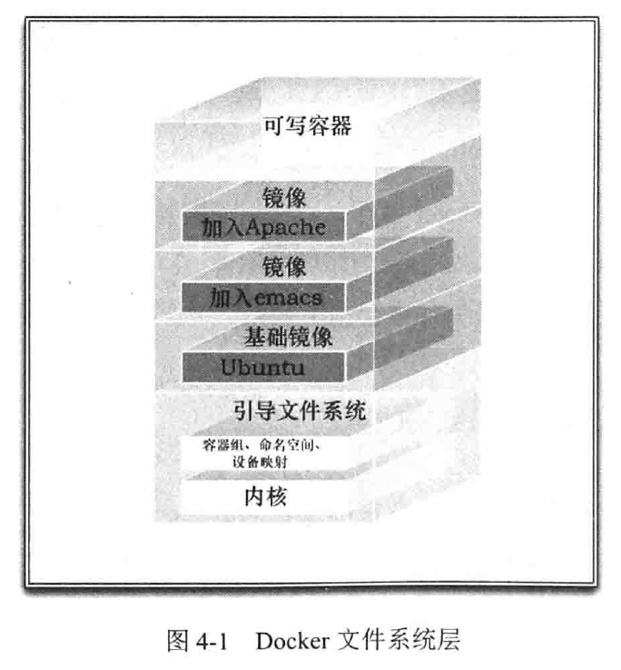

# 1 简介

​	容器与管理程序虚拟化（hypervisor virtualization， HV）有所不同，管理程序虚拟化通过中间层将一台或者多台独立的机器虚拟运行与物理硬件之上，而容器则是直接运行在操作系统内核之上的用户空间。因此，容器虚拟化也被称为“操作系统级虚拟化”，容器技术可以让多个独立的用户空间运行在同一台宿主机上。

​	和传统的虚拟化以及半虚拟化（paravirtualization）相比，容器运行不需要模拟层（emulation layer）和管理层（hypervisor），而是使用操作系统的系统调用接口。这降低了运行单个容器所需的开销，也使得宿主机中可以进行更多的容器。

## 1.1 Docker 简介

## 1.2 Docker 组件

### 1.2.1 Docker 客户端和服务器

​	Docker 是一个客户-服务器（C/S）架构的程序。Docker 客户端只需向 Docker 服务器或守护进程发出请求，服务器或守护进程将完成所有工作并返回结果。Docker 提供了一个命令行工具 docker 以及一整套 RESTFUL API。


### 1.2.2 Docker 镜像

​	镜像是构建 Docker 世界的基石。用户基于镜像来运行自己的容器。镜像也是 Docker 生命周期中的”构建“部分。镜像是基于联合（Union）文件系统的一种层式的结构，由一系列指令一步一步构建出来。

### 1.2.3 Registry

​	Docker 用 Registry 来保存用户构建的镜像。Registry 分为公共和私有。

### 1.2.4 容器

​	Docker 可以帮你构建和部署容器，只需要把自己的应用程序或服务打包放进容器即可。可以认为，镜像是 Docker 生命周期中的构建或者打包阶段，而容器则是启动或执行阶段。

​	总结起来，Docker 容器就是：

- 一个镜像格式；

- 一系列标准的操作；

- 一个执行环境。

​	每个容器都包含一个软件镜像，容器里的软件镜像可以进行一些操作。例如，镜像可以被创建、启动、关闭、重启以及销毁。

​	Docker 在执行上述操作时，并不关心容器中到底塞进了什么，它不管里面是 Web 服务器，还是数据库，或者是应用服务器。所有容器都是按照相同的方式将内容“装载”进去。

## 1.5 Docker 的技术组件

​	Docker 包括以下几个部分：

​	一个原生的 Linux 容器格式， Docker 中称为 libcontainer，或者很流行的容器平台 lxc。libcontainer 格式现在是 Docker 容器的默认格式。

​	Linux 内核的命名空间，用于隔离文件系统、进程和网络。

- 文件系统隔离：每个容器都有自己的 root 文件系统。
- 进程隔离：每个容器都运行在自己的进程环境中。
- 网络隔离：容器间的虚拟网络接口和 IP 地址都是分开的。
- 资源隔离和分组：使用 cgroups（即 control group， Linux 的内核特性之一）将 CPU和内存之类的资源独立分配给每个 Docker 容器。
- 写时复制：文件系统都是通过写时复制创建的，这就意味着文件系统是分层的、快速的，而且占用的磁盘空间更小。
- 日志：容器产生的 STDOUT 、 STDERR 和 STDIN 这些 IO 流都会被收集并记入日志，用来进行日志分析和故障排错。
- 交互式 shell：用户可以创建一个伪 tty 终端，将其连接到 STDIN ，为容器提供一个交互式的 shell。

# 2 安装 Docker

## 2.9 Docker 守护进程

​	Docker 以 root 权限运行它的守护进程，来处理普通用户无法完成的操作（如挂载文件系统）。 docker 程序是 Docker 守护进程的客户端程序，同样也需要以 root 身份运行。

​	当 Docker 软件包安装完毕后，默认会立即启动 Docker 守护进程。守护进程监听/var/run/docker.sock 这个 Unix 套接字文件，来获取来自客户端的 Docker 请求。如果系统中存在名为 docker 的用户组的话， Docker 则会将该套接字文件的所有者设置为该用户组。这样， docker 用户组的所有用户都可以直接运行 Docker ，而无需再使用 sudo 命令了。

### 2.9.1 配置 Docker 守护进程

​	运行 Docker 守护进程时，可以使用 -H 标志调整守护进程绑定监听接口的方式。

​	我们可以使用 -H 标志指定不同的网络接口和端口配置，比如，要想绑定到网络接口，命令代码如下。

``` bash
$ sudo /user/bin/docker -d -H tcp://0.0.0.0:2375
```

​	这条命令会将 Docker 守护进程绑定到宿主机上的所有网络接口。 Docker 客户端不会自动检测到网络的变化，我们需要通过 -H 选项来指定服务器的地址。例如，如果把守护进程端口改成 4200，那么运行客户端时就必须指定 docker -H :4200。如果不想每次运行客户端时都加上 -H 标志，我们可以通过设置 DOCKER_HOST 环境变量来省略此步骤，代码如下：

``` bash
$ export DOCKER_HOST="tcp://0.0.0.0:2375"
```

`默认情况下， Docker 的客户端-服务器通信是不经认证的。这就意味着，如果把 Docker 绑定到对外公开的网络接口上，那么任何人都可以连接到该 Docker 守护进程。 Docker0.9 以及更高版本提供了 TLS 认证。`

# 3 Docker 入门 

## 3.1 确保 Docker 已经就绪

​	查看 docker 程序是否存在，功能是否正常，指令如下。

``` bash
$ sudo docker info
```

​	这里我们调用了 docker 可执行程序的 info 命令，该命令会返回所有容器和镜像（镜像即是 Docker 用来构建容器的“构建块”）的数量、 Docker 使用的执行驱动和存储驱动（execution and storage driver），以及 Docker 的基本配置。

## 3.2 运行我们的第一个容器

``` bash
$ sudo docker run -i -t ubuntu /bin/bash
```

​	-i 标志保证容器中 STDIN 是开启的，尽管我们并没有附着到容器中。持久的标准输入是交互式 shell 的“半边天”， -t 标志则是另外的“半边天”，它告诉 Docker 为要创建的容器分配一个伪 tty 终端。这样容器才能提供交互式 shell 。若要在命令行下创建一个我们能与之进行交互的容器，而不是一个运行后台服务的容器，则这两个参数已经是基本参数了。

​	首先 Docker 会检查本地是否存在 ubuntu 镜像，如果本地还没有该镜像的话，那么 Docker 就会连接官方维护的 Docker Hub Registry ，查看 Docker Hub 中是否有该镜像。 Docker 一旦找到该镜像，就会下载该镜像并将其保存到本地宿主机中。

​	随后， Docker 在文件系统内部用这个镜像创建了一个新容器。该容器拥有自己的网络、 IP 地址，以及一个用来和宿主机进行通信的桥接网络接口。最后，我们告诉 Docker 在新容器中要运行什么命令，如上面的例子中我们在容器中运行 /bin/bash 命令启动了一个 Bash shell 。

​	当容器创建完毕之后， Docker 就会执行容器中的 /bin/bash 命令，我们就可以看到容器内的 shell了。

## 3.3 使用第一个容器

​	这是一个完整的 Ubuntu 系统，我们可以做任何事情。当所有工作结束时，输入 exit，就可以返回到 Ubuntu 宿主机的命令行提示符了。此时容器也停止运行了，只有在指定的 /bin/bash 命令处于运行状态的时候，容器才会相应地处于运行状态。一旦退出容器， /bin/bash 命令也就结束了，测试容器也会随之停止运行。

​	但容器仍然是存在的，可以使用 docker ps -a 命令查看当前系统中容器的列表。

​	默认情况下，当执行 docker ps 命令是，只能看到正在运行的容器。如果指定 -a 标志选项的话，那么 docker ps 命令会列出所有容器，包括正在运行的和已经停止的。

## 3.4 容器命名

``` bash
$ sudo docker run --name bob_the_container -i -t ubuntu /bin/bash
```

​	上述命令将会创建一个名为 bob_the_container 的容器。一个合法的容器名称只能包括以下字符：小写字母  a~z、大写字母 A~Z、数字 0~9、下划线、圆点、横线（如果用正则表达式来表示这些符号，就是[a-zA-Z0-9_.-]）。

## 3.5 重新启动已经停止的容器

``` bash
$ sudo docker start bob_the_container
```

​	使用容器名称或者容器 ID 来指定容器重启。

## 3.6 附着到容器上

``` bash
$ sudo docker attach bob_the_container
```

​	可以使用 docker attach 命令，重新附着到该容器的会话上。

## 3.7 创建守护式容器

``` bash
$ sudo docker run --name daemon_dave -d ubuntu /bin/sh -c "while true; do echo hello world; sleep 1; done"
```

​	docker run 命令使用 -d 参数，因此 Docker 会将容器放到后台运行。

## 3.8 容器内部都在干什么

``` bash
$ sudo docker logs daemon_dave
```

​	可以使用 docker logs 命令来获取容器的日志。 Docker 会输出最后几条日志项并返回。我们也可以在命令后使用 -f 参数来监控 Docker 的日志，类似 tail -f。通过 Ctrl + C 退出日志跟踪。

​	可以使用 docker logs --tail 10 daemon_dave 获取日志的最后10行内容。另外可以使用 docker logs 0 -f daemon_dave 命令来跟踪某个容器的最新日志而不必读取整个日志文件。

​	为了调试更加简单，我们还可以使用 -t 标志位每条日志项加上时间戳。

``` bash
$ sudo docker logs -ft daemon_dave
```

## 3.10 在容器内部运行进程

​	在 Docker 1.3 之后，可以通过 docker exec 命令在容器内部额外启动新进程。可以在容器内运行的进程有两种类型：后台任务和交互式任务。后台任务在容器内运行且没有交互需求，而交互式任务则保持在前台运行。对于需要在容器内部打开 shell 的任务，交互式任务是很实用的。

``` bash
$ sudo docker exec -d daemon_dave touch /etc/new_config_file
```

​	-d 表明需要运行一个后台进程，-d 标志之后，指定的是要在内部执行这个命令的容器的名字以及要执行的命令。

``` bash
$ sudo docker exec -d daemon_dave touch /etc/new_config_file
```

​	在容器内运行交互命令类似， -t 和 -i 标志我们执行的进程创建了 TTY 并捕捉 STDIN。

## 3.11 停止守护式容器

``` bash
$ sudo docker stop daemon_dave
```

	Docker stop 命令会向 Docker 容器进程发送 SIGTERM 信号。如果想快速停止某个容器，也可以使用 docker kill 命令来向容器发送 SIGKILL 信号。

## 3.12 自动重启容器

​	如果某种错误导致容器停止运行，可以通过 --restart 标志让 Docker 自动重新启动该容器。 --restart 标志会检查容器的退出代码，并根据此来决定是否要重启容器。默认的行为是 Docker 不会重启容器。

``` bash
$ sudo docker run --restart=always --name daemon_dave -d ubuntu /bin/sh -c "while true; do hello world; sleep 1; done"
```

​	如将 --restart 标志设置为 always。无论容器的退出代码是什么， Docker 都会自动重启该容器。除了 always ，我们还可以将标志设置为 on-failure。这样，只有当容器的退出代码为非 0 值得时候，才会自动重启。另外，on-failure 还接受一个可选的重启次数参数。如 --restart=on-failure:5。

## 3.13 深入容器

​	除了docker ps 命令获取容器的信息，还可以使用 docker inspect 来获取更多的容器信息。

``` bash
$ sudo docker inspect daemon_dave
```

​	docker inspect 命令会对容器进行详细的检查，然后返回其配置信息，包括名称、命令、网络配置以及很多有用的数据。

​	同时可以使用 -f 或者 -format 标志来选定查看结果。如获取容器的运行状态。

``` bash
$ sudo docker inspect --format='{{ .State.Running }}' daemon_dave
```

​	可以通过浏览 /var/lib/docker 目录来深入了解 Docker 的工作原理。该目录存放着 Docker 镜像、容器以及容器的配置。所有的容器都保存在 /var/lib/docker/containers 目录下。

## 3.14 删除容器

​	使用 docker rm 命令来删除它们。运行中的 Docker 容器是无法删除的。

# 4 使用 Docker 镜像和仓库

## 4.1 什么是 Docker 镜像

​	Docker 镜像是由文件系统叠加而成。最底端是一个引导文件系统，即 bootfs ，这很像典型的 Linux/Unix 的引导文件系统。 Docker 用户几乎永远不会和引导文件系统有交互。实际上，当一个容器启动后，它会被移到内存中，而引导文件系统则会被卸载（unmount），以留出更多的内存供 initrd 磁盘镜像使用。

​	Docker 镜像的第二层是 root 文件系统 rootfs，它位于引导文件系统之上。rootfs 可以是一种或多种操作系统（如 Debian 或者 Ubuntu 文件系统）。

​	在传统的 Linux 引导过程中， root 文件系统会最先以只读的方式加载，当引导结束并完成了完整性检查之后，它才会切换为读写模式。但是在 Docker 里，root 文件系统永远只能是只读状态，并且 Docker 利用联合加载（union mount）技术又会在 root 文件系统上加载更多的只读文件系统。联合加载指的是一次同时加载多个文件系统，但是在外面看来只能看到一个文件系统。联合加载会将各层文件系统叠加到一起，这样最终的文件系统会包含所有底层文件和目录。

​	Docker 将文件系统统称为镜像。一个镜像可以放到另一个镜像的顶部。位于下面的镜像称为父镜像（parent image），可以依次类推，最底部的镜像可以称为基础镜像（base image）。最后，当从一个镜像启动容器时， Docker 会在该镜像的最顶层加载一个读写文件系统。Docker 中运行的程序就是在这个读写层中执行的。



​	当 Docker 第一次启动一个容器时，初始的读写层是空的。当文件系统发生变化时，这些变化都会应用到这一层上。比如，如果想修改一个文件，这个文件首先会从该读写层下面的只读层复制到读写层。该文件的只读版本依然存在，但是已经被读写层中该文件副本所隐藏。

## 4.2 列出镜像

``` bash
$ sudo docker images
```

​	本地镜像都保存在 Docker 宿主机的 /var/lib/docker 目录下。每个镜像都保存在 Docker 所采用的存储驱动目录下面，如 aufs 或者 devicemapper 。也可以在 /var/lib/docker/containers 目录下面看到所有的容器。

## 4.3 拉取镜像

​	使用 docker run 命令从镜像启动一个容器时，如果该镜像不在本地， Docker 会先从 Docker Hub 下载该镜像。如果没有指定具体的镜像标签，那么 Docker 会自动下载 latest 标签的镜像。

​	也可以通过 docker pull 命令预先拉取镜像到本地。如“ docker pull ubuntu”。

## 4.4 查找镜像

``` bash
$ sudo docker search puppet
```

​	可以通过 docker search 命令来查找 Docker Hub 上公共的可用镜像。

## 4.5 构建镜像

​	构建 Docker 镜像有以下两种方法。

- 使用 docker commit 命令。

- 使用 docker build 命令和 Dockerfile 文件。

### 4.5.1 创建 Docker Hub 账号

​	可以使用 docker login 命令登录 Docker Hub。个人认证信息将会保存到 $HOME/.dockercfg 文件中。

### 4.5.2 使用 Docker 的 commit 命令创建镜像

​	首先创建一个容器，并在容器里做出修改，然后将修改提交为一个新镜像。

​	首先，基于 ubuntu 镜像，创建新容器。

``` bash
$ sudo docker run -i -t ubuntu /bin/bash
```

​	接下来，在容器中安装 Apache 。

``` bash
apt-get -yqq update
apt-get -y install apache2
```

​	如上，启动了一个容器，并在里面安装了 Apache 。完成此项工作后，需要先使用 exit 命令从容器里退出，之后再运行 docker commit 命令。

``` bash
$ sudo docker commit 4aab3ce3cb76 jamtur01/apache2
```

​	docker commit 命令中，指定了要提交的修改过的容器的 ID （可以通过 docker ps -l -q 命令得到刚创建的容器的 ID），以及一个目标镜像仓库和镜像名，这里是 jamtur01/apache2 。

### 4.5.3 使用 Dockerfile 构建镜像

​	相比 docker commit 的方法构建镜像。相反， 推荐使用被 称为 Dockerfile 的定义文件和 docker build 命令来构建镜像。Dockerfile 使用基本 DSL 语法的指令来构建一个 Docker 镜像，之后使用 docker build 命令基于该 Dockerfile 中的指令构建一个新的镜像。

``` bash
$ mkdir static_web
$ cd static_web
$ touch Dockerfile
```

​	创建了一个名为 static_web 的目录用来保存 Dockerfile ，这个目录就是我们的构建环境（ build environment ）， Docker 则称此环境为上下文（ context ）或者构建上下文（build context ）。Docker 会在构建对象是将构建上下文和该上下文中的文件和目录上传到 Docker 守护线程。这样 Docker 守护进程就能直接访问你想在镜像中存储的任何代码、文件或者其他数据。

``` dockerfile
# Version: 0.0.1
FROM ubuntu:14.04
MAINTAINER James Turnbull "james@example.com"
RUN apt-get update
RUN apt-get install -y nginx
RUN echo 'Hi, I am in your container' \
	>/usr/share/nginx/html/index.html
EXPOSE 80
```

​	该 Dockerfile 由一系列指令和参数组成。每条指令，如 FROM ，都必须为大写字母，且后面要跟一个参数。

​	每条指令都会创建一个新的镜像层并对镜像进行提交。 Docker 大体上按照如下流程执行 Dockerfile 中的命令。

- Docker 从基础镜像运行一个容器。

- 执行一条命令，对容器做出修改。

- 执行类似 docker commit 的操作，提交一个新的镜像层。

- Docker 在基于刚提交的镜像运行一个新容器。

- 执行 Dockerfile 中的下一条指令，直到所有指令都执行完毕。

​	如果 Dockerfile 由于某些原因（如某条指令失败了）没有正常结束，那么将得到了一个可以使用的镜像。这对调试非常有帮助。可以基于该镜像运行一个具备交互功能的容器，使用最后创建的镜像对为什么你的指令会失败进行调试。

​	每个 Dockerfile 的第一条指令都应该是 FROM。 FROM 指令指定一个已经存在的镜像，后续指令都基于该镜像进行，这个镜像被称为基础镜像（ base image ）。

​	MAINTAINER 指令，告诉 Docker 该镜像的作者是谁，以及作者的电子邮件地址。

​	每条 RUN 指令都会创建一个新的镜像层，如果该指令执行成功，就会将此镜像层提交，之后继续执行 Dockerfile 中的下一条指令。

​	默认情况下， RUN 指令会在 shell 里使用命令包装器 /bin/sh -c 来执行。如果是在一个不支持 shell 的平台运行或者不希望在 shell 中运行（ 比如避免 shell 字符串篡改），也可以只使用 exec 格式的 RUN 指令。示例如下。

``` dockerfile
RUN { "apt-get" , "install" , "-y" ,"nginx" }
```

​	这种方式中，使用一个数组来指定要运行的命令和传递给该命令的每个参数。

​	EXPOSE 指令，告诉 Docker 该容器内的应用程序将会使用容器的指定端口。但并不意味着可以自动访问任意容器运行中服务发的端口。出于安全的原因， Docker 并不会自动打开该端口，而是需要在使用 docker run 运行容器时来指定需要打开哪些端口。可以指定多个 EXPOSE 指令来向外部公开多个端口。

### 4.5.4 基于 Dockerfile 构建新镜像

​	执行 docker build 命令时， Dockerfile 中的所有指令都会别执行并且提交，并且在该命令结束后返回一个新镜像。

``` bash
$ cd static_web
$ sudo docker build -t="jamtur01/static_web" .
```

​	使用 docker build 命令来构建新镜像。通过指定 -t 选项为新镜像设置了仓库和名称，在本例中仓库为 jamtur01，镜像名为 static_web 。也可以在构建镜像的过程中为镜像设置一个标签，其使用方法为“镜像名：标签”。

``` bash
$ sudo docker build -t="jamtur01/static_web:v1" .
```

​	如果没有制定任何标签， Docker 将会自动为镜像设置一个 latest 标签。

​	命令中最后的“.”，告诉 Docker 到本地目录中去找 Dockerfile 文件。也可以指定一个 Git 仓库的源地址来指定 Dockerfile 的位置。

``` bash
$ sudo docker build -t="jamtur01/static_web:v1" \
git@github.com:jamtur01/docker-static_web
```

### 4.5.6 Dockerfile 和构建缓存

​	Docker 会将之前构建的镜像当做缓存作为新的开始点。如果做出了修改， Docker 会从第一条发生变化的指令开始。

​	有些时候需要确保构建过程不会使用缓存。可以使用 docker build 的 --no-cache 标志，示例如下。

``` bash
$ sudo docker build --no-cache -t="jamtur01/static_web:v1" .
```

### 4.5.8 查看新镜像

​	如果想深入探究镜像是如何构建出来的，可以使用 docker history 命令，示例如下。

``` bash
$ sudo docker history 22d47c8vb6e5
```

​	可以看到新构建的 jamtur01/static_web 镜像的每一层，以及创建这些层的 Dockerfile 指令。

### 4.5.9 从新镜像启动容器

``` bash
$ sudo docker run -d -p 80 --name static_web jamtur01/static_web \
nginx -g "daemon off;"
```

​	-d 选项，告诉 Docker 以分离（ detached ）的方式在后台运行。-p 选项用来控制 Docker 在运行时应该公开哪些网络端口给外部（宿主机）。运行一个容器时，Docker 可以通过两种方法来在宿主机上分配端口。

- Docker 可以在宿主机上选择一个位于 49153~65535 的一个比较大的端口号来映射到容器的 80 端口上。

- 可以在 Docker 宿主机中指定一个具体的端口号来映射到容器中的 80 端口上。

  使用 docker ps 命令查看容器端口的分配情况。

``` bash
$ sudo docker ps -l
```

​	也可以通过 docker port 来查看容器的端口映射情况。

``` bash
$ sudo docker port 6751b94bb5c0 80
```

​	-p 选项可以灵活地管理容器和宿主机之间的端口映射关系。例如，指定将容器中的端口映射到 Docker 宿主机的某一特定端口上。

``` bash
$ sudo docker run -d -p 80:80 --name static_web jamtur01/static_web \
nginx -g "daemon off;"
```

​	上面的命令将容器内的80端口绑定到本地宿主机的80端口上。如果要运行多个容器，只有一个容器能成功地将本地端口绑定到本地宿主机上。

``` bash
$ sudo docker run -d -p 127.0.0.1:80:80 --name static_web jamtur01/static_web \
nginx -g "daemon off;"
```

​	也可以将容器内的 80 端口绑定到本地宿主机的 127.0.0.1 这个 IP 的80端口上。如果使用“127.0.0.1::80 ”，则只指定了一个 IP 地址127.0.0.1，这时可以使用 docker inspect 或者 docker port 命令来查看容器内的 80 端口具体被绑定到宿主机的哪个端口上。

​	也可以通过在端口绑定时使用 /udp 后缀来指定 UDP 端口。

### 4.5.10 Dockerfile 指令

#### 4.5.10.1 CMD

​	CMD 指令用于指定一个容器启动时要运行的命令。有点类似 RUN 指令，只是 RUN 指令是指定镜像被构建时要运行的命令，而 CMD 是指定容器被启动时要运行的命令。这和使用 docker run 命令启动容器时指定要运行的命令非常类似。

``` bash
$ sudo docker run -i -t jamtur01/static_web /bin/true
```

``` dockerfile
CMD ["/bin/true"]
```

​	如上代码是等效的。

​	``使用 docker run 命令可以覆盖 CMD 指令。如果在 Dockerfile 里指定了 CMD 指令，同时在 docker run 命令行中也指定了要运行的命令，命令行中指定的命令会覆盖 Dockerfile 中的 CMD 指令。``

​	在 Dockerfile 中只能指定一条 CMD 指令。如果指定了多条 CMD 指令，也只有最后一条 CMD 指令会被使用。如果想在启动容器时运行多个进程或者多条命令，可以考虑使用类似 Supervisor 这样的服务管理工具。

#### 4.5.10.2 ENTRYPOINT

​	ENTRYPOINT 指令提供的命令则不容易在启动时被覆盖。实际上， docker run 命令行中指定的任何参数都会被当做参数再次传递给 ENTRYPOINT 指令中指定的命令。

​	若将 ENTRYPOINT 设置为 ["/usr/sbin/nginx"]重新构建 static_web 镜像，然后从 jamtur01/static_web 镜像中启动一个新容器。

``` bash
$ sudo docker build -t="jamtur01/static_web" .
```

​	使用 docker run 命令启动包含 ENTRYPOINT 指令的容器

``` bash
$ sudo docker run -t -i jamtur01/static_web -g "daemon off;"
```

​	-g "daemon off"这个参数会传递给用 ENTRYPOINT 指定的命令，在这里命令为 /usr/sbin/nginx -g "daemon off"。

#### 4.5.10.3 WORKDIR

​	WORKDIR 指令用来在从镜像创建一个新容器时，在容器内部设置一个工作目录， ENTRYPOINT 和 CMD指定的程序会在这个目录下执行。

​	可以使用该指令为 Dockerfile 中后续的一系列指令设置工作目录，也可以为最终的容器设置工作目录。示例如下。

``` dockerfile
WORKDIR /opt/webapp/db
RUN bundle install
WORKDIR /opt/webapp
ENTRYPOINT [ "rackup" ]
```

​	也可以通过 -w 选项在运行时覆盖工作目录

``` bash
$ sudo docker run -ti -w /var/log ubuntu pwd
```

​	该命令会将容器内的工作目录设置为 /var/log

#### 4.5.10.4 ENV

​	ENV 指令用来设置镜像构建过程中设置环境变量。

``` dockerfile
ENV RVM_PATH /home/rvm/
```

​	这个新的环境变量可以在后续的任何 RUN 指令中使用，就如同在命令前面指定了环境变量前缀一样。

``` dockerfile
RUN gem install unicorn
```

​	可以在其他指令中直接使用这些环境变量。

``` dockerfile
ENV TARGET_DIR /opt/app/
WORKDIR $TARGET_DIR
```

​	这些环境变量会被持久保存到从我们的镜像创建的任何容器中。

​	也可以使用 docker run 命令行的 -e 标志来传递环境变量。这些变量只有在运行时有效。

``` bash
$ sudo docker run -ti -e "WEB_PORT=8080" ubuntu env
```

#### 4.5.10.5 USER

​	USER 指令用来指定该镜像会以什么样的用户去运行。示例如下。

``` dockerfile
USER nginx
```

​	基于该镜像启动的容器会以 nginx 用户的身份来运行。也可以指定用户名或 UID 以及组或 GID，甚至是两者的组合。

​	如果不通过 USER 指令指定用户，默认用户为 root 。

#### 4.5.10.6 VOLUME

​	VOLUME 指令用来基于镜像创建的容器添加卷。一个卷是可以存在于一个或者多个容器内的指定的目录，这个目录可以绕过联合文件系统，并提供如下共享数据或者对数据进行持久化的功能。

- 卷可以在容器间共享和重用。

- 一个容器不一定必须和其他容器共享卷。

- 对卷的修改是立即生效的。

- 对卷的修改不会对更新镜像产生影响。

- 卷会一直存在直到没有任何容器再使用它。

  卷的功能可以让我们将数据（如源代码）、数据库或者其他内容添加到镜像中而不是将这些提交到镜像中，并且允许我们在多个容器共享这些内容。我们可以利用此功能来测试容器和内部的应用程序代码，管理日志，或者处理容器内部的数据库。

``` dockerfile
VOLUME ["/opt/project"]
```

​	这条指令将会基于此镜像创建的任何容器创建一个名为 /opt/project 的挂载点。

#### 4.5.10.7 ADD

​	ADD 指令用来将构建环境下的文件和目录复制到镜像中。比如，在安装一个应用程序时。 ADD 指令需要源文件位置和目的文件位置两个参数。

``` dockerfile
ADD software.lic /opt/application/software.lic
```

​	注意不能对构建目录或者上下文之外的文件进行 ADD 操作。 ADD 在处理本地归档文件时， Docker 会自动将归档文件解开。

​	如果目的位置不存在的话， Docker 将会创建这个全路径，包括路径中的任何目录。新创建的文件和目录的模式为 0755，并且 UID 和 GID 都是0。

​	``ADD 指令会使得构建缓存变得无效。如果通过 ADD 指令向镜像添加一个文件或者目录，那么这将使 Dockerfile 中的后续指令都不能继续使用之前的构建缓存。``

#### 4.5.10.8 COPY

​	COPY 指令与 ADD 类似，根本的不同是 COPY 只关心在构建上下文中复制本地文件，而不是去做文件提取和解压的工作。

#### 4.5.10.9 ONBUILD

​	ONBUILD 指令能为镜像添加触发器（ trigger ）。当一个镜像被用做其他镜像的基础镜像时（比如你的镜像需要从某为准备好的位置添加源代码，或者需要执行特定于构建镜像的环境构建脚本），该镜像中的触发器讲会被执行。

​	触发器会在构建过程中插入新指令，这些指令是紧跟在 FROM 之后指定的。

``` dockerfile
ONBUILD ADD . /app/src
ONBUILD RUN cd /app/src && make
```

​	ONBUILD 触发器会按照在父镜像中指定的顺序执行，并且只能被继承一次（只能在子镜像中执行，而不会再孙子镜像中执行）。

``为了避免构建过程中产生地柜调用的问题，例如 FROM、MAINTAINER 和 ONBUILD 不能种在 ONBUILD 指令中。``

## 4.7 删除镜像

​	使用 docker rmi 命令来删除一个镜像。

## 4.8 运行自己的 Docker Registry

### 4.8.1 从容器运行 Registry

``` bash
$ sudo docker run -p 5000:5000 registry
```

​	该命令将会启动一个运行 Registry 应用的容器，并绑定到本地宿主机器的 5000 端口。

​	使用新的 Registry 给镜像打上标签。为了指定新的 Registry 目的地址，需要在镜像名前加上主机名和端口前缀。

``` bash
$ sudo docker tag 22d47c8cb6e5 docker.example.com:5000/jamtur01/static_web
```

​	为镜像打完标签之后，就可以通过 docker push 命令将它推送到新的 Registry 中去了。

# 5 在测试中使用 Docker

### 5.2.4 连接到 Redis 容器

​	在安装 Docker 时，会创建一个新的网络接口，名字是 docker0 。每个 Docker 容器都会在这个接口上分配一个 IP 地址。

``` bash
$ ip a show docker0
```

​	docker0 接口有符合 RFC1918 的私有 IP 地址，范围是 172.16~172.30。接口本身的地址 172.17.42.1 是这个 Docker 网络的网关地址，也是所有 Docker 容器的网关地址。

``Docker 会默认使用 172.17.x.x 作为子网地址，除非已经有别人占用了这个子网。如果这个子网被占用， Docker 会在172.16~172.30这个范围内尝试创建子网。``

​	Docker 每创建一个容器就会创建一组互联的网络接口。这组接口就像管道的两端。这组接口其中一端作为容器里的 eth0 接口，而另一端统一命名为类似 vethec6a 这种名字，作为宿主机的一个端口。

​	需要设置防火墙规则和 NAT 配置， Docker 网络才能允许建立连接。可以通过下面的命令查看宿主机的 IPTables NAT 配置。

``` bash
$ sudo iptables -t nat -L -n
```

### 5.2.6 让 Docker 容器互联

``` bash
$ sudo docker run -p 4567 \
--name webapp --link redis:db -t -i \
```

​	--link 标志创建了两个容器的父子连接。这个标志需要两个参数：一个是要连接的容器名字，另一个是连接后容器的别名。

``出于安全原因，可以强制 Docker 只允许有连接的容器之间互相通信。需要在启动 Docker 守护进程时加上 --icc=false 标志，关闭所有没有连接的容器间的通信。``

​	Docker 在容器里的以下两个地方写入了连接信息：

- /etc/hosts 文件中；
- 包含连接信息的环境变量中。

## 5.3 Docker 用于持续集成

​	--privileged 标志可以启动 Docker 的特权模式，这种模式允许我们以其宿主主机具有的（几乎）所有能力来运行容器，包括一些内核特性和设备访问。

​	`` 这种模式下，运行容器对 Docker 宿主机拥有 root 访问权限。``

# 6 使用 Docker 构建服务

## 6.2 使用 Docker 构建一个 Java 应用服务

