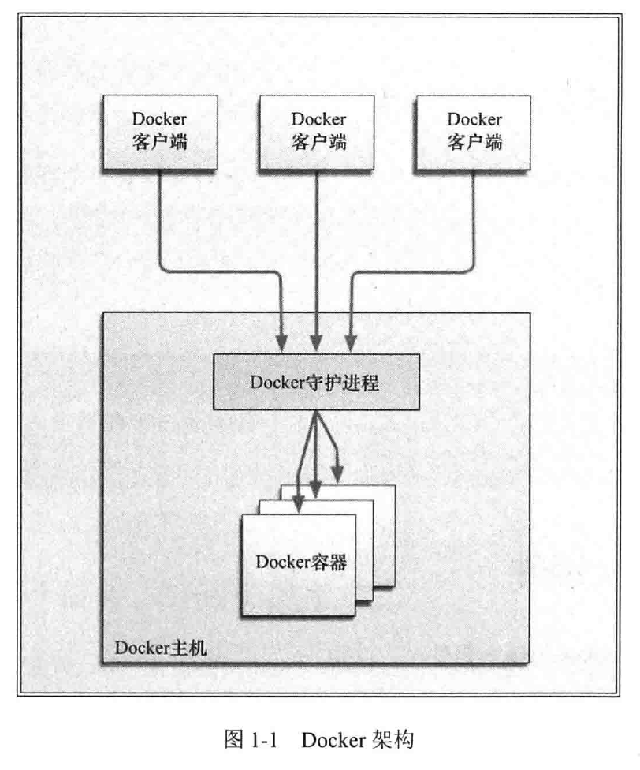

# 1 简介

​	容器与管理程序虚拟化（hypervisor virtualization， HV）有所不同，管理程序虚拟化通过中间层将一台或者多台独立的机器虚拟运行与物理硬件之上，而容器则是直接运行在操作系统内核之上的用户空间。因此，容器虚拟化也被称为“操作系统级虚拟化”，容器技术可以让多个独立的用户空间运行在同一台宿主机上。

​	和传统的虚拟化以及半虚拟化（paravirtualization）相比，容器运行不需要模拟层（emulation layer）和管理层（hypervisor），而是使用操作系统的系统调用接口。这降低了运行单个容器所需的开销，也使得宿主机中可以进行更多的容器。

## 1.1 Docker 简介

## 1.2 Docker 组件

### 1.2.1 Docker 客户端和服务器

​	Docker 是一个客户-服务器（C/S）架构的程序。Docker 客户端只需向 Docker 服务器或守护进程发出请求，服务器或守护进程将完成所有工作并返回结果。Docker 提供了一个命令行工具 docker 以及一整套 RESTFUL API。



### 1.2.2 Docker 镜像

​	镜像是构建 Docker 世界的基石。用户基于镜像来运行自己的容器。镜像也是 Docker 生命周期中的”构建“部分。镜像是基于联合（Union）文件系统的一种层式的结构，由一系列指令一步一步构建出来。

### 1.2.3 Registry

​	Docker 用 Registry 来保存用户构建的镜像。Registry 分为公共和私有。

### 1.2.4 容器

​	Docker 可以帮你构建和部署容器，只需要把自己的应用程序或服务打包放进容器即可。可以认为，镜像是 Docker 生命周期中的构建或者打包阶段，而容器则是启动或执行阶段。

​	总结起来，Docker 容器就是：

- 一个镜像格式；

- 一系列标准的操作；

- 一个执行环境。

​	每个容器都包含一个软件镜像，容器里的软件镜像可以进行一些操作。例如，镜像可以被创建、启动、关闭、重启以及销毁。

​	Docker 在执行上述操作时，并不关心容器中到底塞进了什么，它不管里面是 Web 服务器，还是数据库，或者是应用服务器。所有容器都是按照相同的方式将内容“装载”进去。

## 1.5 Docker 的技术组件

​	Docker 包括以下几个部分：

​	一个原生的 Linux 容器格式， Docker 中称为 libcontainer，或者很流行的容器平台 lxc。libcontainer 格式现在是 Docker 容器的默认格式。

​	Linux 内核的命名空间，用于隔离文件系统、进程和网络。

- 文件系统隔离：每个容器都有自己的 root 文件系统。
- 进程隔离：每个容器都运行在自己的进程环境中。
- 网络隔离：容器间的虚拟网络接口和 IP 地址都是分开的。
- 资源隔离和分组：使用 cgroups（即 control group， Linux 的内核特性之一）将 CPU和内存之类的资源独立分配给每个 Docker 容器。
- 写时复制：文件系统都是通过写时复制创建的，这就意味着文件系统是分层的、快速的，而且占用的磁盘空间更小。
- 日志：容器产生的 STDOUT 、 STDERR 和 STDIN 这些 IO 流都会被收集并记入日志，用来进行日志分析和故障排错。
- 交互式 shell：用户可以创建一个伪 tty 终端，将其连接到 STDIN ，为容器提供一个交互式的 shell。

# 2 安装 Docker

## 2.9 Docker 守护进程

​	Docker 以 root 权限运行它的守护进程，来处理普通用户无法完成的操作（如挂载文件系统）。 docker 程序是 Docker 守护进程的客户端程序，同样也需要以 root 身份运行。

​	当 Docker 软件包安装完毕后，默认会立即启动 Docker 守护进程。守护进程监听/var/run/docker.sock 这个 Unix 套接字文件，来获取来自客户端的 Docker 请求。如果系统中存在名为 docker 的用户组的话， Docker 则会将该套接字文件的所有者设置为该用户组。这样， docker 用户组的所有用户都可以直接运行 Docker ，而无需再使用 sudo 命令了。

### 2.9.1 配置 Docker 守护进程

​	运行 Docker 守护进程时，可以使用 -H 标志调整守护进程绑定监听接口的方式。

​	我们可以使用 -H 标志指定不同的网络接口和端口配置，比如，要想绑定到网络接口，命令代码如下。

``` bash
$ sudo /user/bin/docker -d -H tcp://0.0.0.0:2375
```

​	这条命令会将 Docker 守护进程绑定到宿主机上的所有网络接口。 Docker 客户端不会自动检测到网络的变化，我们需要通过 -H 选项来指定服务器的地址。例如，如果把守护进程端口改成 4200，那么运行客户端时就必须指定 docker -H :4200。如果不想每次运行客户端时都加上 -H 标志，我们可以通过设置 DOCKER_HOST 环境变量来省略此步骤，代码如下：

``` bash
$ export DOCKER_HOST="tcp://0.0.0.0:2375"
```

`默认情况下， Docker 的客户端-服务器通信是不经认证的。这就意味着，如果把 Docker 绑定到对外公开的网络接口上，那么任何人都可以连接到该 Docker 守护进程。 Docker0.9 以及更高版本提供了 TLS 认证。`

# 3 Docker 入门 

## 3.1 确保 Docker 已经就绪

​	查看 docker 程序是否存在，功能是否正常，指令如下。

``` bash
$ sudo docker info
```

​	这里我们调用了 docker 可执行程序的 info 命令，该命令会返回所有容器和镜像（镜像即是 Docker 用来构建容器的“构建块”）的数量、 Docker 使用的执行驱动和存储驱动（execution and storage driver），以及 Docker 的基本配置。

## 3.2 运行我们的第一个容器

``` bash
$ sudo docker run -i -t ubuntu /bin/bash
```

​	-i 标志保证容器中 STDIN 是开启的，尽管我们并没有附着到容器中。持久的标准输入是交互式 shell 的“半边天”， -t 标志则是另外的“半边天”，它告诉 Docker 为要创建的容器分配一个伪 tty 终端。这样容器才能提供交互式 shell 。若要在命令行下创建一个我们能与之进行交互的容器，而不是一个运行后台服务的容器，则这两个参数已经是基本参数了。

​	首先 Docker 会检查本地是否存在 ubuntu 镜像，如果本地还没有该镜像的话，那么 Docker 就会连接官方维护的 Docker Hub Registry ，查看 Docker Hub 中是否有该镜像。 Docker 一旦找到该镜像，就会下载该镜像并将其保存到本地宿主机中。

​	随后， Docker 在文件系统内部用这个镜像创建了一个新容器。该容器拥有自己的网络、 IP 地址，以及一个用来和宿主机进行通信的桥接网络接口。最后，我们告诉 Docker 在新容器中要运行什么命令，如上面的例子中我们在容器中运行 /bin/bash 命令启动了一个 Bash shell 。

​	当容器创建完毕之后， Docker 就会执行容器中的 /bin/bash 命令，我们就可以看到容器内的 shell了。

## 3.3 使用第一个容器

​	这是一个完整的 Ubuntu 系统，我们可以做任何事情。当所有工作结束时，输入 exit，就可以返回到 Ubuntu 宿主机的命令行提示符了。此时容器也停止运行了，只有在指定的 /bin/bash 命令处于运行状态的时候，容器才会相应地处于运行状态。一旦退出容器， /bin/bash 命令也就结束了，测试容器也会随之停止运行。

​	但容器仍然是存在的，可以使用 docker ps -a 命令查看当前系统中容器的列表。

​	默认情况下，当执行 docker ps 命令是，只能看到正在运行的容器。如果指定 -a 标志选项的话，那么 docker ps 命令会列出所有容器，包括正在运行的和已经停止的。

## 3.4 容器命名

``` bash
$ sudo docker run --name bob_the_container -i -t ubuntu /bin/bash
```

​	上述命令将会创建一个名为 bob_the_container 的容器。一个合法的容器名称只能包括以下字符：小写字母  a~z、大写字母 A~Z、数字 0~9、下划线、圆点、横线（如果用正则表达式来表示这些符号，就是[a-zA-Z0-9_.-]）。

## 3.5 重新启动已经停止的容器

``` bash
$ sudo docker start bob_the_container
```

​	使用容器名称或者容器 ID 来指定容器重启。

## 3.6 附着到容器上

``` bash
$ sudo docker attach bob_the_container
```

​	可以使用 docker attach 命令，重新附着到该容器的会话上。

## 3.7 创建守护式容器

``` bash
$ sudo docker run --name daemon_dave -d ubuntu /bin/sh -c "while true; do echo hello world; sleep 1; done"
```

​	docker run 命令使用 -d 参数，因此 Docker 会将容器放到后台运行。

## 3.8 容器内部都在干什么

``` bash
$ sudo docker logs daemon_dave
```

​	可以使用 docker logs 命令来获取容器的日志。 Docker 会输出最后几条日志项并返回。我们也可以在命令后使用 -f 参数来监控 Docker 的日志，类似 tail -f。通过 Ctrl + C 退出日志跟踪。

​	可以使用 docker logs --tail 10 daemon_dave 获取日志的最后10行内容。另外可以使用 docker logs 0 -f daemon_dave 命令来跟踪某个容器的最新日志而不必读取整个日志文件。

​	为了调试更加简单，我们还可以使用 -t 标志位每条日志项加上时间戳。

``` bash
$ sudo docker logs -ft daemon_dave
```

## 3.10 在容器内部运行进程

​	在 Docker 1.3 之后，可以通过 docker exec 命令在容器内部额外启动新进程。可以在容器内运行的进程有两种类型：后台任务和交互式任务。后台任务在容器内运行且没有交互需求，而交互式任务则保持在前台运行。对于需要在容器内部打开 shell 的任务，交互式任务是很实用的。