# 1 走进 java

## 1.2 java 技术体系

​	JDK （ Java Development Kit ）包括 Java 程序设计语言、 Java API 类库和 Java 虚拟机。 JDK 是用于支持 Java 程序开发的最小环境。

​	JRE（ Java Runtime Environment ）包括 Java API 类库中的 Java SE API 子集和 Java 虚拟机， JRE 是支持 Java 程序运行的标准环境。

## 1.4 java 虚拟机发展史

### 1.4.2 Sun HotSpot VM

​	HotSpot VM  的热点代码检测能力可以通过执行计数器找出最有编译价值的代码，然后通知 JIT 编译器以方法为单位进行编译。如果一个方法被频繁调用，或方法中训话次数很多，将会分别触发标准编译和 OSR（栈上替换）编译动作。通过编译器与解释器恰当地协同工作，可以在最优化的程序响应时间与最佳执行性能中取得平衡，而且无须等本地代码输出才能执行程序，即时编译的时间压力也相对减小，这样有助于引入更多的代码优化技术，输出质量更高的本地代码。

## 1.6 实战：自己编译 jdk

### 1.6.1 获取 JDK 源码

​	OpenJDK 是 Sun在2006年末把 Java 开源而形成的项目。Sun 自 JDK 1.5 之后就开始以 Java Research License （JRL）的形式公布过 Java 源码。把 这些 JRL 许可证形式的 Sun/OracleJDK 源码和对应版本的 OpenJDK 源码进行比较，发现除了文件头的版权注释之外，其余代码基本上都是相同的，只有字体渲染部分存在一点差异。 Oracle JDK 中还会存在一些 Open JDK 没有的、商用闭源的功能，例如从 JRockit 移植改造而来的 Java Flight Recorder 。

# 2 Java 内存区域与内存溢出异常

​	Java 虚拟机所管理的内存将会包括以下几个运行时数据区域。

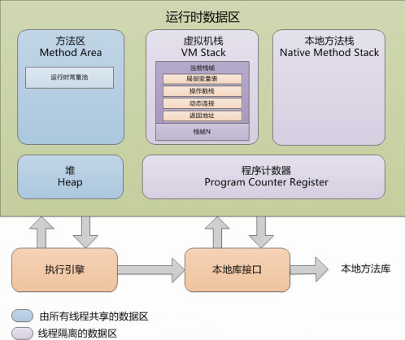

### 2.2.1 程序计数器

​	程序技术器（ Program Counter Register ） 是一块较小的内存空间，它可以看作是当前线程所执行的字节码的行号指示器。在虚拟机的概念模型里（仅是概念模型，各种虚拟机可能会通过一些更高效的方式去实现），字节码解释器工作时就是通过改变这个计数器的值来选取下一条需要执行的字节码指令，分支、循环、跳转、异常处理、线程恢复等基础功能都需要依赖这个计数器完成。

​	由于 Java 虚拟机的多线程是通过线程轮流切换并奉陪处理器执行时间的方式来实现的，在任何一个确定的时刻，一个处理器（对于多核处理器来说是一个内核）都只会执行一条线程中的命令。因此，为了线程切换后能恢复到正确的执行位置，每条线程都需要一个独立的程序计数器，各条线程之间计数器互不影响，独立存储，我们称这类内存区域为“线程私有”的内存。

​	如果线程正在执行的是一个 Java 方法，这个计数器记录的是正在执行的虚拟机字节码指令的地址；如果正在执行的是 Native 方法，这个计数值则为空（ Undefined ）。此内存区域是唯一一个在 Java 虚拟机规范中没有规定任何 OutOfMemoryError 情况的区域。

### 2.2.2 Java 虚拟机栈

​	与程序计数器一样， Java 虚拟机栈（ Java Virtual Machine Stacks ）也是线程私有的，它的生命周期与线程相同。虚拟机栈描述的是 Java 方法执行的内存模型：每个方法在执行的同时会创建一个栈帧（ Stack Frame ）用于存储局部变量表、操作数栈、动态链接、方法出口等信息。每一个方法总调用直至执行完成的过程，就对应一个栈帧在虚拟机栈中入栈到出栈的过程。

​	局部变量表存放了编译期可知的各种基本数据类型（ boolean 、 byte 、 char 、 short 、 int 、 float 、 long 、 double ）、对象引用（ reference 类型，它不等同于对象本身，可能是一个指向对象起始地址的引用指针，也可能是执行一个代表对象的句柄或其他与此对象相关的位置）和 returnAddress 类型（指向了一条字节码指令的地址）。

​	其中 64 位长度的 long 和 double 类型的数据会占用2个局部变量空间（ Slot ），其余的数据类型只占用1个。局部变量表所需的内存空间在编译期间完成分配，当进入一个方法时，这个方法需要在帧中分配多大的局部变量空间是完全确定的，在方法运行期间不会改变局部变量表的大小。

​	在 Java 虚拟机规范中，对这个区域规定了两种异常情况：如果线程请求的栈深度大于虚拟机所允许的深度，将抛出 StackOverflowError 异常：如果虚拟机栈可以动态扩展（当前大部分 Java 虚拟机都可以动态扩展，只不过 Java 虚拟机规范中也允许固定长度的虚拟机栈），如果扩展时无法申请到足够的内存，就会抛出 OutOfMemoryError 异常。

### 2.2.3 本地方法栈

​	本地方法栈（ Native Method Stack ）与虚拟机栈所返回的作用是非常相似的，他们之间的区别不过是虚拟机栈为虚拟机执行 Java 方法（也就是字节码）服务，而本地方法则为虚拟机使用到的 Native 方法服务。在虚拟机规范中对本地方法栈中方法使用的语言、使用方式与数据结构并没有强制规定，因此具体的虚拟机栈可以自由实现它。与虚拟机栈一样，本地方法栈区域也会抛出 StackOverflowError 和 OutOfMemoryError 异常。

### 2.2.4 Java 堆

​	Java 堆是被所有线程共享的一块内存区域，在虚拟机启动时创建。所有的对象实例以及数组都要在堆上分配，但是随着 JIT 编译器的发展与逃逸分析技术逐渐成熟，栈上分配、标量替换优化技术将会导致一些微妙的变化发生，所有的对象都分配在堆上也渐渐变得不那么“绝对”了。

​	Java 堆是垃圾收集器管理的主要区域，因此很多时候也被称作“ GC 堆”。从内存分配的角度来看，线程共享的 Java 堆可能划分出多个线程私有的分配缓冲区（ Thread Local Allocation Buffer ， TLAB ）。

​	Java 堆可以处于物理上不连续的内存空间中，只要逻辑上是连续的即可。在实现时，既可以实现成固定大小的，也可以是可扩展的，不过当前主流的虚拟机都是按照可扩展来实现的（通过 ``-Xmx`` 和 ``-Xms`` 控制）。

### 2.2.5 方法区

​	方法区（ Method Area ）是各个线程共享的内存区域，用于存储已被虚拟机加载的类信息、常量、静态变量、即时编译器编译后的代码数据。虽然 Java 虚拟机规范把方法区描述为堆的一个逻辑部分，但是它却又一个别名叫做 Non-Heap （非堆），目的应该是与 Java 对区分开来。

​	这个区域的内存回收目标主要是针对常量池的回收和对类型的卸载。

### 2.2.6 运行时常量池

​	运行时常量池（ Runtime Constant Pool ）是方法区的一部分。 Class 文件中除了有类的版本、字段、方法、接口等描述信息外，还有一项信息是常量池（ Constant Pool Table ），用于存放编译期生成的各种字面量和符号引用，这部分内容将在类加载后进入方法区的运行时常量池中存放。

​	Java 语言并不要求常量一定只有编译期才能产生，也就是并非预置入 Class 文件中常量池的内容才能进入方法区运行时常量池，运行期间也可以将新的常量放入池中，这种特性被利用得比较多的便是 String 类的 intern() 方法。

> 1. 直接定义字符串变量的时候赋值，如果表达式右边只有字符串常量，那么就是把变量存放在常量池里面。
>
> 2. new出来的字符串是存放在堆里面。
>
> 3. 对字符串进行拼接操作，也就是做"+"运算的时候，分2种情况：
>
>    i.表达式右边是纯字符串常量，那么存放在栈里面。
>
>    ii.表达式右边如果存在字符串引用，也就是字符串对象的句柄，那么就存放在堆里面。
>
>    String 的 intern() 把字符串对象加入常量池中。

### 2.2.7 直接内存

​	直接内存（ Direct Memory ）并不是虚拟机运行时数据区的一部分，也不是 Java 虚拟机规范中定义的内存区域。但是这部分内存也被频繁地使用，而且也可能导致 OutOfMemoryError 异常出现。

​	在 JDK 1.4 中新加入了 NIO 类，引入了一种基于通道（ Channel ）与缓冲区（ Buffer ）的 I/O 方式，它可以使用 Native 函数库直接分配对外内存，然后通过一个存储在 Java 堆中的 DirectByteBuffer 对象作为该块内存的引用进行操作。这样能在一些场景中显著提高性能，因为避免了在 Java 堆和 Native 堆中来回复制数据。

## 2.3 HotSpot 虚拟机对象探秘

### 2.3.1 对象的创建

​	虚拟机遇到一条 new 指令时，首先将去检查这个指令的参数是否能在常量池中定位到一个类的符号引用，并且检查这个符号引用代表的类是否已被加载、解析和初始化。如果没有，那必须先执行相应的类加载过程。

​	在类加载检查通过后，接下来虚拟机将为新生对象分配内存。对象所需内存大小在类加载完成后便可完全确定。

​	假设 Java 堆中内存是绝对规整的，所有用过的内存都放在一边，空闲的内存放在另一边，中间放着一个指针作为分界点的指示器，分配内存就仅仅是把那个指针向空闲空间那边挪动一端与对象大小相等的距离，这种分配方式称为“指针碰撞”（ Bump the Pointer ）。

​	如果 Java 堆中的内存并不是规整的，已使用的内存和空间的内存相互交错，虚拟机就必须维护一个列表，记录哪些内存块是可用的，在分配的时候从列表中找到一块足够大的空间划分给对象实例，并更新列表上的记录，这种分配方式称为“空闲列表”（ Free List ）。

​	选择哪种分配方式由 Java 堆是否规整决定，而 Java 堆是否规整又由所采用的垃圾收集器是否带有压缩整理功能决定。因此，在使用 Serial 、 ParNew 等带 Compact 过程的收集器是，系统采用的分配算法是指针碰撞，而使用  CMS 这种基于 Mark-Sweep 算法的收集器时，通常采用空闲列表。

​	除如何划分可用空间之外，还有另一个需要考虑的问题是对象创建在虚拟机中是非常频繁的行为，即使是仅仅一个修改指针所指向的位置，在并发情况下也并不是线程安全的。解决这个问题有两种方案，一种是对分配内存空间的动作进行同步处理——实际上虚拟机采用 CAS 配上失败重试的方式保证更新操作的原子性；另一种是把内存分配的动作按照线程划分在不同的空间中进行，即每个线程在 Java 堆中预先分配一小块内存，称为本地线程分配缓冲（ Thread Local Allocation Buffer , TLAB ）。哪个线程要分配内存，就在哪个线程的 TLAB 上分配，只有 TLAB 用完并分配新的 TLAB 时，才需要同步锁定。虚拟机是否使用 TLAB ，可以通过 `` -XX:+/-UseTLAB``参数来设定。

​	内存分配完成后，虚拟机需要将分配到的内存空间都初始化为零值（不包括对象头），如果使用 TLAB ，这一工作也可以提前至 TLAB 分配时进行。这一步操作保证了对象的实例字段在 Java 代码中不赋初始值就可以直接使用，程序能访问到这些字段的数据类型所对应的零值。

​	接下来，虚拟机要对对象进行必要的设置，例如这个对象是哪个类的实例、如何才能找到类的元数据信息、对象的哈希码、对象的 GC 分代年龄等信息。这些信息存放在对象的对象头（ Object Header ）之中。根据虚拟机当前的运行状态不同，如是否有偏向锁等，对象头会有不同的设置方式。

​	上面工作都完成后，从虚拟机的视角来看，一个新的对象已经产生了，但从 Java 程序的视角来看，一般来说（由字节码中是否跟随 invokespecial 指令所决定），执行 new 指令之后会接着执行\< init \>方法。

### 2.3.2 对象的内存布局

​	在 HotSpot 虚拟机中，对象在内存中存储的布局可以分为3块区域：对象头（ Header ）、实例数据（ Instance Data ）和对齐填充（ Padding ）。

​	HotSpot 虚拟机的对象头包括两部分信息，第一部分用于存储对象自身的运行时数据，如哈希码（ HashCode ）、 GC 分代年龄、锁状态标志、线程持有的锁、偏向线程 ID 、偏向时间戳等，这部分数据的长度在32位和64位的虚拟机（未开启压缩指针）中分别为32 bit 和64 bit ，官方称它为“ Mark Word ”。对象需要存储的运行时数据很多，其实已经超出了32位、64位 Bitmap 结构所能记录的限度， Mark Word 被设计成一个非固定的数据结构以便在极小的空间内存储尽量多的信息，它会根据对象的状态复用自己的存储空间。例如，在32位的 Hotspot 虚拟机中，如果对象处于未被锁定的状态下，那么 Mark Word 的32 bit 空间中的25 bit 用于存储对象哈希码，4 bit 用于存储对象分代年龄，2 bit 用于存储锁标志位，1 bit 固定为0，而在其他状态（轻量级锁定、重量级锁定、 GC 标记、可偏向）下对象的存储内容如下。

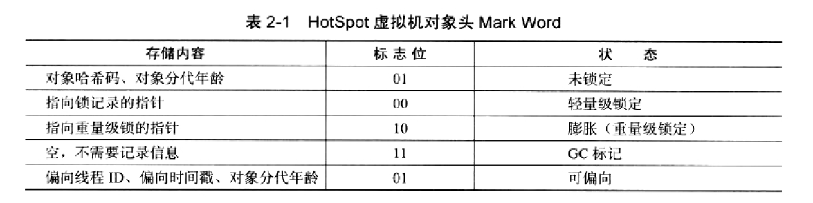

​	对象头的另外一部分是类型指针，即对象指向它的类元数据的指针，虚拟机通过这个指针来确定这个对象是哪个类的实例。并不是所有的虚拟机实现都必须在对象数据上保留类型指针，话句话说，查找对象的元数据信息并不一定要经过对象本身。另外，如果对象是一个数组，还必须有一块用于记录数组长度的数据。

​	无论是从父类集成下来的，还是在子类中定义的，在程序代码中所定义的各种类型的字段内容，都需要记录下来。这部分的存储顺序会受到虚拟机分配策略参数（ FiledsAllocationStyle ）和字段在 Java 源码中定义顺序的影响。 Hotspot 虚拟机默认的分配策略为 longs/doubles 、ints 、 shorts/chars 、bytes/booleans 、 oops （ Ordinary Object Pointers ），从分配策略可以看出，相同宽度的字段总是被分配到一起。在满足这个前提条件的情况下，在父类中定义的变量会出现在子类之前。如果 CompactFileds 参数值为 true （默认为 true），那么子类之中较窄的变量也可能会插入到父类变量的空隙之中。

​	第三部分对齐填充并不是必然存在的，也没有特别的含义，它仅仅起着占位符的作用。由于 Hotspot VM 的自动内存管理系统要求对象起始地址必须是8字节的整数倍，也就是对象的大小必须是8字节的整数倍。而对象头正好是8字节的整数倍，因此，当对象实例数据部分没有对齐时，就需要通过对齐填充来补全。

### 2.3.3 对象的访问定位

​	通过何种方式定位、访问堆中对象的具体位置，取决于虚拟机的实现而定的。目前主流的访问方式由使用句柄和直接指针两种。

- 如果使用句柄访问的话，那么 Java 堆中将会划分出一块内存来作为句柄池， reference 中存储的就是对象的句柄地址，而句柄中包含了对象实例数据与类型数据各自的具体地址信息，如下图所示。


- 如果使用直接指针访问，那么 Java 堆对象的布局就必须考虑如何放置访问类型数据的相关信息，而 reference 中存储的直接就是对象地址，如下图所示。

  

​	使用句柄的最大好处就是 reference 中存储的稳定的句柄地址，在对象被移动（垃圾收集时，移动对象是非常普遍的行为）时只会改变句柄中的实例数据指针，而 reference 本身不需要修改。

​	使用直接指针访问方式的最大好处就是速度快，它节省了一次指针定位的时间开销，由于对象的访问在 Java 中非常频繁，因此这类开销积少成多后也是一项非常可观的执行成本。 Sun HotSpot 使用第二种防护四进行对象访问。

### 2.4 实战 OutMemoryError 异常

### 2.4.2 虚拟机栈和本地方法栈溢出

​	操作系统分配给每个进程的内存是有限制的，譬如 32 位的 Windows 限制为 2 GB 。剩余的内存为 2 GB （操作系统限制）减去 Xmx （最大堆容量），再减去 MaxPermSize （最大方法区容量），程序计数器小号内存很小，可以忽略掉。如果虚拟机进程本身消耗的内存不计算在内，剩下的内存就有虚拟机栈和本地方法栈“瓜分”了。

​	如果是建立过多线程导致的内存溢出，在不能减少线程数或者更换 64 位虚拟机的情况下，就只能通过减少最大堆和减少栈容量来换取更多的线程。

### 2.4.3 方法区和运行时常量池溢出

​	当前的很多主流框架，如 Spring 、 Hibernate ，在对类进行增强是，都会使用到 CGLib 这类字节码技术，增强的类越多，就需要越大的方法区来保证动态生成的 Class 可以加载入内存。另外， JVM 上的动态语言（如 Groovy 等）通常都会持续创建类来实现动态语言的特性。

​	方法区溢出是一种常见的溢出异常，一个类要被垃圾收集器回收掉，判定条件是比较苛刻的。在经常动态生成大量 Class 的应用中，需要特别注意类的惠州状况。这类场景除了 CGLib 字节码增强和动态语言之外，常见的还有：大量 JSP 或动态产生 JSP文件多的应用（ JSP 第一次运行时需要编译为 Java 类）、基于 OSGi 的应用（即使是同一个类文件，被不同的加载器加载也会被视为不同的类）等。

### 2.4.4 本机直接内存溢出

​	DirectMemory 容量可以通过 -XX ：MaxDirectMemorySize 指定，如果不指定，则默认与 Java 堆最大值（ -Xms 指定）一样，下面的代码通过 DirectByteBuffer 类，直接通过反射获取 Unsafe 实例进行内存分配（ Unsafe 类的 getUnsafe() 方法限制了只有引导类加载器才会返回实例，也就是设计者希望只有 rt.jar 中的类才能使用 Unsafe 的功能）。因为，虽然使用 DirectByteBuffer 分配内存也会抛出内存溢出异常，但它抛出异常时并没有真正向操作系统申请分配内存，而是通过计算得知内存无法分配，于是手动抛出异常，真正申请分配内存的方法是 unsafe.allocateMemory() 。

``` java
public class DirectMemoryOOM {

    private static final int _1MB = 1024 * 1024;

    public static void main(String[] args) throws Exception {
        Field unsafeField = Unsafe.class.getDeclaredFields()[0];
        unsafeField.setAccessible(true);
        Unsafe unsafe = (Unsafe) unsafeField.get(null);
        while (true) {
            unsafe.allocateMemory(_1MB);
        }
    }
}
```

​	通过 DirectMemory 导致的内存溢出，一个明显的特征是在 Heap Dump 文件中不会看见明显的异常，如果发现 OOM 之后 Dump 文件很小，而程序中又直接或间接使用了 NIO，可以考虑检查一下是不是这方面的原因。

# 3 垃圾收集器与内存分配策略

## 3.1 引用计数算法

​	主流的 Java 虚拟机里面没有选用引用计数算法来管理内存，其中主要的原因是它很难解决对象之间互相循环引用的问题。

## 3.2 可达性分析算法

 	算法的基本思路是通过一系列称为”GC Roots”的对象作为起始点，从这些节点开始向下搜索，搜索走过的路径称之为”引用链（ Reference Chain ）”，当一个对象到 GC Roots 没有任何的引用链相连时(从GC Roots到这个对象不可达)时，证明此对象是不可用的。


​	在 Java 语言中，可作为 GC Roots 的对象包括下面几种：

- 虚拟机栈（栈帧中的本地变量表）中引用的对象。
- 方法区中类静态属性引用的对象。
- 方法区中常量引用的对象。
- 本地方法中 JNI（即一般说的 Native 方法）引用的对象。

​	 Java 从 JDK 1.2版本之后，把对象的引用分为四种级别：强引用（ Strong Reference ）、软引用（ Soft Reference ）、弱引用（ Weak Reference ）和虚引用（ Phantom Reference ）。这4种引用强度依次逐渐减弱。

- 强引用就是指在程序代码之中普遍存在的，类似“ Object obj = new Object() ”这类的引用，只要强引用还存在，垃圾器永远不会回收掉被引用的对象。

- 软引用是用来描述一些还有用但并非必需的对象。对于软引用关联着的对象，在系统将要发生内存溢出异常之前，将会把这些对象列进回收范围之中进行第二次回收。如果这次回收还没有足够的内存，才会抛出内存溢出异常。在 JDK 1.2之后，提供了 SoftReference 类来实现软引用。这一点可以很好地用来解决 OOM 问题，这个特性适合用来实现缓存：比如网页缓存、图片缓存等。

  ```java
  Browser prev = new Browser();// 获取页面进行浏览
  SoftReference<Browser> sr = new SoftReference<>(prev);// 浏览完毕后置为软引用
  if (sr.get() != null) {
      rev = sr.get();// 未被回收器回收，直接获取
  } else {
      prev = new Browser();// 内存不足时，软引用对象已被回收。重新构建。
      sr = new SoftReference<>(prev);
  }
  ```

- 弱引用也是用来描述非必需对象的，但是它的强度比软引用更弱一些，被弱引用关联的对象只能生存到下一次垃圾回收发生之前，当垃圾回收器工作时，无论当前内存是否足够，都会回收掉只被弱引用关联的对象。在 JDK 1.2之后，提供了 WeakReference 类来实现弱引用。由于，垃圾回收器是一个优先级很低的线程，因此不一定会很快发现那些只具有弱引用的对象。

- 虚引用也称为幽灵引用或者幻影引用，它是最弱的一种引用关系。一个对象是否有虚引用的存在，完全不会对其生存时间构成影响，也无法通过虚引用来取得一个对象实例。为一个对象设置虚引用关联的唯一目的就是能在这个对象被收集器回收时收到一个系统通知。在 JDK 1.2之后，提供了 PhantomReference 类来实现虚引用。

  | 引用类型   | 用途           | 被回收时间 | 生存时间          |
  | ---------- | -------------- | ---------- | ----------------- |
  | **强引用** | 对象的一般状态 | 从来不会   | JVM停止运行时终止 |
  | **软引用** | 对象缓存       | 内存不足   | 内存不足时终止    |
  | **弱引用** | 对象缓存       | 垃圾回收   | GC运行后终止      |
  | **虚引用** | unknow         | unknow     | unknow            |

### 3.2.4 生存还是死亡

​	即使在可达性分析算法中不可达的对象，也并非是“非死不可”的，真正宣告一个对象死亡，至少要经历两次标记过程：如果对象在进行可达性分析后发现与 GC Roots 相连接的引用链，那它将会被第一次标记并且进行一次筛选，筛选的条件是此对象是否有必要执行 finalize() 方法。当对象没有覆盖 finalize() 方法，或者 finalize() 方法已经被虚拟机调用过，虚拟机将这两种情况都视为“没有必要执行”。

​	如果这个对象被判定有必要执行 finalize() 方法，那么这个对象将会放置在一个叫做 F-Queue 的队列中，并在稍后由一个虚拟机自动建立的、低优先级的 Finalizer 线程去执行它。这里的“执行”是指虚拟机会触发这个方法，但并不承诺会等待它运行结束，这样做的原因是，如果一个对象在 finalize() 方法中执行缓慢，或者发生了死循环（更极端的情况），将很可能会导致 F-Queue 队列中其他对象永久等待，甚至导致整个内存会后系统崩溃。 finalize() 方法是对象逃脱死亡命运的最后一次机会，稍后 GC 将对 F-Queue 中的对象进行第二次小规模的标记。

​	finalize() 不是 C/C++ 中的析构函数，而是 Java 刚诞生时为了使 C/C++ 程序员更容易接受它所作出的一个妥协。它的运行代价高昂，不确定性大，无法保证各个对象的调用顺序。

### 3.2.5 回收方法区

​	方法区（或者 HotSpot 虚拟机中的永久代）中进行垃圾收集的“性价比”一般比较低。

​	永久代的垃圾收集主要回收两部分内容：废弃常量和无用的类。以常量池中字面量的回收为例，假如一个字符串“abc”已经进入了常量池中，没有任何 String 对象引用常量池中的“abc”常量，也没有其他地方引用了这个字面量，如果这时发生内存回收，而且必要的话，这个“abc”常量就会被系统清理出常量池。

​	判定一个常量是否是“废弃常量”比较简单，而要判定一个类是否是“无用的类”的条件则相对苛刻许多。类需要同时满足下面3个条件才能算是“无用的类”：

- 该类所有的实例都已经被回收，也就是 Java 堆中不存在该类的任何实例。

- 加载该类的 ClassLoader 已经被回收。

- 该类对应的 java.lang.Class 对象没有在任何地方被引用，无法在任何地方通过反射访问该类的方法。

​	虚拟机可以对满足上述3个条件的无用类进行回收，这里说的仅仅是“可以”，而并不是和对象一样，不使用了就必然会回收， HotSpot 虚拟机提供了 -Xnoclassgc 参数进行控制，还可以使用 -verbose:class 以及 -XX:+TraceClassLoading 、 -XX:+TraceClassUnLoading 查看类加载和卸载信息，其中  -verbose:class 和 -XX:+TraceClassLoading 可以在 Product 版的虚拟机中使用， -XX:+TraceClassUnLoading 参数需要 FastDebug 版的虚拟机支持。

## 3.3 垃圾收集算法

### 3.3.1 标记-清除算法


​	最基础的收集算法是“标记-清除”（ Mark-Sweep ）算法，算法分为“标记”和“清除”两个阶段：首先标记出所有需要回收的对象，在标记完成后统一回收所有被标记的对象。它的不足主要有两个：一个是效率问题，标记和清除两个过程的效率都不高；另一个是空间问题，标记清除之后会产生大量不连续的内存碎片，空间碎片太多可能会导致以后再程序运行过程中需要分配较大对象时，无法找到足够的连续内存而不得不提前触发另一次垃圾收集动作。


### 3.3.2 复制算法


​	“复制”（ Copying ）算法，解决了效率问题，它将可用内存按容量划分为大小相等的两块，每次只使用其中一块。当这一块的内存用完了，就将还存活的对象复制到另一块上面，然后再把已使用过的内存空间一次清理掉。这样使得每次都对整个半区进行内存回收，内存分配时也就不用考虑内存碎片等复杂情况，只要一动堆顶指针，按顺序分配内存即可，实现简单，运行高效。代价是将内存缩小为原来的一半。

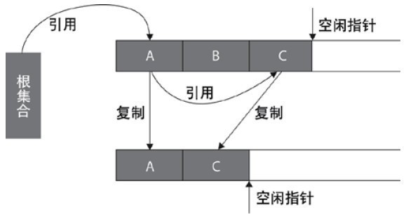

​	现在商业虚拟机都采用这种收集算法来回收新生代， IBM 公司的专门研究表明，新生代中的对象98%是“朝生夕死”的，所以并不需要按照1：1的比例来划分内存空间，而是将内存分为一块较大的 Eden 空间和两块较小的 Survivor 空间，每次使用 Eden 和其中一块 Survivor 空间。当回收时，将 Eden 和 Survivor 中还存活着的对象一次性地复制到另外一块 Survivor 空间上，最后清理掉 Eden 和刚才使用过的 Survivor 空间。 Hotspot 虚拟机默认 Eden 和 Survivor 的大小比例是 8:1。当 Survivor 空间不够用时，需要依赖其他内存（这里指老年代）进行分配担保（ Handle Promotion ）。

### 3.3.3 标记-整理算法


​	老年代一般不能直接使用复制收集算法。

​	标记过程与“标记-清除”算法一样，后续让所有存活的对象都向一端移动，然后直接清理掉边界以外的内存。


### 3.3.4 分代收集算法

​	在新生代中，每次垃圾收集时都发现有大批对象死去，只有少量存活，那就选用复制算法，只需要付出少量存活对象的复制成本就可以完成收集。而老年代中因为对象存活率高，没有额外空间对它进行分配担保，就必须使用“标记-清理”或者“标记-整理”算法进行回收。

## 3.4 HotSpot 的算法实现

### 3.4.1 枚举根节点

​	可达性分析对执行时间的敏感体现在 GC 停顿上，因为这项分析工作必须在一个能确保一致性的快照中进行——这里的“一致性”的意思是指在整个分析期间整个执行系统看起来就像被冻结在某个时间点上，不可以出现分析过程中对象引用关系还在不断变化的情况，该点不满足的话分析结果就无法得到保证。这点是导致 GC 进行时必须停顿所有 Java 执行线程的其中一个重要原因。

​	目前的主流 Java 虚拟机使用的都是准确式 GC ，所以当执行系统停顿下来后，并不需要一个不漏地检查完所有执行上下文和全局的引用位置，虚拟机应当是有办法直接得知哪些地方存放着对象的引用。在 HotSpot 的实现中，是使用一组称为 OopMap 的数据结构来达到这个目的，在类加载完成的时候， HotSpot 就把对象内什么偏移量上是什么类型的数据计算出来，在 JIT 编译过程中，也会在特定的位置记录下栈和寄存器中哪些位置是引用。这样， GC 在扫描时就可以直接得知这些信息了。

### 3.4.2 安全点

​	HotSpot 没有为每条指令都生成 OopMap ，只是在“特定的位置”记录了这些信息，这些位置称为安全点（ Safepoint ），即程序执行时并非在所有地方都能停顿下来开始 GC ，只有在到达安全点事才能暂停。安全点的选定基本上是以程序“是否具有让程序长时间执行的特征”为标准进行选定的——因为每条指令执行的时间都非常短暂，程序不太可能因为指令流长度太长这个原因而过长时间运行，“长时间执行”的最明显特征就是指令序列复用，例如方法调用、循环跳转、异常跳转等，所以具有这些功能的指令才会产生 Safepoint 。

​	抢先式中断（ Preemptive Suspension ）：不需要线程的执行代码主动配合，在 GC 发生时，首先把所有线程全部中断，如果发现有线程中断的地方不在安全点上，就恢复线程，让它“跑”到安全点上。现在几乎没有虚拟机实现采用抢先式中断来暂停线程从而响应 GC 事件。

​	主动式中断（Voluntary Suspension ）：当 GC 需要中断的时候，不直接对线程操作，仅仅简单地设置一个标志，各个线程执行时主动去轮询这个标志，发现中断标志为真时就自己中断挂起。轮询标志的地方和安全点是重合的，另外再加上创建对象需要分配内存的地方。

### 3.4.3 安全区域

​	安全区域（ Safe Region ）是指一段代码片段之中，引用关系不会发生变化。在这个区域中的任何地方开始 GC 都是安全的，可以把 Safe Region 看做是被拓展了的 Safepoint 。

​	在线程执行到 Safe Region 中的代码时，首先标识自己已经进入了 Safe Region ，当在这段时间里 JVM 要发起  GC 时，就不用管标识自己为 Safe Region 状态的线程了。在线程要离开 Safe Region 时，它要检查系统是否已经完成了根节点枚举（或者是整个 GC 过程），如果完成了，那线程就继续执行，否则它就必须等待直到收到可以安全离开 Safe Region 的信号为止。

## 3.5 垃圾收集器

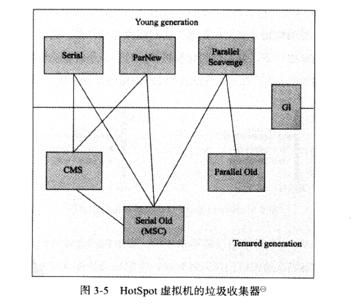

​	上图展示了7种作用于不同分代的收集器，如果两个收集器之间存在连线，就说明它们可以搭配使用。

### 3.5.1 Serial 收集器

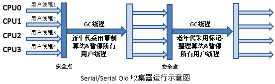

​	Serial 收集器是最基本、发展历史最悠久的收集器，曾经（在 JDK 1.3.1 之前）是虚拟机新生代收集的唯一选择。在它进行垃圾收集时，必须暂停其他所有的工作线程，直到它收集结束。

### 3.5.2 ParNew 收集器

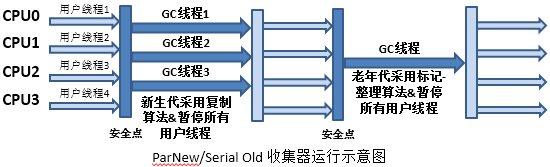

​	ParNew 收集器其实就是 Serial 收集器的多线程版本，除了使用多条线程进行垃圾收集之外，其余行为包括 Serial 收集器可用的所有控制参数（例如： -XX:SurvivorRatio 、-XX:PretenureSizeThreshold 、 -XX:HandlePromotionFailure 等）、收集算法、 Stop The World 、对象分配规则、回收策略等都与 Serial 收集器完全一样。

​	它是许多运行在 Server 模式下的虚拟机中首选的新生代收集器，其中一个与性能无关的重要原因是，除了 Serial 收集器外，目前只有它能与 CMS （ Concurrent Mark Sweep ）收集器配合工作。

​	ParNew 收集器在单 CPU 的环境中绝对不会有比 Serial 收集器更好的效果，甚至优于存在线程交互的开销，该收集器在通过超线程技术实现的两个 CPU 的环境中都不能百分之百地保证可以超越 Serial 收集器。随着可以使用的 CPU 的数量的增加，它对于 GC时系统资源的有效利用还是很有好处的。它默认开启的收集线程数与 CPU 的数量相同，在 CPU 非常多的环境下，可以使用 -XX:ParallelGCThreads 参数来限制垃圾收集的线程数。

>在垃圾收集器的上下文语境中，将并发和并行，做专门解释。
>
>- 并行（ Parallel ）：指多条垃圾收集线程并行工作，但此时用户线程仍然处于等待状态。
>- 并发（ Concurrent ）：指用户线程与垃圾收集线程同时执行（但不一定是并行的，可能会交替执行），用户程序在继续执行，而垃圾收集程序运行在另一个 CPU 上。

### 3.5.3 Parallel Scavenge 收集器

​	Parallel Scavenage 收集器的目标是达到一个可控制的吞吐量。所谓吞吐量就是 CPU 用于运行客户代码的时间与 CPU 总消耗时间的比值，即吞吐量=运行用户代码时间/（运行用户代码时间+垃圾收集时间）。

​	停顿时间越短就越适合需要与用户交互的程序，良好的响应速度能提升用户体验，而高吞吐量则可以高效率地利用 CPU 时间，尽快完成程序的运算任务，主要适合在后台运算而不需要太多交互的任务。

​	Parallel Scavenage 收集器提供了两个参数用于精确控制吞吐量，分别是控制最大垃圾收集停顿时间的 -XX:MaxGCPauseMillis 参数以及直接设置吞吐量大小的 -XX:GCTimeRatio 参数。

​	MaxGCPauseMillis 参数允许的值是一个大于0的毫秒数，收集器将尽可能地保证内存回收花费的时间不超过设定值。不要以为如果把这个参数设置得稍小一点就能使得系统的垃圾收集速度变得更快， GC 停顿时间缩短是以牺牲吞吐量和新生代空间来换取的。

​	 -XX:GCTimeRatio 参数的值应当是一个大于0且小于100的整数，也就是垃圾收集时间占总时间的比率，相当于是吞吐量的倒数。如果把此参数设置为19，那允许的最大 GC 时间就占总时间的5%（即1/(1+19)），默认值为99，就是允许最大1%（即1/（1+99））的垃圾收集时间。

​	Parallel Scavenage 收集器也经常称为“吞吐量优先”收集器。Parallel Scavenage 收集器还有一个参数 -XX:UseAdaptiveSizePolicy ，这是一个开关参数，当这个参数打开之后，就不需要手工指定新生代的大小（ -Xmn ）、 Eden 与 Survivor 区的比例（ -XX:SurvivorRatio ）、晋升老年代对象年龄（ -XX:PretenureSizeThreshold ）等细节参数了，虚拟机会根据当前系统的运行情况收集性能监控信息，动态调整这些参数以提供最合适的停顿时间或者最大的吞吐量，这种调节方式称为 GC 自适应的调节策略。自适应调节策略也是 Parallel Scavenge 收集器与 ParNew 收集器的一个重要区别。

### 3.5.4 Serial Old 收集器

​	Serial Old 收集器是 Serial 收集器的老年代版本，同样是一个单线程收集器，使用“标记-整理”算法。这个收集器的主要意思也是在于给 Client 模式下的虚拟机使用。如果在 Server 模式下，那么它主要还有两大用途：一种用途是在 JDK 1.5 以及以前的版本中与 Parallel Scavenage 收集器搭配使用，另一种用途就是作为 CMS 收集器的后备预案，在并发收集发生 Concurrent Mode Failure 时使用。

### 3.5.5 Parallel Old 收集器

​	Parallel Old 是 Parallel Scavenge 收集器的老年代版本，使用多线程和“标记-整理”算法。在注重吞吐量以及 CPU 资源敏感的场合，都可以优先考虑 Parallel Scavenage 加 Parallel Old 收集器。

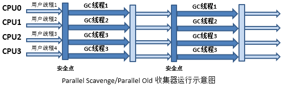

### 3.5.6 CMS 收集器

​	CMS（ Concurrent Mark Sweep ）收集器是以一种获取最短回收停顿时间为目标的收集器。

​	CMS 收集器是基于“标记——清除”算法实现的，整个过程分为4个步骤：

- 初始标记（ CMS initial mark ）

- 并发标记（ CMS concurrent mark ）

- 重新标记（ CMS remark ）

- 并发清除（ CMS concurrent sweep ）

  初始标记、重新标记这两个步骤需要“ Stop The World ”。初始标记仅仅只是标记一下 GC Roots 能直接关联到的对象，速度很快，并发标记阶段就是进行 GC Roots Tracing 的过程，而重新标记阶段则是为了修正并发标记期间因用户程序继续运作而导致标记产生变动的那一部分对象的标记记录，这个阶段的停顿时间会比初始标记阶段稍长一些，但远比并发标记时间短。

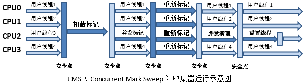

​	CMS 有以下3个明显的缺点：

- CMS 收集器对 CPU 资源非常敏感。 CMS 默认启动的回收线程数是（ CPU 数量+3）/4，也就是当 CPU 在4个以上时，并发回收时垃圾收集线程不少于25%的 CPU 资源，并且随着 CPU 数量的增加而下降。
- CMS 无法处理浮动垃圾，可能出现“ Concurrent Mode Failure ”失败而导致另一次 Full GC 产生。由于 CMS 并发清理阶段用户线程还在运行着，伴随程序运行自然就还会有新的垃圾不断产生，着一部分垃圾出现在标记过程之后， CMS 无法再档次收集中处理掉它们，只要等待下一次 FC 时再清理掉。这一部分垃圾就称为“浮动垃圾”。 CMS 收集器需要预留一部分空间提供并发收集时的程序运作使用。在 JDK 1.5 的默认设置下， CMS 收集器当老年代使用了 68% 的空间后就会被激活，这是一个偏保守的设置，如果在应用中老年代增长不是很快，可以适当调高参数 -XX:CMSInitiatingOccupancyFraction 的值来提高触发百分比，以便降低内存回收次数从而获取更好的性能，在 JDK 1.6 中， CMS 收集器的启动阈值已经提升至92%。要是 CMS 运行期间预留的内存无法满足程序需要，就会出现一次“ Concurrent Mode Failure ”失败，这时虚拟机将启动后备预案：临时启用 Serial Old 收集器来重新进行老年代的垃圾收集，这样停顿时间就很长了。所以说参数 -XX:CMSInitiatingOccupancyFraction 设置得太高很容易导致大量“ Concurrent Mode Failure ”失败，性能反而降低。
- 收集结束时，会有大量空间碎片产生。 CMS 收集器提供了一个 -XX:+UseCMSCompactAtFullCollection 开关参数（默认是开启的），用于在 CMS 收集器顶不住要进行 FullGC 时开启内存碎片的合并整理过程，内存整理的过程是无法并发的，空间碎片问题没有了，但停顿时间不得不变长。虚拟机设计者还提供了另外一个参数 -XX:CMSFullGCsBeforeCompaction ，这个参数用于设置执行多少次不压缩的 Full GC 后，跟着来一次带压缩的（默认值为0，表示每次进入 Full GC 时都进行碎片整理）

### 3.5.7 G1 收集器

​	G1 特点：

- 并行与并发
- 分代收集
- 空间整合
- 可预测的停顿：能让使用者明确再也一个长度为 M 毫秒的时间片段内，消耗在垃圾收集上的时间不得超过 N 毫秒。

​	G1 收集器将整个 Java 堆划分为多个大小相等的独立区域（ Region ），虽然还保留有新生代和老年代的概念，但新生代和老年代不再是物理隔离的了，它们都是一部分 Region （不需要连续）的集合。

​	G1 收集器之所以能建立可预测的停顿时间模型，是因为它可以有计划地避免在整个 Java 堆中进行安全区域的垃圾收集。G1 跟踪各个 Region 里面的垃圾堆积的价值大小（回收所获得的空间大小以及回收所需时间的经验值），在后台维护一个优先列表，每次根据允许的收集时间，优先回收价值最大的 Region 。这种使用 Region 划分内存空间以及优先级的区域回收方式，保证了 G1 收集器在有限的时间内可以获取尽可能高的收集效率。

​	在 G1 收集器中， Region 之间的对象引用以及其他收集器中的新生代与老年代之间的对象引用，虚拟机都是使用 Remembered Set 来避免全堆扫描的。 G1 中每个 Region 都有一个与之对应的 Remembered Set ，虚拟机发现程序在对 Reference 类型的数据进行写操作时，会产生一个 Writer Barrier 暂时中断写操作，检查 Reference 引用对象是否处于不同的 Region 之中，如果是，便通过 CardTable 把相关引用信息记录到被引用对象所属的 Region 的 Remembered Set 之中。当进行内存回收时，在 GC 根节点的枚举范围中加入 Remembered Set 即可保证不对全堆扫描也不会有遗漏。

​	如果不计算维护 Remembered Set 的操作， G1 收集器的运作大致可划分为以下几个步骤：

- 初始标记（ Initial Marking）

- 并发标记（ Concurrent Marking ）

- 最终标记（ Fianl Marking ）

- 筛选回收（ Live Data Counting and Evacuation ）

​	初始标记阶段仅仅只是标记一下 GC Roots 能直接关联到的对象，并且修改 TAMS （ Next Top at Mark Start ）的值，让下一阶段用户程序并发运行时，能在正确可用的 Region 中创建新对象，这个阶段需要停顿线程，但耗时很短。

​	并发标记阶段是从 GC Root 开始对堆对象进行可达性分析，找出存活的对象，这阶段耗时较长，但可与用户程序并发执行。

​	最终标记阶段则是为了修正在并发标记期间因用户陈旭继续运作而导致标记产生变动的那一部分标记记录，虚拟机将这段时间对象变化记录在线程 Remembered Set Logs 里面，最终标记阶段需要把 Remembered Set Logs 的数据合并到 Remembered Set 中，这个阶段需要停顿线程，但是可并行执行。

​	筛选回收阶段首先对各个 Region 的回收价值和成本进行排序，根据用户所期望的 GC 停顿时间来制定回收计划。


### 3.5.8 理解 GC 日志

​	每个收集器的日志格式可以不一样。但虚拟机设计者为了方便用户阅读，将各个收集器的日志都维持一定的共性，例如以下两段典型的 GC 日志：

> 33.125：[ GC [ DefNew : 3324k->152k(3712k), 0.0025925 secs ] 3324k->152k(11904K),0.0031680 secs ]
>
> 100.667：\[ Full GC [ Tenured：0K-＞210K(10240K)，0.0149142 secs ] 4603K-＞ 210K(19456K)，\[ Perm：2999K-＞2999K(21248K)]，0.0150007 secs][Times：user=0.01 sys=0.00，real=0.02 secs]

​	最前面的数字“33.125：”和“100.667：”代表了GC发生的时间，这个数字的含义是从Java虚拟机启动以来经过的秒数。

​	GC 日志开头的“[GC”和“[Full GC”说明了这次垃圾收集的停顿类型。如果有“Full”，说明这次 GC 是发生了 Stop-The-World 的，例如下面这段新生代收集器 ParNew 的日志也会出现“[Full GC”（这一般是因为出现了分配担保失败之类的问题，所以才导致 STW ）。如果是调用 System.gc() 方法所触发的收集，那么在这里将显示“[ Full GC ( System )”。

> [Full GC 283.736：[ParNew：261599K-＞261599K（261952K），0.0000288 secs]

​	接下来的“[DefNew”、“[Tenured”、“[Perm”表示GC发生的区域，这里显示的区域名称与使用的GC收集是密切相关的，例如上面样例所使用的Serial收集器中的新生代名为“Default New Generation”，所以显示的是“[DefNew”。

​	后面方括号内部的“3324K-＞152K（3712K）”含义是“GC前该内存区域已使用容量-＞GC后该内存区域已使用容量（该内存区域总容量）”。 
而在方括号之外的“3324K-＞152K（11904K）”表示“GC前Java堆已使用容量-＞GC后Java堆已使用容量（Java堆总容量）”。

​	再往后，“0.0025925 secs”表示该内存区域GC所占用的时间，单位是秒。

​	有的收集器会给出更具体的时间数据，如“[Times：user=0.01 sys=0.00，real=0.02 secs]”，这里面的 user 、 sys 和 real 与 Linux 的 time 命令所输出的时间含义一致，分别代表用户态消耗的 CPU 时间、内核态消耗的 CPU 事件和操作从开始到结束所经过的墙钟时间（ Wall Clock Time ）。

​	CPU时间与墙钟时间的区别是，墙钟时间包括各种非运算的等待耗时，例如等待磁盘 I/O 、等待线程阻塞，而 CPU 时间不包括这些耗时，但当系统有多 CPU 或者多核的话，多线程操作会叠加这些 CPU 时间，所以 user 或 sys 时间超过 real 时间是完全正常的。

| 参　　数                                                     | 描　　述                                                     |
| ------------------------------------------------------------ | ------------------------------------------------------------ |
| UseSerialGC                                                  | 虚拟机运行在 Client 模式下的默认值，打开此开关后，使用 Serial + Serial Old 的收集器组合进行内存回收 |
| UseParNewGC                                                  | 打开此开关后，使用 ParNew + Serial Old 的收集器组合进行内存回收 |
| UseConcMarkSweepGC                                           | 打开此开关后，使用 ParNew + CMS + Serial Old 的收集器组合进行内存回收。 Serial Old 收集器将作为 CMS 收集器出现 Concurrent Mode Failure 失败后的后备收集器使用 |                                                              |
| UseParallelGC                                                | 虚拟机运行在 Server 模式下的默认值，打开此开关后，使用 Parallel Scavenge + Serial Old（PS MarkSweep）的收集器组合进行内存回收 |
| UseParallelOldGC                                             | 打开此开关后，使用 Parallel Scavenge + Parallel Old 的收集器组合进行内存回收 |
| SurvivorRatio                                                | 新生代中 Eden 区域与 Survivor 区域的容量比值， 默认为8， 代表 Eden ：Survivor =8∶1 |
| PretenureSizeThreshold                                       | 直接晋升到老年代的对象大小，设置这个参数后，大于这个参数的对象将直接在老年代分配 |
| MaxTenuringThreshold                                         | 晋升到老年代的对象年龄。每个对象在坚持过一次 Minor GC 之后，年龄就加1，当超过这个参数值时就进入老年代 |
| UseAdaptiveSizePolicy                                        | 动态调整 Java 堆中各个区域的大小以及进入老年代的年龄         |
| HandlePromotionFailure                                       | 是否允许分配担保失败，即老年代的剩余空间不足以应付新生代的整个 Eden 和 Survivor 区的所有对象都存活的极端情况 |
| ParallelGCThreads                                            | 设置并行 GC 时进行内存回收的线程数                           |
| GCTimeRatio                                                  | GC 时间占总时间的比率，默认值为99，即允许1% 的 GC 时间。仅在使用 Parallel Scavenge 收集器时生效 |
| MaxGCPauseMillis                                             | 设置 GC 的最大停顿时间。仅在使用 Parallel Scavenge 收集器时生效 |
| CMSInitiatingOccupancyFraction                               | 设置 CMS 收集器在老年代空间被使用多少后触发垃圾收集。默认值为68%，仅在使用 CMS 收集器时生效 |
|UseCMSCompactAtFullCollection|设置 CMS 收集器在完成垃圾收集后是否要进行一次内存碎片整理。仅在使用 CMS 收集器时生效|
|CMSFullGCsBeforeCompaction|设置 CMS 收集器在进行若干次垃圾收集后再启动一次内存碎片整理。仅在使用 CMS 收集器时生效|

## 3.6 内存分配与回收策略

​	对象主要分配在新生代的 Eden 区上，如果启动了本地线程分配缓冲，将按线程优先在 TLAB 上分配。少数情况下也可能会直接分配在老年代中，分配的规则并不是百分之百固定的，其细节取决于当前使用的哪一种垃圾收集器组合，还有虚拟机中与内存相关的参数的设置。

### 3.6.1 对象优先在 Eden 分配

​	大多数情况下，对象在新生代 Eden 区中分配。当 Eden 区没有足够空间进行分配时，虚拟机将发起一次 Minor  GC 。

> - 新生代 GC （ Minor GC ）：指发生在新生代的垃圾收集动作，因为 Java 对象大多都具备朝生夕灭的特性，所以 Minor GC 非常频繁，一般回收速度也比较块。
>
> - 老年代 GC （ Major GC / Full GC ）：指发生在老年代的 GC ，出现了 Major GC ，经常会伴随至少一次的 Minor GC （但非绝对的，在 Parallel Scavenge 收集器的收集策略里就直接进行 Major GC 的策略选择过程）。 Major GC 的速度一般会比 Minor GC 慢 10 倍以上。

### 3.6.2 大对象直接进入老年代

​	所谓的大对象是指，需要大量连续内存空间的 Java 对象，最典型的大对象就是那种很长的字符串以及数组。虚拟机提供了一个 -XX:PretenureSizeThreshold 参数，令大于这个设置值得对象直接在老年代分配。避免在 Eden 区以及两个 Survivor 区之间发生大量的内存复制。

> PretenureSizeThreshold 参数只针对 Serial 和 ParNew 两款收集器有效， Parallel Scavenge 收集器不认识这个参数， Parallel Scavenge 收集器一般并不需要设置。如果遇到必须使用此参数的场合，可以考虑 ParNew 和 CMS 的收集器组合。

### 3.6.3 长期存活的对象将进入老年代

​	虚拟机采用了分代收集的思想管理内存。虚拟机给每个对象定义了一个对象年龄计数器。如果对象在 Eden 出生并经过第一次 Minor GC 后仍然存活，并且能被 Survivor 容纳的haul，将被移动到 Survivor 空间中，并且对象年龄设为1。对象在 Survivor 区中每“熬过”一次 Minor GC ，年龄就增加 1 岁，当它的年龄增加到一定程度（默认为15岁），就会被晋升到老年代中。对象晋升老年代的年龄阈值，可以通过参数 -XX:MaxTenuringThreshold 设置。

### 3.6.4 动态对象年龄判定

​	为了更好地适应不同程序的内存状况，虚拟机并不是永远地要求对象的年龄必须达到 MaxTenuringThreshold 才能晋升老年代，如果在 Survivor 空间中相同年龄所有对象大小的总和大于 Survivor 空间的一半，年龄大于或等于该年龄的对象就可以直接进入老年代，无须等到 MaxTenuringThreshold 中要求的年龄。

### 3.6.5 空间分配担保

​	在发生 Minor GC 之前，虚拟机会先检查老年代最大可用的连续空间是否大于新生代所有对象空间，如果这个条件成立，那么 Minor GC 可以确保是安全的。如果不成立，则虚拟机会查看 HandlePromotionFailure 设置是否允许担保失败。如果允许，那么会继续检查老年代最大可用的连续空间是否大于历次晋升到老年代对象的平均大小，如果大于，将尝试这进行一次 Minor GC ，尽管这次 Minor GC 是有风险的；如果小于，或者 HandlePromotionFailure 设置不允许冒险，那这时也要改为进行一次 Full GC 。

​	在 JDK 6 Update 24 之后， HandlePromotionFailure 参数不会影响到虚拟机的空间分配担保策略，虽然源码中还定义了 HandlePromotionFailure 参数，但是在代码中已经不会再使用它。 JDK 6 Update 24 之后的规则变为只要老年代的连续空间大于新生代对象总大小或者历次晋升的平均大小就会进行 Minor GC ，否则将进行 Full GC 。

# 4 虚拟机性能监控与故障处理工具

## 4.2 JDK 的命令行工具

|名称	|主要作用|
| ----- | ----- |
|jps	|JVM Process Status Tool ，显示指定系统内所有的 HotSpot 虚拟机进程|
|jstat	|JVM statistics Monitoring Tool ，用于收集 HotSpot 虚拟机各方面的运行数据|
|jinfo	|Configuration Info for Java ，显示虚拟机配置信息|
|jmap	|Memory Map for Java ，生成虚拟机的内存转储快照（ heapdump 文件）|
|jhat	|JVM Heap Dump Brower ，用于分析 heapdump 文件，它会建立一个 HTTP/HTML 服务器，让用户可以在浏览器上查看分析结果|
|jstack	|Stack Trace for Java ，显示虚拟机的线程快照|

### 4.2.1 jps：虚拟机进程状况工具

​	JDK 的很多小工具的名字都参考了 UNIX 命令的命名方式， jps 可以列出正在运行的虚拟机进程，并显示虚拟机执行主类名称以及这些进程的本地虚拟机唯一 ID （ Local Virtual Machine Identifier , LVMID ）。对于本地虚拟机进程来说， LVMID 与操作系统的进程 ID （ Process Identifier ， PID ）是一致的，但如果同时启动了多个虚拟机进程，无法根据进程名称定位时，那就只能依赖 jps 命令显示主类的功能才能区分了。

​	jps 命令格式：

``` bash
jps [ options ] [ hostid ]
```

|属性 	|作用|
| ----- | ----- |
|-q 	|只输出 LVMID ，省略主类的名称|
|-m 	|输出虚拟机进程启动时传递给主类 main ()函数的参数|
|-l 	|输出主类的全名，如果进程执行的是jar包，输出jar路径|
|-v 	|输出虚拟机进程启动时 jvm 参数|

### 4.2.2 jstat： 虚拟机统计信息监控工具

​	jstat 是用于监视虚拟机各种运行状态信息的命令行工具。它可以显示本地或者远程虚拟机进程中的类装载、内存、垃圾收集、 JIT 编译等运行数据。

``` bash
jstat [option vmid [interval [s|ms] [count]] ]
```

​	如果是本地虚拟机进程， VMID 和 LVMID 是一致的，如果是远程虚拟机，那 VMID 的格式应当是：

　　[protocol:] [//] lvmid[@hostname[:port]/servername]

​	参数 interval 和 count 分别表示查询的间隔和次数，如果省略这两个参数，说明只查询一次。例如需要每250毫秒查询一次进程2764垃圾收集状况，一共查询20次：

``` bash
jstat -gc 2764 250 20
```

​	选项 option 代表着用户希望查询的虚拟机信息，主要分为3类：类装载、垃圾收集、运行期编译状况。

|选项|作用|
| ----- | ----- |
|-class|监视装载类、卸载类、总空间以及类装载所耗费的时间|
|-gc|监视 Java 堆状况，包括 Eden 区、两个 survivor 区、老年代、永久代等的容量、已用空间、 GC 时间合计信息|
|-gccapacity|监视内容与 -gc 基本相同，但输出主要关注 Java 堆各个区域使用到最大、最小空间|
|-gcutil|监视内容与 -gc 基本相同，但输出主要关注已使用控件占总空间的百分比|
|-gccause|与 -gcutil 功能一样，但是会额外输出导致上一次 gc 产生的原因|
|-gcnew|监视新生代GC情况|
|-gcnewcapacity|监视内容与 -gcnew 基本相同，输出主要关注使用到的最大、最小空间|
|-gcold|监视老年代GC情况|
|-gcoldcapacity|监视内容与 -gcold 基本相同，输出主要关注使用到的最大、最小空间|
|-gcpermcapacity|输出永久代使用到的最大、最小空间|
|-compiler|输出 JIT 编译过的方法、耗时等信息|
|-printcompilation|输出已经被 JIT 编译过的方法|

### 4.2.3 jinfo ： Java 配置信息工具

​	jinfo 的作用是实时地查看和调整虚拟机各项参数。使用 jps 命令的 -v 参数可以查看虚拟机启动时显示指定的参数列表，但如果想知道未被显式指定的参数的系统默认值，除了去找资料以外，就得使用 jinfo 的 -flag 选项。 jinfo 还可以使用 -sysprops 选项吧虚拟机进程的 System.getProperties() 的内容打印出来。 JDK 1.6 之后，加入了运行期间修改参数的能力，可以使用 -flag [+|-] name 或者 -flag name=value 修改一部分运行期可写的虚拟机参数值。 JDK 1.6中， jinfo 对于 Windows 平台功能任由较大限制，只提供了最基本的 -flag 选项。

​	jinfo 命令格式：

``` bash
jinfo [option] pid
```

​	例如查询 CMSInitiatingOccupancyFraction 参数值：

``` bash
jinfo -flag CMSInitiatingOccupancyFraction 1444
```

### 4.2.4 jmap： Java 内存映像工具

​	jmap 的作用并不仅仅是为了获取 dump 文件，它还可以查询 finalize 执行队列、 Java 堆和永生代的详细信息，如空间使用率、当前用的哪种收集器等。

​	jmap 在 Windows 下也受到比较大的限制。除了生成 dump 文件的 -dump 选项和用于查看每个类的实例、控件占用统计的 -histo 选项在所有操作系用都提供之外，其余选项只能在 Linux/Solaris 下使用。

​	jmap 命令格式：

> jmap [option] vmid

|选项	|作用|
| ----- | ----- |
|-dump	|生成 Java 堆转储快照。格式为： -dump:[live,]format=b,file=\<filename>，其中 live 子参数说明是否只 dump 出存活的对象|
|-finalizerinfo	|显示在 F-Queue 中等待 Finalizer 线程执行 finalize 方法的对象。只在 Linux/Solaris 平台下有效|
|-heap	|显示 Java 堆详细信息，如使用哪种收集器、参数配置、分代情况等，在 Linux/Solaris 平台下有效|
|-jisto	|显示堆中对象统计信息，包含类、实例对象、合集容量|
|-permstat	|以 ClassLoader 为统计口径显示永久代内存状态。只在Linux/Solaris平台下有效|
|-F	|当虚拟机进程对 -dump 选项没有相应时。可使用这个选项强制生成 dump 快照。只在 Linux/Solaris 平台下有效|

### 4.2.6 jstack： Java 堆栈跟踪工具

​	jstack 命令用于生成虚拟机当前时刻的线程快照（一般称为 threaddump 或者 javacore 文件）。线程快照就是当前虚拟机内每一条线程正在执行的方法堆栈的集合，生成线程快照的主要目的是定位线程长时间停顿的原因，如线程死锁、死循环、请求外部资源导致的长时间等待都是导致线程长时间停顿的常见原因。

​	jstack 命令格式：

​	jstack [option] vmid

　option 选项的合法值和具体含义

|选项	|作用|
| ----- | ----- |
|-F	|当正常输出的请求不被响应时，强制输出线程堆栈|
|-l	|除堆栈外，显示关于锁的附加信息|
|-m	|如果调用到本地方法的话，可以显示c/c++的堆栈|

### 4.3.2 VisualVM：多合一故障工具处理

**4、BTrace 动态日志跟踪**

​	BTrace 是一个 VisualVM 插件，本身也是可以独立运行的程序。它的作用是在不停止目标程序运行的前提下，通过 HotSpot 虚拟机的 HotSwap 技术动态加入原本并不存在的调试代码。

​	打印调用堆栈、参数、返回值只是 BTrace 的最基本的应用， BTrace 还可以进行性能监视、定位连接泄漏和内存泄漏、解决多线程竞争问题等。

# 5 调优案例分析与实战

### 5.2.1 高性能硬件上的程序部署策略

​	计划使用 64 位 JDK 来管理大内存时，需要考虑下面可能面临的问题：

- 内存回收导致的长时间停顿。
- 现阶段，64 位 JDK 的性能测试结果普遍低于 32 位 JDK 。
- 需要保证程序足够稳定，因为这种应用要是产生堆溢出几乎就无法产生堆转储快照（因为要产生十几 GB 乃至更大的 Dump 文件），哪怕产生了快照也几乎无法分析。
- 相同程序在 64 位 JDK 消耗的内存一般比 32 位 JDK 大，这是由于指针膨胀，以及数据类型对齐补白等因素导致的。

​	计划使用逻辑集群的方式来部署程序时，需要考虑下面可能面临的问题：

- 尽量避免节点竞争全局的资源，最典型的就是磁盘竞争，各个节点如果同时访问某个磁盘文件的话（尤其是并发写操作容易出现问题），很容易导致 IO 异常。
- 很难高效率地利用某些资源池，譬如连接池，一般都是在各个节点建立自己独立的连接池，这样可能导致一些节点池满了而另外一些节点仍有较多空余。尽管可以使用集中式的 JNDI ，但这个有一定的复杂性并且可能带来额外的性能开销。
- 大量使用本地缓存（如使用大量 HashMap 作为 K/V 缓存）的应用，在逻辑集群中会造成较大的内存浪费，因为每个逻辑节点都会有一份缓存，这时候可以考虑把本地缓存改为集中式缓存。

### 5.2.3 堆外内存导致的溢出错误

​	从实践经验的角度出发，除了 Java 堆和永久代之外，应该注意到下面这些区域还会占用较多的内存，这里所有的内存总和受到操作系统进程最大内存的限制。

- Direct Memory ： 可通过 -XX:MaxDirectMemorySize 调整大小，内存不足时抛出 OutOfMemoryError 或者 OutOfMemoryError： Direct buffer memory 。
- 线程堆栈：可以通过 -Xss 调整大小，内存不足时抛出 StackOverflowError （纵向无法分配，即无法分配新的栈帧）或者 OutOfMemoryError: unable to create new native thread (（横向无法分配，即无法建立新的线程）。
- Socket 缓存区：每个 Socket 连接都 Receive 和 Send 两个缓存区，分别占大约 37 KB 和25 KB 内存，连接多的话这块内存占用也比较乐观。如果无法分配，则可能会抛出 IOException: Too many open files 异常。
- JNI 代码：如果代码中使用 JNI 调用本地库，那本地库使用的内存也不在堆中。
- 虚拟机和 GC ：虚拟机、 GC 的代码执行也要消耗一定的内存。

### 5.2.4 外部命令导致系统缓慢

​	在 Java 虚拟机中通过 Java 的 Runtime.getRuntime().exec() 方法来调用执行外部执行，是非常消耗资源的操作。即使外部命令本身能很快执行完毕，频繁调用时，创建进程的开销也非常可观。 Java 虚拟机执行这个命令的过程是：首先克隆一个和当前虚拟机拥有一样环境变量的进程，再用这个新的进程去执行外部命令，最后再退出这个进程。如果频繁执行这个操作，系统的消耗会很大，不仅是 CPU ，内存负担也很重。

### 5.2.6 不恰当数据结构导致内存占用过大

​	例如，在 HashMap<Long, Long> 结构中，只有 Key 和 Value 所存放的两个长整型数据时有效数据，共 16B （2×8B）。这两个长整型数据包装成 Java.lang.Long 对象之后，就分别具有 8B 的 MarkWord 、8B 的 Klass 指针，再加上 8B 存储数据的 long 值。在这两个 Long 对象组成 Map.Entry 之后，又多了 16B 的对象头，然后一个 8B 的 next 字段和 4B 的 int 类型的 hash 字段，为了对齐，还必须添加 4B 的空白填充，最后还有一个 HashMap 中对这个 Entry 的 8B 的引用，这样增加两个长整型数字，实际消耗的内存为 (Long（24B）×2)+Entry（32B）+HashMap Ref （8B）= 88B ，空间效率为 16B/88B = 18%。

# 6 类文件结构

## 6.3 Class 类文件的结构

​	Class 文件是一组以 8 位字节为基础单位的二进制流，当遇到需要占用 8 位字节以上空间的数据项时，则会按照高位在前的方式（ Big-Endian ）分割成若干个 8 位字节进行存储。

> Big-Edian 具体是指最高位字节在地址最低位，最低位字节在地址最高位的顺序来存储数据，它是 SPARC 、 PowerPC 等处理器的默认多字节存储顺序，而 ×86 等处理器则使用了相反的“ Little-Edian ”顺序来存储数据。

​	根据 Java 虚拟机规范的规定， Class 文件格式采用一种类似于 C 语言结构体的伪结构来存储数据，这种伪结构中只有两种数据类型：无符号和表。

​	**无符号数**：属于基本的数据类型，以 u1 、 u2 、 u4 、 u8 来分别代表 1个字节、2个字节、4个字节和8个字节的无符号数，无符号数可以用来描述数字、索引引用、数量值或者按照UTF-8编码构成的字符串值。

​	**表**：由多个无符号数或者其他表作为数据项构成的复合数据类型，所有表都习惯性地以“_info”结尾。整个 Class 文件本质上就是一张表，它由下表的数据项构成。

| 类型           | 名称                | 数量                  | 描述                                               |
| -------------- | ------------------- | --------------------- | -------------------------------------------------- |
| u4             | magic               | 1                     | 魔法数字，表明当前文件是.class文件，固定0xCAFEBABE |
| u2             | minor_version       | 1                     | Class 文件的副版本                                 |
| u2             | major_version       | 1                     | Class 文件的主版本                                 |
| u2             | constant_pool_count | 1                     | 常量池计数                                         |
| cp_info        | constant_pool       | constant_pool_count-1 | 常量池内容                                         |
| u2             | access_flags        | 1                     | 类访问标识                                         |
| u2             | this_class          | 1                     | 当前类                                             |
| u2             | super_class         | 1                     | 父类                                               |
| u2             | interfaces_count    | 1                     | 实现的接口数                                       |
| u2             | interfaces          | interfaces_count      | 实现接口信息                                       |
| u2             | fields_count        | 1                     | 字段数量                                           |
| field_info     | fields              | fields_count          | 包含的字段信息                                     |
| u2             | methods_count       | 1                     | 方法数量                                           |
| method_info    | methods             | methods_count         | 包含的方法信息                                     |
| u2             | attributes_count    | 1                     | 属性数量                                           |
| attribute_info | attributes          | attributes_count      | 各种属性                                           |

​	无论是无符号数还是表，当需要描述同一类型但数量不定的多个数据时，经常会使用一个前置的容量计数器加若干个连续的数据项的形式，这时称这一系列连续的某一类型的数据为某一类型的集合。

###  6.3.1 魔法数字与 Class 文件的版本

魔法数字的唯一作用是确定这个文件是否为一个能被虚拟机接受的 Class 文件。 Class 文件的魔法数字值为 0xCAFEBABE （咖啡宝贝）。

​	紧跟着魔法数字的4个字节存储的是 Class 文件的版本号：第5和第6个字节是次版本号（ Minor Version ），第7和第8个字节是主版本号（ Major Version ）。 Java 的版本是从 45 开始的， JDK 1.1 之后的每个 JDK 大版本发布主版本号向上加1。

### 6.3.2 常量池

​	紧接着主次版本号之后的是常量池入口，常量是可以理解为 Class 文件之中的资源仓库，它是 Class 文件结构中与其他项目关联最多的数据类型，也是占用 Class 文件空间最大的数据项目之一，同时它还是在 Class 文件中第一个出现的表类型数据项目。

​	由于常量池中常量的数量是不固定的，所以常量池的入口需要放置一项 u2 类型的数据，代表常量池的容量计数值（ constant_pool_count ）。与 Java中 语言习惯不一样的是，这个容量计数是从１而不是０开始的，在Class文件格式规范制定之时，设计者将第０项常量空出来是有特殊考虑的，这样做的目的在于满足后面某些指向常量池的索引值的数据在特定情况下需要表达“不引用任何一个常量池项目”的含义，这种情况就可以把索引值置为０来表示。 Class 文件结构中只有常量池的容量计数是从１开始，对于其他集合类型，包括接口索引集合、字段表集合、方法表集合等的容量计数都与一般习惯相同，是从０开始的。

​	常量池中主要存放两大类常量：字面量( Literal )和符号引用( Symbolic References )。字面量比较接近于Java语言层面的常量概念，如文本字符串、声明为final的常量值等。而符号引用则属于编译原理方面的概念，主要包括了下面三类常量：

- 类和接口的全限定名( Fully Qualified Name )
- 字段的名称和描述符( Descriptor )
- 方法的名称和描述符

​	Java代码在进行Javac编译的时候，并不像 C 和 C++ 那样有“连接”这一步骤，而是在虚拟机加载 Class 文件的时候进行动态连接。也就是说，在 Class 文件中不会保存各个方法、字段的最终内存布局信息，因此这些字段、方法的符号引用不经过运行期转换的话无法得到真正的内存入口地址，也就无法直接被虚拟机使用。当虚拟机运行时，需要从常量池获得对应的符号引用，再在类创建时或运行时解析、翻译到具体的内存地址之中。

​	常量池中每一项常量都是一个表，在 JDK 1.7之前共有11种结构各不相同的表结构数据，在 JDK 1.7中为了更好地支持动态语言调用，又额外增加了３种（ CONSTANT_MethodHandle_info 、 CONSTANT_MethodType_info 和 CONSTANT_InvokeDynamic_info )。这14种表都有一个共同的特点，就是表开始的第一位是一个 u1 类型的标志位，代表当前这个常量属于哪种常量类型。

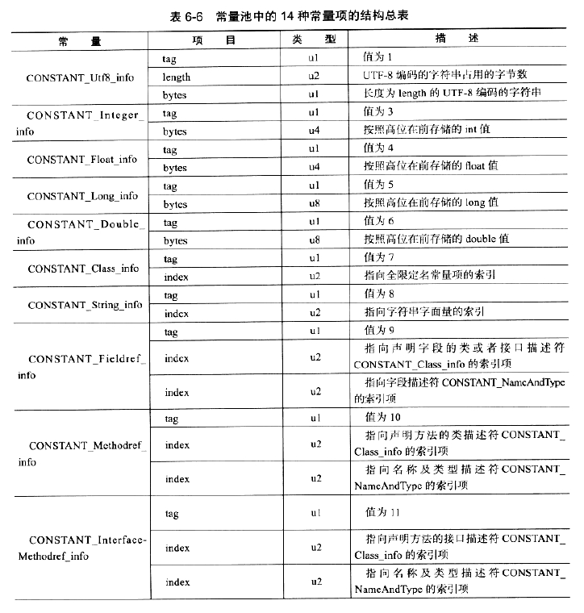

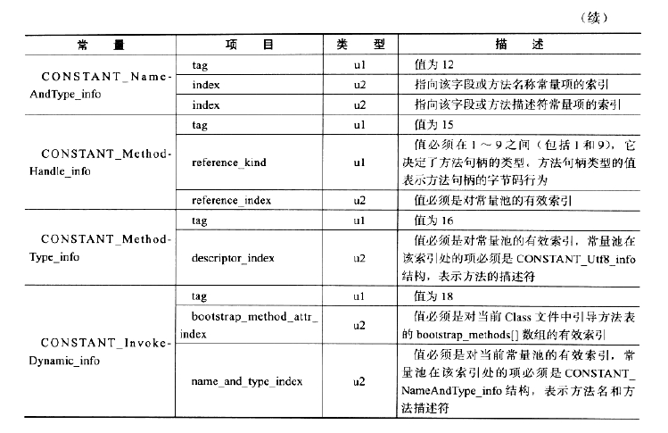

​	由于 Class 文件中方法、字段等都需要引用 CONSTANT_utf8_info 类型常量来描述名称，所以 CONSTANT_utf8_info 类型常量的最大长度也就是 Java 中方法、字段名的最大长度。而这里的最大长度就是 length 的最大值，既 u2 类型能表达的最大值 65535。所以 Java 程序中如果定义了超过64 KB 英文字符的变量或方法名，将无法编译。

### 6.3.3 访问标志

​	在常量池结束之后，紧接着的两个字节代表访问标志（ access_flags ），这个标志用于识别一些类或者接口层次的访问信息。

| 标志名称       | 标志值 | 含义                                                         |
| -------------- | ------ | ------------------------------------------------------------ |
| ACC_PUBLIC     | 0x0001 | 是否为 public 类型                                           |
| ACC_FINAL      | 0x0010 | 是否被声明为 final ，只有类可设置                            |
| ACC_SUPER      | 0x0020 | 是否允许使用 invokespecial 字节码指令的新语意， JDK 1.0.2以后编译出来的类这个标志为真 |
| ACC_INTERFACE  | 0x0200 | 标识这是一个接口                                             |
| ACC_ABSTRACT   | 0x0400 | 是否为 abstract 类型，对于接口和抽象类，此标志为真，其它类为假 |
| ACC_SYNTHETIC  | 0x1000 | 标识别这个类并非由用户代码产生                               |
| ACC_ANNOTATION | 0x2000 | 标识这是一个注解                                             |
| ACC_ENUM       | 0x4000 | 标识这是一个枚举                                             |

### 6.3.4 类索引、父类索引与接口索引集合

​	类索引、父类索引和接口索引集合都按顺序排列在访问标志之后，类索引和父类索引用两个 u2 类型的索引值表示，它们各自指向一个类型 CONSTANT_Class_info 的类描述符常量，通过 CONSTANT_Class_info 类型的常量中索引值可以找到定义在 CONSTANT_Utf8_info 类型的常量中的全限定名符串。

​	对于接口索引集合，入口的第一项—— u2 类型的数据为接口计数器（ interfacess_count ），表示索引表的容量。如果该类没有实现任何接口，则该计数器值为0，后面的索引表不再占用任何字节。

### 6.3.5 字段表集合

​	 字段表（field_info）用于描述接口或者类中剩余的变量。字段（field）包括类级变量以及实例级变量，但不包括在方法内部剩余的局部变量。

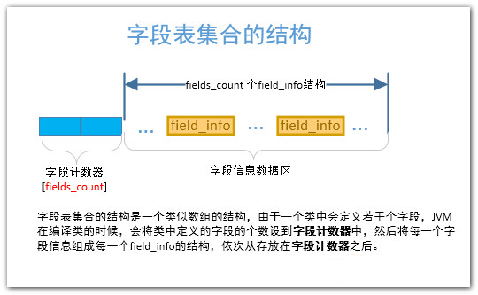

​	字段表集合紧跟在 class 文件的接口索引集合结构的后面，如下图所示。

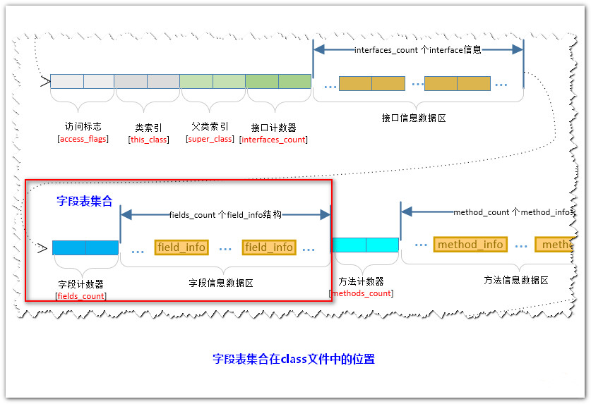

​	JVM 虚拟机规范规定了 field_info 结构体来描写叙述字段。

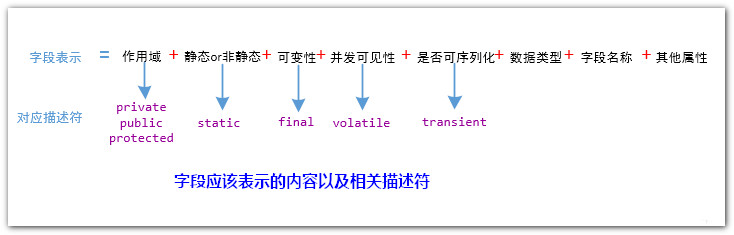

​	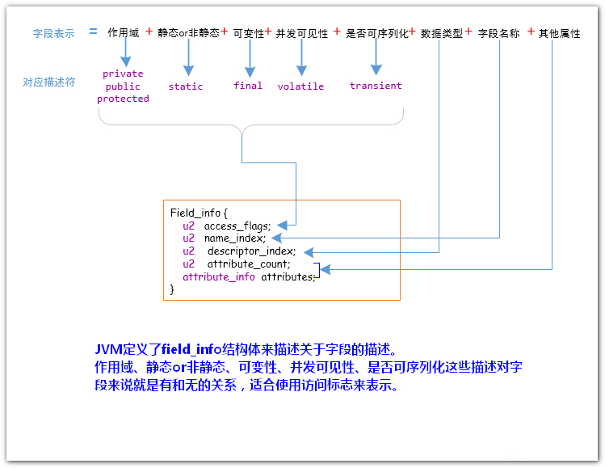

​	field 字段的访问标志(access_flags)占有两个字节，它可以表述的信息例如以下。

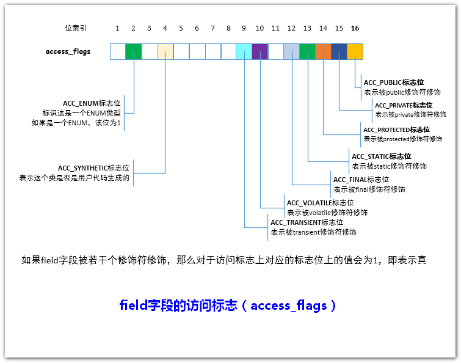

​	假设我们在某个类中有定义 field 域：private static String str;。那么在訪问标志上，第15位ACC_PRIVATE和第13位ACC_STATIC标志位都应该为1。

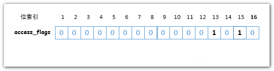

​	字段的数据类型表示和字段名称表示

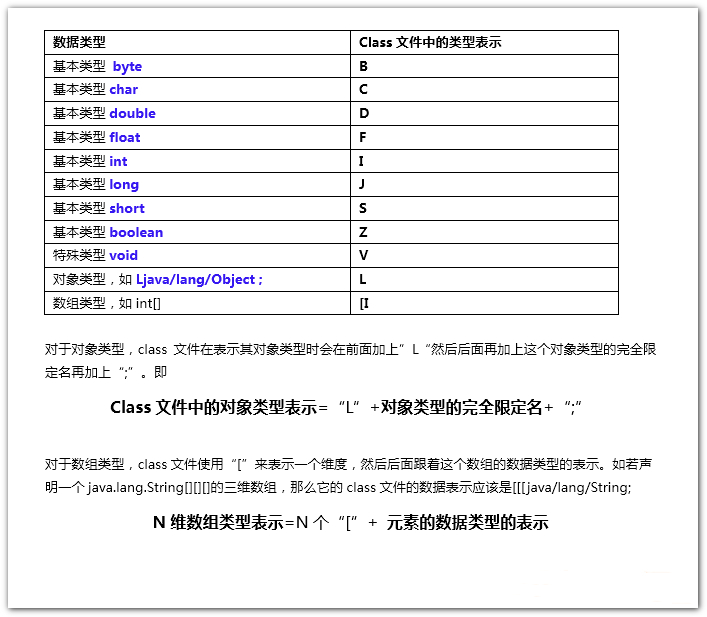

​	Sun javac编译器对于静态**field**字段的初始化赋值策略：

​	当前的 Sun javac 编译器的选择是：假设使用 final 和 static 同一时候修饰一个 field 字段。而且这个字段是基本类型或者 String 类型的。那么编译器在编译这个字段的时候，会在相应的 field_info 结构体中添加一个 ConstantValue 类型的结构体，在赋值的时候使用这个 ConstantValue 进行赋值；假设该 field 字段并没有被 final 修饰。或者不是基本类型或者 String 类型，那么将在类构造方法()中赋值。

​	例如 public static final init MAX=100; javac 编译器在编译此 field 字段构建 field_info 结构体时，除了访问标志、名称索引、描写叙述符索引外。会添加一个 ConstantValue 类型的属性表。

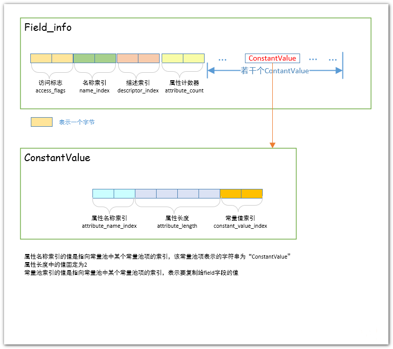

​	字段表集合中不会列出从超类或者父接口中继承而来的字段，但有可能列出原本 Java 代码之中不存在的字段，譬如在内部类中为了保持对外部类的访问性，会自动添加指向外部类实例的字段。另外在 Java 语言中字段是无法重载的，两个字段的数据类型、修饰符不管是否相同，都必须使用不一样的名称，但是对于字节码来讲，如果两个字段的描述不一致，那字段重名就是合法的。

​	示例分析：

``` java
public class Simple {
	private  transient static final String str ="This is a test";
}
```

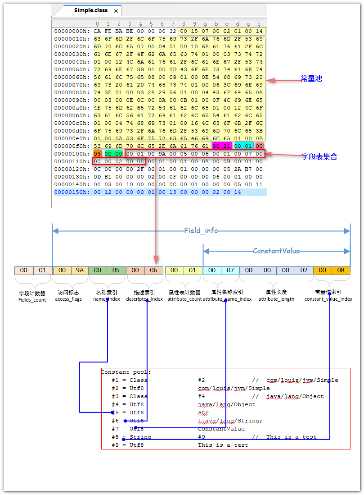

1. 字段计数器中的值为0x0001，表示这个类就定义了一个 field 字段。
2. 字段的訪问标志是0x009A，二进制是00000000 10011010，即第9、12、13、15位标志位为1，这个字段的标志符有： ACC_TRANSIENT 、 ACC_FINAL 、 ACC_STATIC 、 ACC_PRIVATE ;
3. 名称索引中的值为0x0005，指向了常量池中的第5项。为“str”，表明这个 field 字段的名称是 str ；
4. 描写叙述索引中的值为0x0006，指向了常量池中的第6项，为"Ljava/lang/String;"，表明这个 field 字段的数据类型是 java.lang.String 类型。
5. 属性表计数器中的值为0x0001，表明 field_info 另一个属性表。
6. 属性表名称索引中的值为0x0007，指向常量池中的第7项，为“ConstantValue”，表明这个属性表的名称是 ConstantValue ，即属性表的类型是 ConstantValue 类型的。
7. 属性长度中的值为0x0002，由于此属性表是 ConstantValue 类型，它的值固定为2；
8. 常量值索引中的值为0x0008，指向了常量池中的第8项。为 CONSTANT_String_info 类型的项，表示“This is a test” 的常量。在对此 field 赋值时，会使用此常量对 field 赋值。

### 6.3.6 方法集合

​	Class 文件存储格式中对方法的描述与对字段的描述几乎采用了完全一致的方式，方法的表结构如同字段表一样。

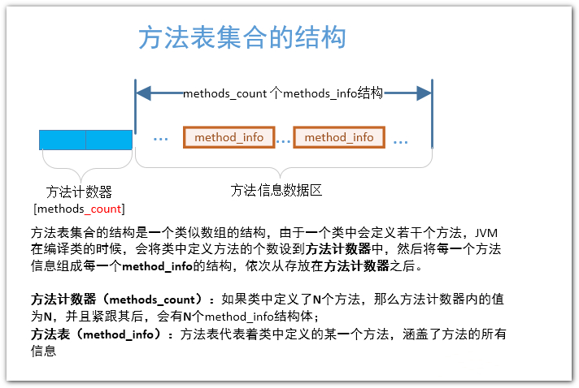

​	 method 方法的描述-方法表集合紧跟在字段表集合的后面。

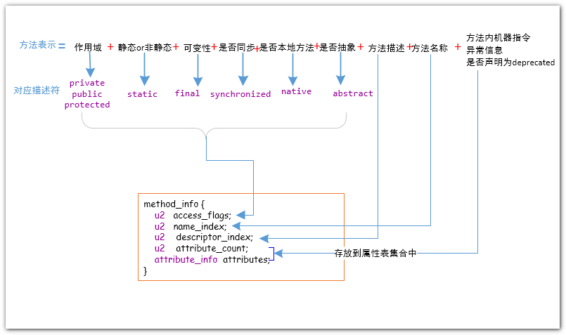

​	方法表的结构体由：访问标志( access_flags )、名称索引( name_index )、描述索引( descriptor_index )、属性表( attribute_info )集合组成。

​	方法描述符索引( descrptor_index )是紧跟在名称索引后面的两个字节，这两个字节中的值跟名称索引中的值性质一样，都是指向了常量池中的某个常量池项。这两个字节中的指向的常量池项，是表示了方法描述符的字符串。

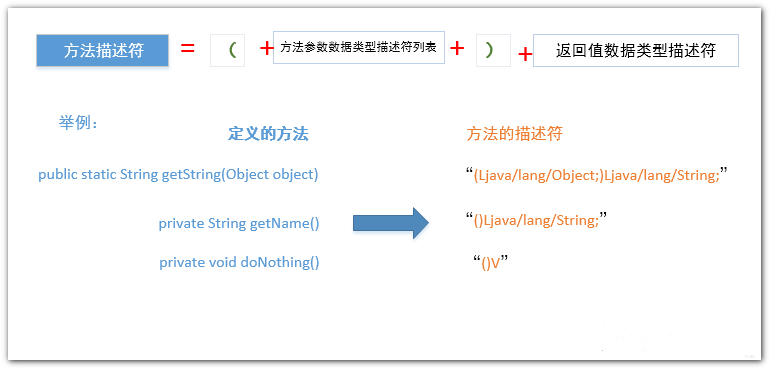

``` java
public static synchronized final void greeting() {}
```

​	如下图所示， method_info 结构体的名称索引中存储了一个索引值 x ，指向了常量池中的第 x 项，第 x 项表示的是字符串"greeting"，即表示该方法名称是"greeting"；描述符索引中的 y 值指向了常量池的第 y 项，该项表示字符串"()V"，即表示该方法没有参数，返回值是void类型。

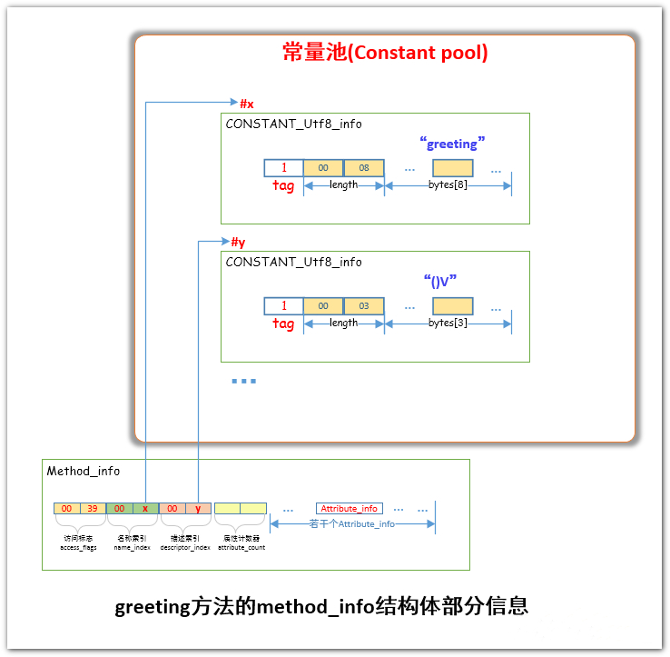

​	方法里的 Java 代码，经过编译器编译成字节码指令后，存放在方法属性表集合中一个为“Code”的属性里面，属性表是 Class 文件格式中最具扩展性的一种数据项目。

​	与字段表集合相对应的，如果父类方法在子类中没有被重写（ Override ），方法表集合中就不会出现来自父类的方法信息。同样的，有可能会出现由编译器自动添加的方法，最典型的是类构造器“\<client\>”方法和实例构造器“\<init\>”方法。

> 实例构造器：新建对象时，设置对象的初始状态。
>
> 类型构造器（静态构造器，类构造器）：用来设置类型的初始状态。类型默认没有定义类型构造器，如果定义，也只能定义一个。此外，类型构造器没有参数。类型构造器的定义类似于无参的实例构造器，区别在于必须将其标记为static。此外，类型构造器总是私有的。

​	在 Java 语言中，要重载（ Overload ）一个方法，除了要与原方法具有相同的简单名称之外，还要求必须拥有一个与原方法不同的特征签名，特征签名就是一个方法中各个参数在常量池中的字段符号引用的集合，也就是因为返回值不会包含在特征签名之中，因此Java语言里无法仅仅依靠返回值的不同来对一个已有方法进行重载。但在 Class 文件格式中，特征签名的范围更大一些，只要描述符不是完全一致的两个方法就可以共存。也就是说，如果两个方法有相同的名称和特征签名，但返回值不同，那么也是可以合法共存于同一个 Class 文件中。

### 6.3.7 属性表集合

​	在 Class 文件、字段表、方法表都可以携带自己的属性表集合，以用于描述某些场景专有的信息。

​	与 Class 文件中其他的数据项目要求严格的顺序、长度和内容不同，不再要求各个属性表具有严格顺序，并且只要不与已有属性名重复，任何人实现的编译器都可以向属性表中写入自己定义的属性信息， Java 虚拟机运行时会忽略掉它不认识的属性。

|属性名称	|使用位置	|含义|
| ---- | ---- | ---- |
|Code	                                    |方法表	            |Java代码编译成的字节码指令|
|ConstantValue	                            |字段表	            |final关键字定义的常量值|
|Deprecated	                                |类、方法表、字段表	|被声明为deprecated的方法和字段|
|Exceptions	                                |方法表	            |方法抛出的异常|
|EnclosingMethod	                        |类文件	            |仅当一个类为局部类或者匿名类时才能拥有这个属性，这个属性用于标识这个类所在的外围方法|
|InnerClasses	                            |类文件	            |内部类列表|
|LineNumberTable	                        |Code属性	        |Java源码的行号与字节码指令的对用关系|
|LocalVariableTable	                        |Code属性	        |方法的局部变量描述|
|StackMapTable	                            |Code属性	        |JDK1.6中新增的属性，供新的类型检查验证器（Type Checker）检查和处理目标方法的局部变量和操作数栈所需要的类型是否匹配|
|Signature	                                |类、方法表、字段表	|JDK1.5中新增的属性，这个属性用于支持泛型情况下的方法签名，在Java语言中，任何类、接口、初始化方法或成员的泛型签名如果包含了类型变量（Type Variables）或参数化类型（Parameterized Types），则Signature属性会为他记录泛型签名信息。由于Java的泛型采用擦除法实现，在为了避免类型信息被擦出后导致签名混乱，需要这个属性记录泛型中的相关信息|
|SourceFile	                                |类文件	            |记录源文件名称|
|SourceDebugExtension	                    |类文件	            |JDK 1.6中新增的属性，SourceDebugExtension属性用于存储额外的调试信息，譬如在进行JSP文件调试时，无法同构Java堆栈来定位到JSP文件的行号，JSR-45规范为这些非Java语言编写，却需要编译成字节码并运行在Java虚拟机中的程序提供了一个进行调试的标准机制，使用SourceDebugExtension属性就可以用于存储这个标准所新加入的调试信息|
|Synthetic	                                |类、方法表、字段表	|标识方法或字段为编译器自动生成的|
|LocalVariableTypeTable	                    |类	                |JDK 1.5中新增的属性，他使用特征签名代替描述符，是为了引入泛型语法之后能描述泛型参数化类型而添加|
|RuntimeVisibleAnnotations	                |类、方法表、字段表	|JDK 1.5中新增的属性，为动态注解提供支持。RuntimeVisibleAnnotations属性用于指明哪些注解是运行时（实际上运行时就是进行反射调用）可见的|
|RuntimeInVisibleAnnotations	            |类、方法表、字段表	|JDK 1.5新增的属性，与RuntimeVisibleAnnotations属性作用刚好相反，用于指明哪些注解是运行时不可见的|
|RuntimeVisibleParameter Annotations        |方法表	            |JDK 1.5新增的属性，作用与RuntimeVisibleAnnotations属性类似，只不过作用对象为方法参数|
|RuntimeInVisibleAnnotations Annotations	|方法表	            |JDK 1.5中新增的属性，作用与RuntimeInVisibleAnnotations属性类似，只不过作用对象为方法参数|
|AnnotationDefault	                        |方法表	            |JDK 1.5中新增的属性，用于记录注解类元素的默认值|
|BootstrapMethods	                        |类文件	            |JDK 1.7中新增的属性，用于保存invokedynamic指令引用的引导方法限定符                        |


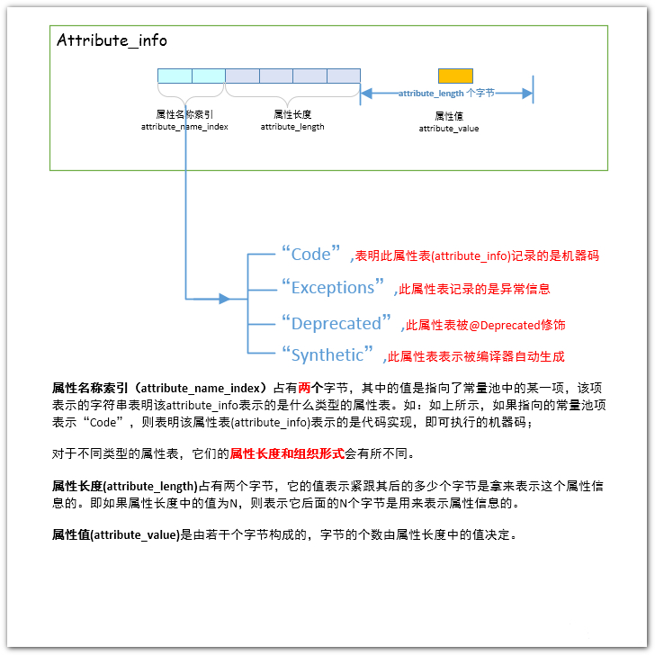

#### 6.3.7.1 Code 属性

| 类型           | 名称                   | 数量                   |
| -------------- | ---------------------- | ---------------------- |
| u2             | attribute_name_index   | 1                      |
| u4             | attribute_length       | 1                      |
| u2             | max_stack              | 1                      |
| u2             | max_locals             | 1                      |
| u4             | code_length            | 1                      |
| u1             | code                   | code_length            |
| u2             | exception_table_length | 1                      |
| exception_info | exception_table        | exception_table_length |
| u2             | attributes_count       | 1                      |
| attribute_info | attributes             | attributes_count       |

- attribute_name_index 是一项指向 CONSTANT_Utf8_info 型常量的索引，常量值固定为“Code”，它代表了该属性的属性名称。
- attribute_length 表示属性值的长度。
- max_stack 表示操作数栈的最大深度， JVM 运行的时候需要根据这个值来分配栈帧中的操作数栈深度。
- max_locals 表示局部变量表所需要的存储空间。单位为 Slot ， Slot 是虚拟机为局部变量分配内存所使用的最小单位。对于 byte 、 char 、 float 、 int 、 short 、 boolean 和 returnAddress 等长度不超过 32 位的数据类型，每个局部变量占用 1 个 Slot ，而 double 和 long 这两种 64 位的数据类型则需要两个 Slot 来存放。方法参数（包括实例方法中的隐藏参数“this”）、显式异常处理器的参数（ Exception Handler Parameter ，就是 try-catch 语句中 catch 块所定义的异常）、方法体中定义的局部变量都需要使用局部变量表来存放。另外，并不是在方法中用到了多少个局部变量，就把这些局部变量所占 Slo t之和作为 max_locals 的值，原因是局部变量表中的 Slot 可以重用，当代码执行超出一个局部变量的作用域时，这个局部变量所占的 Slot 可以被其他局部变量所使用， Javac 编译器会根据变量的作用域来分配 Slot 给各个变量使用，然后计算出 max_locals 的大小。
- code_length 代表字节码指令长度。虽然它是一个 u4 类型的长度值，理论上最大值可以达到2的32次方减1，但是虚拟机规范中明确限制了一个方法不允许超过65535条字节码指令，即他实际只使用了 u2 的长度，如果超过这个限制， Javac 编译器也会拒绝编译。一般来讲，编写 Java 代码时只要不是刻意去编写一个超长的方法来为难编译器，是不太可能超过这个最大值的限制。但是，某些特殊情况，例如在编译一个很复杂的 JSP 文件时，某些 JSP 编译器会把 JSP 内容和页面输出的信息归并于一个方法之中，就可能因为方法生成字节码超长的原因而导致编译失败。
- code 用于存储字节码指令的一系列字节流，代表具体的字节码指令。根据 JVM 规范，每个字节码指令占用一个字节， JVM 可以自动识别该指令是否需要接收参数。目前， Java 虚拟机规范已经定义了其中约 200 条编码值对应的指令含义。Code 属性是 Class 文件中最重要的一个属性，如果把一个 Java 程序中的信息分为代码（ Code ，方法体里面的 Java 代码）和元数据（ Metadata ，包括类、字段、方法定义及其他信息）两部分，那么在整个 Class 文件中， Code 属性用于描述代码，所有的其他数据项目都用于描述元数据。
- exception_table_length 表示异常表占用的字节数。
- exception_table 表示具体的异常表。
- Code 属性本身还有自己的一些属性表，包括 LineNumberTable 、 LocalVariableTable 和 StackMapTable ，这些属性不是必须的，如果有的话，会在 attributes_count 和 attributes 中体现出来。

> ​	在任何实例方法里面，都可以通过“this”关键字访问到此方法所属的对象。这个访问机制对 Java 程序的编写很重要，而他的实现却非常简单，仅仅是通过javac编译器编译的时候把对 this 关键字的访问转变为对一个普通方法参数的访问，然后在虚拟机调用实例方法时自动传入此参数而已。因此在实例方法的局部变量表中至少会存在一个指向当前对象实例的局部变量，局部变量表中也会预留出第一个 Slot 位来存放对象实例的引用，方法参数值从1开始计算。这个处理只对实例方法有效，如果方法声明为 static ，那 Args_size 就不会等于1而是等于0了。

​	 异常表的格式如下表所示，它包含4个字段，这些字段的含义为：如果当字节码在第 start_pc 行到 end_pc 行之间（不含第 end_pc 行）出现了类型为 catch_type 或者其子类的异常（ catch_type 为指向一个 CONSTANT_Class_info 型常量的索引），则转到第 handler_pc 行继续处理。当 catch_type 的值为0时，代表任意异常情况都需要转向到 handler_pc 处进行处理。

| 类型 | 名称     | 数量 |
| ---  | ------- | --- |
| u2   | start_pc | 1    |
| u2   | end_pc   | 1    |
| u2   | handler_pc | 1  |
| u2   | catch_type | 1  |

> ​	此处字节码的“行”是一种形象的描述，指的是字节码相对于方法体开始的偏移量，而不是 Java 源码的行号。
>
> ​	在 JDK 1.4.2 之前的 Javac 编译器采用了 jsr 和 ret 指令实现 finally 语句，但1.4.2之后已经改为编译器自定在每段可能的分支路径之后都将 finally 语句块的内容冗余生成一遍来实现 finally 语义。在 JDK 1.7中，已经完全禁止 Class 文件中出现 jsr 和 ret 指令，如果遇到这两条指令，虚拟机会在类加载的字节码校验阶段抛出异常。

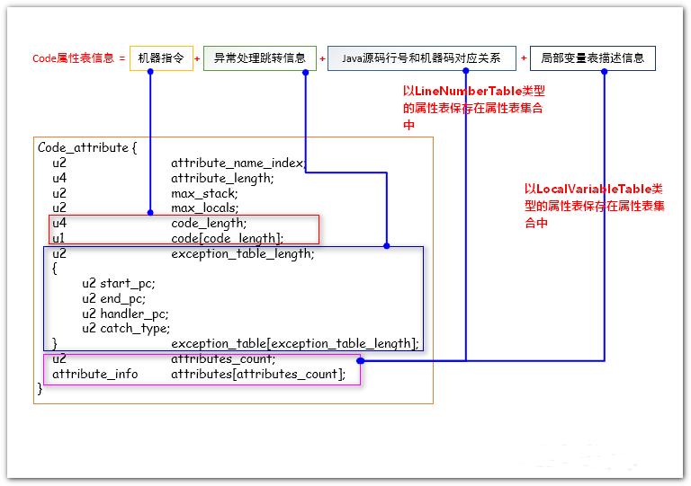

#### 6.3.7.2 Exceptions 属性

​	这里的 Exceptions 属性是在方法表与 Code 属性平级的一项属性。 Exceptions 属性的作用是列举出方法中可能抛出的受查异常（ Checked Exceptions ），也就是说方法描述时在 throws 关键字后面列举的异常。

| 类型 | 名称                 | 数量 |
| --- | ------------------- | --- |
| u2   | attribute_name_index | 1    |
| u4   | attribute_length     | 1    |
| u2   | number_of_exceptions  | 1                    |
| u2   | exception_index_table | number_of_exceptions |

​	Exceptions 属性中的 number_of_exceptions 项表示方法可能抛出 number_of_exceptions 种受查异常，每一种受查异常使用一个 exception_index_table 项表示， exception_index_table 是一个指向常量池中 CONSTANT_Class_info 型常量的索引，代表了该受查异常的类型。

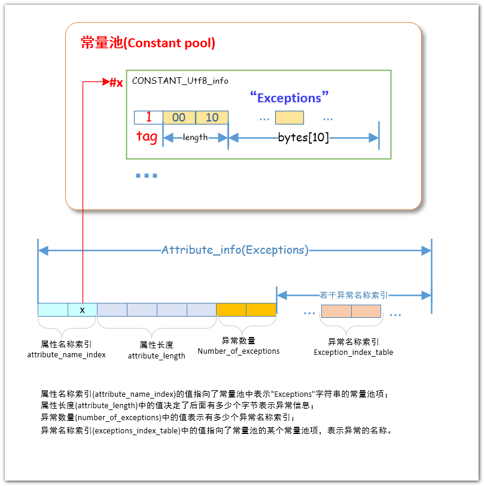

#### 6.3.7.3 LineNumberTable 属性

​	 LineNumberTable 属性用于描述 Java 源码行号与字节码行号（字节码的偏移量）之间的对应关系。并不是运行时必须的属性，但默认生成到 Class 文件之中，可以在 Javac 中分别使用 -g : none 或 -g : lines 选项来取消或要求生成这项信息。如果选择不生成 LineNumberTable 属性，对程序运行产生的最主要的影响就是当抛出异常时，堆栈中将不会显示出错的行号，并且在调试程序的时候，也无法按照源码行来设置断点。 LineNumberTable 属性的结构见下表。

| 类型             | 名称                     | 数量                     |
| :--------------- | :----------------------- | :----------------------- |
| u2               | attribute_name_index     | 1                        |
| u4               | attribute_length         | 1                        |
| u2               | line_number_table_length | 1                        |
| line_number_info | line_number_table        | line_number_table_length |

​	line_number_table 是一个数量为 line_number_table_length 、类型为 line_number_info 的集合， line_number_info 表包括了 start_pc 和 line_number 两个 u2 类型的数据项，前者是字节码行号，后者是 Java 源码行号。

#### 6.3.7.4 LineVariableTable 属性

​	 LocalVariableTable 属性用于描述栈帧中局部变量表中的变量与 Java 源码中定义的变量之间的关系，也不是运行时必须的属性，但默认会生成到 Class 文件之中，可以在 Javac 中分别使用 -g : none 或 -g :vars 选项来取消或要求生成这项信息。如果没有生成这项属性，最大的影响就是当前其他人引用这个方法时，所有的参数名称都将会丢失， IDE 将会使用诸如 arg0 、 arg1 之类的占位符代替原有的参数名，这对程序运行没有影响，但是会对代码编写带来较大不便，而且在调试期间无法根据参数名称从上下文中获得参数值。 LocalVariableTable 属性的结构见下表。

| 类型                | 名称                        | 数量                        |
| :------------------ | :-------------------------- | :-------------------------- |
| u2                  | attribute_name_index        | 1                           |
| u4                  | attribute_length            | 1                           |
| u2                  | local_variable_table_length | 1                           |
| local_variable_info | local_variable_table        | local_variable_table_length |

​	其中， local_variable_info 项目代表了一个栈帧与源码中的局部变量的关联，结构如下表。

| 类型                | 名称                        | 数量                        |
| :------------------ | :-------------------------- | :-------------------------- |
| u2                  | start_pc                    | 1                           |
| u2                  | length                      | 1                           |
| u2                  | name_index                  | 1                           |
| u2                  | descriptor_index            | 1                           |
| u2                  | index                       | 1                           |

​	 start_pc 和 length 属性分别代表了这个局部变量的生命周期开始地字节码偏移量及其作用范围覆盖的长度，两者结合起来就是这个局部变量在字节码之中的作用域范围。

​	 name_index 和 descriptor_index 都是指向常量池中 CONSTANT_Utf8_info 型常量的索引，分别代表了局部变量的名称以及这个局部变量的描述符。

​	index 是这个局部变量在栈帧局部变量表中 Slot 的位置。当这个变量数据类型是64位类型时（ double 和 long ），他占用的 Slot 为 index 和 index+1 两个。

​	在JDK1.5引入泛型之后， LocalVariableTable 属性增加了一个“姐妹属性”： LocalVariableTypeTable ，这个新增的属性结构与 LocalVariableTable 非常相似，仅仅是把记录的字段描述符的 descriptor_index 替换成了字段的特征签名（ Signature ），对于非泛型类型来说，描述符和特征签名能描述的信息是基本一致的，但是泛型引入后，由于描述符中反省的参数化类型被擦除掉，描述符就不能准确的描述泛型类型了，因此出现了 LocalVariableTypeTable 。

#### 6.3.7.5 SourceFile 属性

​	 SourceFile 属性用于记录生成这个 Class 文件的源码文件名称。这个属性也是可选的，可以分别使用 Javac 的 -g :none 或 =g : source 选项来关闭或要求生成这项信息。在 Java 中，对于大多数的类来说，类名和文件名是一致的，但是有一些特殊情况（如内部类）例外。如果不生成这项属性，当抛出异常时，堆栈中将不会显示出错代码所属的文件名。这个属性是一个定长的属性，其结构见下表。

> | 类型 | 名称                 | 数量 |
> | :--- | :------------------- | :--- |
> | u2   | attribute_name_index | 1    |
> | u4   | attribute_length     | 1    |
> | u2   | sourcefile_index     |      |

​	 sourcefile_index 数据项是指向常量池中 CONSTANT_Utf8_info 型常量的索引，常量值是源码文件的文件名。

#### 6.3.7.6 ConstantValue 属性

​	ConstantValue 属性的作用是通知虚拟机自动为静态变量赋值。只有被 static 关键字修饰的变量（类变量）才可以使用这项属性。类似“int x = 123”和“static int x=123”这样的变量定义在 Java 程序中是非常常见的事情，但虚拟机对这两种变量赋值的方法和时刻都有所不同。对于非 static 类型的变量（也就是实例变量）的赋值是在实例构造器\<init\>方法中进行的；而对于类变量，则有两种方式可以选择：在类构造器\<clinit\>方法中或者使用 ConstantValue 属性。目前 Sun Javac 编译器的选择是：如果同时使用 final 和 static 来修饰一个变量（按照习惯，这里称“常量”更贴切），并且这个变量的数据类型是基本类型或者 java.lang.String 的话，就生成 ConstantValue 属性来进行初始化，如果这个变量没有被 final 修饰，或者并非基本类型及字符串，则将会选择在\<clinit\>方法中进行初始化。

​        虽然有 final 关键字才更符合“ConstantValue”的语义，但虚拟机规范中并没有强制要求字段必须设置了 ACC_FINAL 标志，只要求了有 ConstantValue 属性的字段必须设置 ACC_STATIC 标志而已，对 final 关键字的要求是 javac 编译器自己加入的限制。而对 ConstantValue 属性值只能限于基本类型和 String ，此属性的属性值只是一个常量池的索引号，由于 Class 文件格式的常量类型中只有与基本属性和字符串相对应的字面量，所以就算 ConstantValue 属性在想支持别的类型也无能为力。ConstantValue属性的结构见下表。

| 类型 | 名称                 | 数量 |
| :--- | :------------------- | :--- |
| u2   | attribute_name_index | 1    |
| u4   | attribute_length     | 1    |
| u2   | constantvalue_index  | 1    |

​	 ConstantValue 属性是一个定长属性，它的 attribute_length 数据项值必须固定为2。 constantvalue_index 数据项代表了常量池中一个字面量常量的引用，根据字段类型的不同，字面量可以是 CONSTANT_Long_info 、 CONSTANT_Float_info 、 CONSTANT_Double_info 、 CONSTANT_Integer_info 、 CONSTANT_String_info 常量中的一种。

#### 6.3.7.7 InnerClasses 属性

​	InnerClasses 属性用于记录内部类与宿主类之间的关联。如果一个类中定义了内部类，那编译器将会为他以及他所包含的内部类生成InnerClasses属性。该属性的结构见下表。

| 类型               | 名称                 | 数量              |
| :----------------- | :------------------- | :---------------- |
| u2                 | attribute_name_index | 1                 |
| u4                 | attribute_length     | 1                 |
| u2                 | number_of_class      | 1                 |
| inner_classes_info | inner_class          | number_of_classes |

​	数据项 number_of_classes 代表需要记录多少个内部类信息，每一个内部类的信息都由一个 inner_classes_info 表进行描述。 inner_classes_info 的结构见下表。

| 类型 | 名称                    | 数量 |
| :--- | :---------------------- | :--- |
| u2   | inner_class_info_index  | 1    |
| u2   | outer_class_info_index  | 1    |
| u2   | inner_name_index        | 1    |
| u2   | inner_class_access_info | 1    |

​	inner_name_index 是指向常量池中 CONSTANT_Utf8_info 型常量的索引，代表这个内部类的名称，如果是匿名内部类，那么这项值为0。

​	 inner_class_access_flags 是内部类的访问标志，类似于类的 access_flags 。

#### 6.3.7.8 Deprecated 及 Synthetic 属性

​	Deprecated 和 Synthetic 两个属性都属于标志类型的布尔属性。

​	Deprecated 属性用于表示每个类、字段或者方法，已经被程序作者定位不在推荐使用，他可以通过在代码中使用 @deprecated 注释进行设置。

​	Synthetic 属性代表此字段或者方法并不是由 Java 源码直接产生的，而是由编译器自行添加的，在 JDK 1.5之后，标识一个类、字段或者方法是编译器自动产生的，也可以设置他们访问标志中的 ACC_SYNTHETIC 标志位，其中最典型的例子就是 Bridge Method 。所有由非用户代码产生的类、方法及字段都应当至少设置 Synthetic 属性和 ACC_SYNTHETIC 标志位中的一项，唯一的例外是实例构造器“\<init\>”方法和类构造器“\<clinit\>”方法。

#### 6.3.7.9 StackMapTable 属性

​	StackMapTable 属性在 JDK 1.6发布后增加到了 Class 文件规范中，它是一个复杂的变长属性，位于 Code 属性的属性表，这个属性会在虚拟机类加载的字节码验证阶段被新类型检查验证器（ Type Checker ）使用，目的在于代替以前比较消耗性能的基于数据流分析的类型推导验证器。

​	新的验证器在同样能保证 Class 文件合法性的前提下，省略了在运行期通过数据流分析确认字节码的行为逻辑合法性的步骤，而是在编译阶段将一系列的验证类型（Verification Types）直接记录在 Class 文件之中，通过检查这些验证类型代替了类型推导过程，从而大幅提升了字节码验证的性能。这个验证器在 JDK 1.6中首次提供，并在 JDK 1.7中强制代替原本基于类型推断的字节码验证器。

​	 StackMapTable 属性中包含零至多个栈映射栈（Stack Map Frames），每个栈映射帧都显示或隐式的代表了一个字节码偏移量，用于表示该执行到该字节码时局部变量表和操作数栈的验证类型。类型检查验证器会通过检查目标方法的局部变量和操作数栈所需要的类型来确定一段字节码指令是否符合逻辑约束。 StackMapTable 属性的结构见下表。

| 类型            | 名称                    | 数量              |
| :-------------- | :---------------------- | :---------------- |
| u2              | attribute_name_index    | 1                 |
| u4              | attribute_length        | 1                 |
| u2              | number_of_entries       | 1                 |
| stack_map_frame | stack_map_frame_entries | number_of_entries |

​	《 Java虚拟机规范（Java SE 7版）》明确规定：在版本号大于或等于50.0的 Class 文件中，如果方法的 Code 属性中没有附带 StackMapTable 属性，那就意味着他带有一个隐式的 StackMap 属性。这个 StackMap 属性的作用等同于 number_of_entries 值为0的 StackMapTable 属性。一个方法的 Code 属性最多只能有一个 StackMapTable 属性，否则将抛出 ClassFormatError 异常。

#### 6.3.7.10 Signature 属性

​	Signature 属性在 JDK 1.5发布后增加到了 Class 文件规范之中，他是一个可选的定长属性，可以出现于类、属性表和方法表结构的属性表中。在 JDK 1.5大幅增强了 Java 语言的语法，在此之后，任何类、接口、初始化方法或成员的泛型签名如果包含饿了类型变量（Type Variables）或参数化类型（Parameterized Types），则 Signature 属性会为他记录泛型签名信息。之所以要专门使用这样一个属性去记录泛型类型，是因为 Java 语言的泛型采用的是擦除法实现的伪泛型，在字节码（ Code 属性）中，泛型信息编译（类型变量、参数化类型）之后都统统被擦除掉。使用擦除法的好处是实现简单（主要修改 Javac 编译器，虚拟机内部只做了很少的改动）、非常容易实现 Backport ，运行期也能够节省一些类型所占的内存空间。但坏处是运行期就无法像 C# 等有真泛型支持的语言那样，将泛型类型与用户定义的普通类型同等对待，例如运行期做反射时无法获得到泛型信息。 Signature 属性就是为了弥补这个缺陷而增设的，现在 Java 的反射 API 能够获取泛型类型，最终的数据来源也就是这个属性。 Signature 属性的结构见下表。

| 类型 | 名称                 | 数量 |
| :--- | :------------------- | :--- |
| u2   | attribute_name_index | 1    |
| u4   | attribute_length     | 1    |
| u2   | signature_index      | 1    |

​	其中 signature_index 项的值必须是一个对常量池的有效索引。常量池在该索引处的项必须是 CONSTANT_Utf8_info 结构，表示类签名、方法类型签名或字段类型签名。如果当前的 Signature 属性是类文件的属性，则这个结构表示类签名，如果当前的 Signature 属性是方法表的属性，则这个结构表示方法类型签名，如果当前 Signature 属性是字段表的属性，则这个结构表示字段类型签名。

#### 6.3.7.11 BootstrapMethods 属性

​	BootstrapMethods 属性在 JDK 1.7发布后增加到了 Class 文件规范之中，他是一个复杂的变长属性，位于类文件的属性表中。这个属性用于保存 invokedynamic 指令引用的引导方法限定符。《Java虚拟机规范（Java SE 7版）》规定，如果某个类文件结构的常量池中曾经出现过 CONSTANT_InvokeDynamic_info 类型的常量，那么这个类文件的属性表中必须存在一个明确地 BootstrapMethods 属性，另外，即使 CONSTANT_InvokeDynamic_info 类型的常量在常量池中出现过多次，类文件的属性表中最多也只能一个 BootstrapMethods 属性。 BootstrapMethods 属性与 JSR-292 中的 InvokeDynamic 指令和 java.lang.Invoke 包关系非常密切。

​	BootstrapMethods属性的结构见下表。

| 类型             | 名称                  | 数量                  |
| :--------------- | :-------------------- | :-------------------- |
| u2               | attribute_name_index  | 1                     |
| u4               | attribute_length      | 1                     |
| u2               | num_bootstrap_methods | 1                     |
| bootstrap_method | bootstrap_methods     | num_bootstrap_methods |

​	其中引用到的bootstrap_method结构见下表。

| 类型 | 名称                    | 数量                    |
| :--- | :---------------------- | :---------------------- |
| u2   | bootstrap_method_ref    | 1                       |
| u2   | num_bootstrap_arguments | 1                       |
| u2   | bootstrap_arguments     | num_bootstrap_arguments |

​	BootstrapMethods 属性中， num_bootstrap_methods 项的值给出了 bootstrap_methods[] 数组中的引导方法限定符的数量。而 bootstrap_methods[] 数组的每个成员包含了一个指向常量池 CONSTANT_MethodHandle 结构的索引值，它代表了一个引导方法，还包含了这个引导方法静态参数的序列（可能为空）。 bootstrap_methods[] 数组中的每个成员必须包含以下3项内容。

- **bootstrap_method_ref：** bootstrap_method_ref 项的值必须是一个对常量池的有效索引。常量池在该索引处的值必须是一个 CONSTANT_MethodHandle_info 结构。
- **num_bootstrap_arguments：** num_bootstrap_arguments 项的值给出了 bootstrap_arguments[] 数组成员的数量。
- **bootstrap_arguments[]：** bootstrap_arguments[] 数组的每个成员必须是一个对常量池的有效索引。常量池在该索引处必须是下列结构之一： CONSTANT_String_info 、 CONSTANT_Class_info 、 CONSTANT_Integer_info 、 CONSTANT_Long_info 、 CONSTANT_Float_info 、 CONSTANT_Double_info 、 CONSTANT_MethodHandle_info 或 CONSTANT_MethodType_info 。